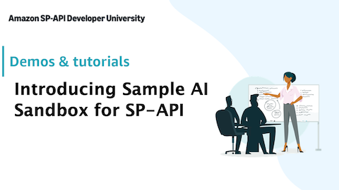
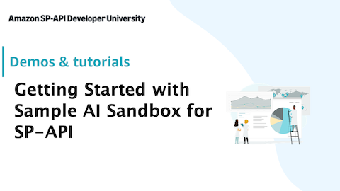

# Sample AI Sandbox for SP-API

Sample AI Sandbox for SP-API is a local development tool for testing SP-API integrations before deploying to production. It validates requests against SP-API OpenAPI schemas, simulates API responses using an AI agent backed by Amazon Bedrock, and provides a Reports API implementation — helping catch integration issues early in the development cycle.

Watch the following video for a brief introduction to Sample AI Sandbox for SP-API on YouTube:
[](https://www.youtube.com/watch?v=DzuGgYYLuEM)

## Prerequisites

- **Node.js 22+** (the project extends `@tsconfig/node22`)
- **npm** (ships with Node.js)
- **AWS credentials** configured in your environment with access to Amazon Bedrock (the app uses Claude Haiku via `@aws-sdk/client-bedrock-runtime`)

## Installation

```bash
npm install
```

## Configuration

Create a `.env` file in the project root (or edit the existing one):

```dotenv
PORT=9001
REGION=NA
SP_API_SANDBOX_TELEMETRY_ENABLED=true
```

| Variable | Description                                                     | Default |
|----------|-----------------------------------------------------------------|---------|
| `PORT` | Port the server listens on                                      | `9001` |
| `REGION` | SP-API region (`NA`, `EU`, or `FE`)                             | `NA` |
| `SP_API_SANDBOX_TELEMETRY_ENABLED` | Enable telemetry (fully anonymized, no personal data collected) | `true` |

AWS credentials are resolved through the standard AWS SDK credential chain (environment variables, `~/.aws/credentials`, IAM role, etc.). No additional env vars are needed for Bedrock access beyond valid credentials with the appropriate permissions.

## Running

### Development (with hot-reload)

```bash
npm run dev
```

### Production

```bash
npm run build
npm run start
```

The server starts on `http://localhost:9001` by default.

## Supported SP-API Endpoints

| Method | Path | API | Mode |
|--------|------|-----|------|
| `GET` | `/catalog/2022-04-01/items` | Catalog Items | AI |
| `GET` | `/catalog/2022-04-01/items/{asin}` | Catalog Items | AI |
| `GET` | `/listings/2021-08-01/items/{sellerId}` | Listings Items | AI |
| `GET` | `/listings/2021-08-01/items/{sellerId}/{sku}` | Listings Items | AI |
| `PUT` | `/listings/2021-08-01/items/{sellerId}/{sku}` | Listings Items | AI |
| `PATCH` | `/listings/2021-08-01/items/{sellerId}/{sku}` | Listings Items | AI |
| `DELETE` | `/listings/2021-08-01/items/{sellerId}/{sku}` | Listings Items | AI |
| `GET` | `/orders/2026-01-01/orders` | Orders | AI |
| `GET` | `/orders/2026-01-01/orders/{orderId}` | Orders | AI |
| `POST` | `/orders/v0/orders/{orderId}/shipmentConfirmation` | Orders | AI |
| `POST` | `/externalFulfillment/inventory/2024-09-11/inventories` | External Fulfillment Inventory | AI |
| `GET` | `/externalFulfillment/2024-09-11/returns` | External Fulfillment Returns | AI |
| `GET` | `/externalFulfillment/2024-09-11/returns/{returnId}` | External Fulfillment Returns | AI |
| `GET` | `/externalFulfillment/2024-09-11/shipments` | External Fulfillment Shipments | AI |
| `GET` | `/externalFulfillment/2024-09-11/shipments/{shipmentId}` | External Fulfillment Shipments | AI |
| `POST` | `/externalFulfillment/2024-09-11/shipments/{shipmentId}` | External Fulfillment Shipments | AI |
| `POST` | `/externalFulfillment/2024-09-11/shipments/{shipmentId}/packages` | External Fulfillment Shipments | AI |
| `PUT` | `/externalFulfillment/2024-09-11/shipments/{shipmentId}/packages/{packageId}` | External Fulfillment Shipments | AI |
| `PATCH` | `/externalFulfillment/2024-09-11/shipments/{shipmentId}/packages/{packageId}` | External Fulfillment Shipments | AI |
| `GET` | `/externalFulfillment/2024-09-11/shipments/{shipmentId}/shippingOptions` | External Fulfillment Shipments | AI |
| `POST` | `/externalFulfillment/2024-09-11/shipments/{shipmentId}/invoice` | External Fulfillment Shipments | AI |
| `GET` | `/externalFulfillment/2024-09-11/shipments/{shipmentId}/invoice` | External Fulfillment Shipments | AI |
| `PUT` | `/externalFulfillment/2024-09-11/shipments/{shipmentId}/shipLabels` | External Fulfillment Shipments | AI |
| `POST` | `/batches/products/pricing/2022-05-01/offer/featuredOfferExpectedPrice` | Product Pricing | AI |
| `POST` | `/batches/products/pricing/2022-05-01/items/competitiveSummary` | Product Pricing | Pass-through (Production) |
| `GET` | `/definitions/2020-09-01/*` | Product Type Definitions | Pass-through (Production) |
| `GET` | `/listings/2021-08-01/restrictions` | Listings Restrictions | Pass-through (Production) |
| `GET` | `/fba/inventory/v1/summaries` | FBA Inventory | Pass-through (Sandbox) |
| `POST` | `/fba/inventory/v1/items` | FBA Inventory | Pass-through (Sandbox) |
| `POST` | `/fba/inventory/v1/items/inventory` | FBA Inventory | Pass-through (Sandbox) |
| `DELETE` | `/fba/inventory/v1/items/*` | FBA Inventory | Pass-through (Sandbox) |
| `POST` | `/reports/2021-06-30/reports` | Reports | Local |
| `GET` | `/reports/2021-06-30/reports` | Reports | Local |
| `GET` | `/reports/2021-06-30/reports/:reportId` | Reports | Local |
| `DELETE` | `/reports/2021-06-30/reports/:reportId` | Reports | Local |
| `GET` | `/reports/2021-06-30/documents/:reportDocumentId` | Reports | Local |
| `POST` | `/reports/2021-06-30/schedules` | Reports | Local |
| `GET` | `/reports/2021-06-30/schedules` | Reports | Local |
| `GET` | `/reports/2021-06-30/schedules/:reportScheduleId` | Reports | Local |
| `DELETE` | `/reports/2021-06-30/schedules/:reportScheduleId` | Reports | Local |

**Mode legend:**
- **AI** — Request is validated against the OpenAPI schema and a response is generated by an AI agent (Claude Haiku on Bedrock).
- **Pass-through (Production)** — Request is proxied to the SP-API production endpoint.
- **Pass-through (Sandbox)** — Request is proxied to the SP-API sandbox endpoint.
- **Local** — Handled entirely locally with deterministic logic (no AI, no external calls).

## Sandbox-Specific Endpoints

| Method | Path | Description                                                                                                                           |
|--------|------|---------------------------------------------------------------------------------------------------------------------------------------|
| `POST` | `/chat` | Creates test data based on the request prompt. Request format:</br>`{ "prompt": "Create an order with fulfillment status unshipped"}` |
| `GET` | `/data` | Returns all data currently stored in the in-memory database                                                                           |
| `DELETE` | `/data` | Clears the in-memory database                                                                                                         |

## How It Works

1. **Request proxying** — Some endpoints (definitions, restrictions, pricing batch, FBA inventory) are proxied directly to the real SP-API production or sandbox backends.
2. **Schema validation** — Incoming requests are validated against the bundled OpenAPI models in `res/models/`.
3. **AI-powered responses** — For supported endpoints, an AI agent (Claude Haiku on Bedrock) generates realistic mock responses that conform to the API schema.
4. **Reports API** — A deterministic, fully local implementation of the SP-API Reports workflow (create, poll, download).
5. **Local database** — Generated data is persisted in a local JSON store (lowdb). View it at `GET /data` or clear it with `DELETE /data`.

## Deployment

A CloudFormation template is provided in `deployment/cloudformation-template.yml` for deploying to AWS Elastic Beanstalk on Node.js 24 / Amazon Linux 2023.

Watch the following video on YouTube for step-by-step instructions on how to install Sample AI Sandbox for SP-API on AWS:
[](https://www.youtube.com/watch?v=XkAeyRcWB1A)

### CloudFormation instructions

1. Install and build
    ```bash
    npm install
    npm run build
    ```
2. Zip the application
    ```bash
    zip -r app.zip .
    ```
3. Upload to AWS S3: Create a new bucket in S3 and upload the zip file.
4. Deploy CloudFormation template: Use [CloudFormation template](/deployment/cloudformation-template.yml) and deploy it in AWS. You need the name of the S3 bucket and the name of the zip file (template parameters).
5. Call Sandbox: After the deployment has finished, a new Elastic Beanstalk environment has been created. Use the domain name to call the sandbox.


## Replace AI Model Provider
By default, the application is using Amazon Bedrock and Anthropic Claude Haiku 4.5. It is possible to:
* Use a different model provided by [Amazon Bedrock](https://docs.aws.amazon.com/bedrock/latest/userguide/model-cards.html)
* Use a different model provider supported by [Strands Agent SDK (TypeScript)](https://strandsagents.com/docs/user-guide/concepts/model-providers/#supported-providers)

Either way, respective changes must be applied to the default model provider configuration in [modelProvider.ts](src/modelProvider.ts).

## Extend Data Generator for Listings Items API
By default, Data Generator (UI and endpoint) doesn't support Listings Items API out of the box. Product Type Definitions are necessary to generate the respective mock data, which are not publicly available and therefore can't be added to this repository. If you want to add listings generation capabilities, manually download product type definitions via SP-API (e.g. for product type PRODUCT) and add it to the [resource folder](res/pt-definitions). Additionally, uncomment **Api.LISTINGS** in the [resourceRetrievalTools](src/tool/resourceRetrievalTool.ts).