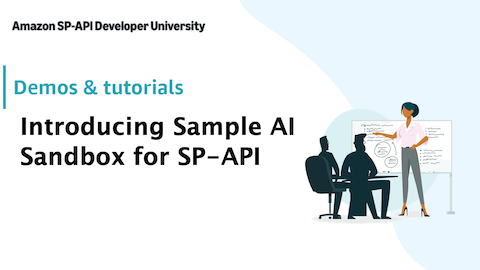
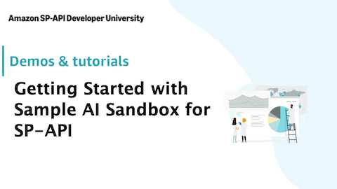

# Sample AI Sandbox for SP-API

Sample AI Sandbox for SP-API is a local development tool for testing SP-API integrations before deploying to production. It validates requests against SP-API OpenAPI schemas and serves responses from deterministic, local operation handlers backed by an in-process database — helping catch integration issues early in the development cycle. An AI agent backed by Amazon Bedrock powers the Data Generator, which turns natural-language prompts into test data stored in the local database.

Watch the following video for a brief introduction to Sample AI Sandbox for SP-API on YouTube:
[](https://www.youtube.com/watch?v=DzuGgYYLuEM)

## Prerequisites

- **Node.js 22+** (the project extends `@tsconfig/node22`)
- **npm** (ships with Node.js)
- **AWS credentials** configured in your environment with access to Amazon Bedrock (the app uses Claude Haiku via `@aws-sdk/client-bedrock-runtime`)

## Installation

```bash
npm install
```

## Configuration

Create a `.env` file in the project root (or edit the existing one):

```dotenv
PORT=9001
REGION=NA
MODE=Seller
DB_MODE=memory
```

| Variable | Description                                                     | Default |
|----------|-----------------------------------------------------------------|---------|
| `PORT` | Port the server listens on                                      | `9001` |
| `REGION` | SP-API region (`NA`, `EU`, or `FE`)                             | `NA` |
| `MODE` | Operating mode (`Seller` or `Vendor`). Mode-restricted operations return `403` when accessed in the wrong mode. | `Seller` |
| `DB_MODE` | Database persistence mode (`memory` or `persistent`)           | `memory` |
| `DB_FILE_PATH` | File path used when `DB_MODE=persistent` (required in that mode) | — |

AWS credentials are resolved through the standard AWS SDK credential chain (environment variables, `~/.aws/credentials`, IAM role, etc.). No additional env vars are needed for Bedrock access beyond valid credentials with the appropriate permissions. Bedrock is only used by the Data Generator (`POST /chat`); SP-API endpoints are served locally and do not call Bedrock.

## Running

### Development (with hot-reload)

```bash
npm run dev
```

### Production

```bash
npm run build
npm run start
```

The server starts on `http://localhost:9001` by default.

## Supported SP-API Endpoints

All SP-API endpoints are validated against their bundled OpenAPI model and served by deterministic local handlers, except where noted as pass-through. The **Modes** column indicates which operating modes (`MODE` env var) expose the operation.

| Method | Path | API | Behavior | Modes |
|--------|------|-----|----------|-------|
| `GET` | `/catalog/2022-04-01/items` | Catalog Items | Local | Seller, Vendor |
| `GET` | `/catalog/2022-04-01/items/{asin}` | Catalog Items | Local | Seller, Vendor |
| `POST` | `/dataKiosk/2023-11-15/queries` | Data Kiosk | Local | Seller, Vendor |
| `GET` | `/dataKiosk/2023-11-15/queries` | Data Kiosk | Local | Seller, Vendor |
| `GET` | `/dataKiosk/2023-11-15/queries/{queryId}` | Data Kiosk | Local | Seller, Vendor |
| `DELETE` | `/dataKiosk/2023-11-15/queries/{queryId}` | Data Kiosk | Local | Seller, Vendor |
| `GET` | `/dataKiosk/2023-11-15/documents/{documentId}` | Data Kiosk | Local | Seller, Vendor |
| `GET` | `/listings/2021-08-01/items/{sellerId}` | Listings Items | Local | Seller, Vendor |
| `GET` | `/listings/2021-08-01/items/{sellerId}/{sku}` | Listings Items | Local | Seller, Vendor |
| `PUT` | `/listings/2021-08-01/items/{sellerId}/{sku}` | Listings Items | Local (validation delegated to Production) | Seller, Vendor |
| `PATCH` | `/listings/2021-08-01/items/{sellerId}/{sku}` | Listings Items | Local | Seller, Vendor |
| `DELETE` | `/listings/2021-08-01/items/{sellerId}/{sku}` | Listings Items | Local | Seller, Vendor |
| `GET` | `/listings/2021-08-01/restrictions` | Listings Restrictions | Local | Seller |
| `GET` | `/orders/2026-01-01/orders` | Orders | Local | Seller |
| `GET` | `/orders/2026-01-01/orders/{orderId}` | Orders | Local | Seller |
| `POST` | `/orders/v0/orders/{orderId}/shipmentConfirmation` | Orders | Local | Seller |
| `POST` | `/externalFulfillment/inventory/2024-09-11/inventories` | External Fulfillment Inventory | Local | Seller |
| `GET` | `/externalFulfillment/2024-09-11/returns` | External Fulfillment Returns | Local | Seller |
| `GET` | `/externalFulfillment/2024-09-11/returns/{returnId}` | External Fulfillment Returns | Local | Seller |
| `GET` | `/externalFulfillment/2024-09-11/shipments` | External Fulfillment Shipments | Local | Seller |
| `GET` | `/externalFulfillment/2024-09-11/shipments/{shipmentId}` | External Fulfillment Shipments | Local | Seller |
| `POST` | `/externalFulfillment/2024-09-11/shipments/{shipmentId}` | External Fulfillment Shipments | Local | Seller |
| `POST` | `/externalFulfillment/2024-09-11/shipments/{shipmentId}/packages` | External Fulfillment Shipments | Local | Seller |
| `PUT` | `/externalFulfillment/2024-09-11/shipments/{shipmentId}/packages/{packageId}` | External Fulfillment Shipments | Local | Seller |
| `PATCH` | `/externalFulfillment/2024-09-11/shipments/{shipmentId}/packages/{packageId}` | External Fulfillment Shipments | Local | Seller |
| `GET` | `/externalFulfillment/2024-09-11/shipments/{shipmentId}/shippingOptions` | External Fulfillment Shipments | Local | Seller |
| `POST` | `/externalFulfillment/2024-09-11/shipments/{shipmentId}/invoice` | External Fulfillment Shipments | Local | Seller |
| `GET` | `/externalFulfillment/2024-09-11/shipments/{shipmentId}/invoice` | External Fulfillment Shipments | Local | Seller |
| `PUT` | `/externalFulfillment/2024-09-11/shipments/{shipmentId}/shipLabels` | External Fulfillment Shipments | Local | Seller |
| `POST` | `/batches/products/pricing/2022-05-01/offer/featuredOfferExpectedPrice` | Product Pricing | Local | Seller |
| `POST` | `/batches/products/pricing/2022-05-01/items/competitiveSummary` | Product Pricing | Pass-through (Production) | Seller |
| `GET` | `/definitions/2020-09-01/productTypes` | Product Type Definitions | Pass-through (Production) | Seller, Vendor |
| `GET` | `/definitions/2020-09-01/productTypes/{productType}` | Product Type Definitions | Pass-through (Production) | Seller, Vendor |
| `GET` | `/fba/inventory/v1/summaries` | FBA Inventory | Local | Seller |
| `GET` | `/notifications/v1/destinations` | Notifications | Local | Seller, Vendor |
| `POST` | `/notifications/v1/destinations` | Notifications | Local | Seller, Vendor |
| `GET` | `/notifications/v1/destinations/{destinationId}` | Notifications | Local | Seller, Vendor |
| `DELETE` | `/notifications/v1/destinations/{destinationId}` | Notifications | Local | Seller, Vendor |
| `GET` | `/notifications/v1/subscriptions` | Notifications | Local | Seller, Vendor |
| `GET` | `/notifications/v1/subscriptions/{notificationType}` | Notifications | Local | Seller, Vendor |
| `POST` | `/notifications/v1/subscriptions/{notificationType}` | Notifications | Local | Seller, Vendor |
| `GET` | `/notifications/v1/subscriptions/{notificationType}/{subscriptionId}` | Notifications | Local | Seller, Vendor |
| `DELETE` | `/notifications/v1/subscriptions/{notificationType}/{subscriptionId}` | Notifications | Local | Seller, Vendor |
| `POST` | `/reports/2021-06-30/reports` | Reports | Local | Seller, Vendor |
| `GET` | `/reports/2021-06-30/reports` | Reports | Local | Seller, Vendor |
| `GET` | `/reports/2021-06-30/reports/:reportId` | Reports | Local | Seller, Vendor |
| `DELETE` | `/reports/2021-06-30/reports/:reportId` | Reports | Local | Seller, Vendor |
| `GET` | `/reports/2021-06-30/documents/:reportDocumentId` | Reports | Local | Seller, Vendor |
| `POST` | `/reports/2021-06-30/schedules` | Reports | Local | Seller, Vendor |
| `GET` | `/reports/2021-06-30/schedules` | Reports | Local | Seller, Vendor |
| `GET` | `/reports/2021-06-30/schedules/:reportScheduleId` | Reports | Local | Seller, Vendor |
| `DELETE` | `/reports/2021-06-30/schedules/:reportScheduleId` | Reports | Local | Seller, Vendor |

**Behavior legend:**
- **Local** — Request is validated against the OpenAPI schema and handled entirely locally with deterministic logic against the in-memory database (no AI, no external calls).
- **Local (validation delegated to Production)** — Handled locally, but the write is first validated against the real production SP-API before being stored.
- **Pass-through (Production)** — Request is proxied to the SP-API production endpoint (requires a valid `x-amz-access-token` header).

Report and Data Kiosk documents are downloaded from the generated URLs at `GET /reports/download/:documentId` and `GET /dataKiosk/download/:documentId`.

## Sandbox-Specific Endpoints

These endpoints are not part of SP-API; they help you generate, seed, inspect, and manage sandbox data.

| Method | Path | Description                                                                                                                           |
|--------|------|---------------------------------------------------------------------------------------------------------------------------------------|
| `POST` | `/chat` | Creates test data based on the request prompt using the AI Data Generator. Request format:</br>`{ "prompt": "Create an order with fulfillment status unshipped"}` |
| `GET` | `/data` | Returns all data currently stored in the in-memory database                                                                           |
| `DELETE` | `/data` | Clears the in-memory database                                                                                                         |
| `GET` | `/scenarios` | Lists the available guided scenarios (pre-seeded, runnable SP-API journeys) defined in `res/scenarios/` |
| `POST` | `/scenarios/:scenarioId/seed` | Seeds a scenario's fixture data into the database |
| `POST` | `/manage/orders` | Creates an order directly in the database (requires `orderId` in the body) |
| `PUT` | `/manage/orders` | Updates an order directly in the database (requires `orderId` in the body) |
| `DELETE` | `/manage/orders/:orderId` | Deletes an order directly from the database |
| `GET` | `/manage/notifications/schemas` | Lists the available notification schemas from `res/notification-schemas/` |
| `POST` | `/manage/notifications/send` | Sends a notification to the SQS destination for a subscription (requires `NotificationType` in the body) |

## How It Works

1. **Schema validation** — Incoming requests are validated against the bundled OpenAPI models in `res/models/`, and the matching operation is identified via the generated operation registry.
2. **Mode check** — Operations restricted to a specific mode (`Seller`/`Vendor`) return `403` when accessed in the wrong `MODE`.
3. **Local operation handlers** — Most endpoints are served by deterministic local handlers that read from and write to the in-process database. No AI or external calls are involved.
4. **Pass-through proxying** — A few endpoints (Product Type Definitions, Pricing `competitiveSummary`) are proxied directly to the real SP-API production backend, forwarding authentication headers.
5. **AI Data Generator** — `POST /chat` uses an AI agent (Claude Haiku on Bedrock) to turn natural-language prompts into test data, which it writes to the local database via tools.
6. **Local database** — Data is persisted in an in-process document database (LokiJS), partitioned by API domain. View it at `GET /data` or clear it with `DELETE /data`. Set `DB_MODE=persistent` with `DB_FILE_PATH` to persist across restarts.
7. **Event-driven triggers** — Database writes fire declarative triggers defined in `res/triggers.yaml` (e.g., deducting inventory when an order is placed).

## Onboarding a New API

Adding a new SP-API endpoint (or a whole new API domain) is mostly registration, not plumbing:

1. **Add the model & generate the registry** — allowlist the upstream model folder in
   `scripts/config/apiRegistrationConfig.ts`, run `npm run models:fetch` to copy and sanitize it
   into `res/models/`, then `npm run registry:generate` to regenerate
   `res/generated/operationRegistry.json`.
2. **Match the `Api` enum** — add the new `dbNamespace` to the `Api` enum in
   `src/database/Context.ts` (the app asserts enum ↔ registry parity at boot).
3. **Choose a behavior template** — per operation, pick either **Pass-through** or **Local (deterministic)**, and register a handler in `src/registry/operationRegistry.ts`.
4. **Add validations & side-effects** — register a validation pipeline in
   `src/validation/validationRegistry.ts` (required for every operation; `[]` if there are no
   business rules) and declare triggers in `res/triggers.yaml`.
5. **Add deterministic business logic** — implement the operation handler in `src/operation/`.

See the full, step-by-step guide with code examples in
**[docs/onboarding-new-api.md](docs/onboarding-new-api.md)**.

## Deployment

A CloudFormation template is provided in `deployment/cloudformation-template.yml` for deploying to AWS Elastic Beanstalk on Node.js 24 / Amazon Linux 2023.

Watch the following video on YouTube for step-by-step instructions on how to install Sample AI Sandbox for SP-API on AWS:
[](https://www.youtube.com/watch?v=XkAeyRcWB1A)

### CloudFormation instructions

1. Install and build
    ```bash
    npm install
    npm run build
    ```
2. Zip the application
    ```bash
    zip -r app.zip .
    ```
3. Upload to AWS S3: Create a new bucket in S3 and upload the zip file.
4. Deploy CloudFormation template: Use [CloudFormation template](/deployment/cloudformation-template.yml) and deploy it in AWS. You need the name of the S3 bucket and the name of the zip file (template parameters).
5. Call Sandbox: After the deployment has finished, a new Elastic Beanstalk environment has been created. Use the domain name to call the sandbox.


## Replace AI Model Provider
By default, the application is using Amazon Bedrock and Anthropic Claude Haiku 4.5. It is possible to:
* Use a different model provided by [Amazon Bedrock](https://docs.aws.amazon.com/bedrock/latest/userguide/model-cards.html)
* Use a different model provider supported by [Strands Agent SDK (TypeScript)](https://strandsagents.com/docs/user-guide/concepts/model-providers/#supported-providers)

Either way, respective changes must be applied to the default model provider configuration in [modelProvider.ts](src/modelProvider.ts).

## Extend Data Generator for Listings Items API
By default, Data Generator (UI and endpoint) doesn't support Listings Items API out of the box. Product Type Definitions are necessary to generate the respective mock data, which are not publicly available and therefore can't be added to this repository. If you want to add listings generation capabilities, manually download product type definitions via SP-API (e.g. for product type PRODUCT) and add it to the [resource folder](res/pt-definitions). Additionally, set **resourcePath** to **./res/pt-definitions/PRODUCT.json** in the [operationRegistry](res/generated/operationRegistry.json).