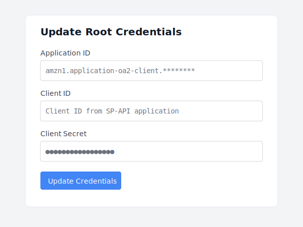
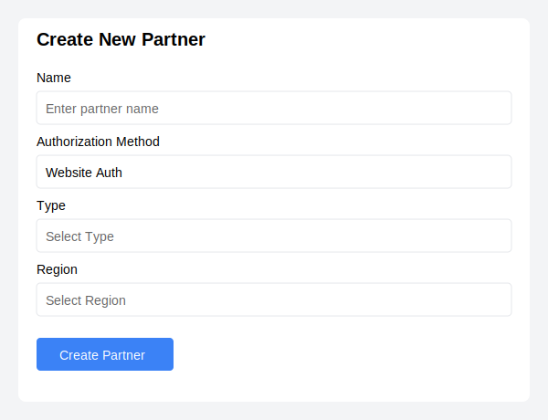
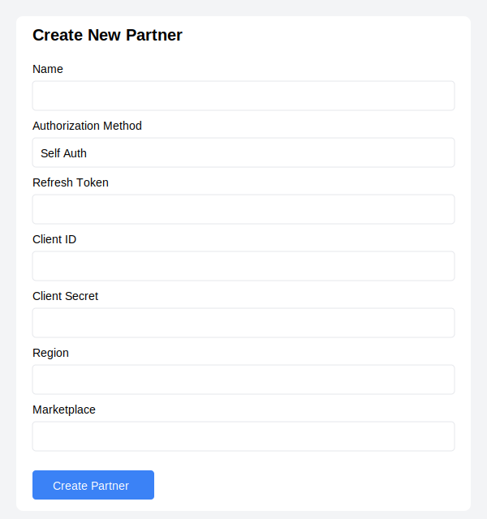
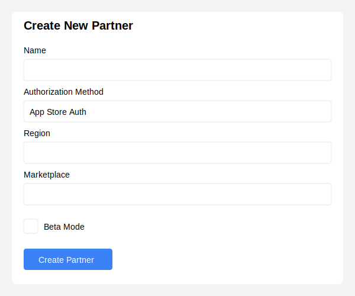
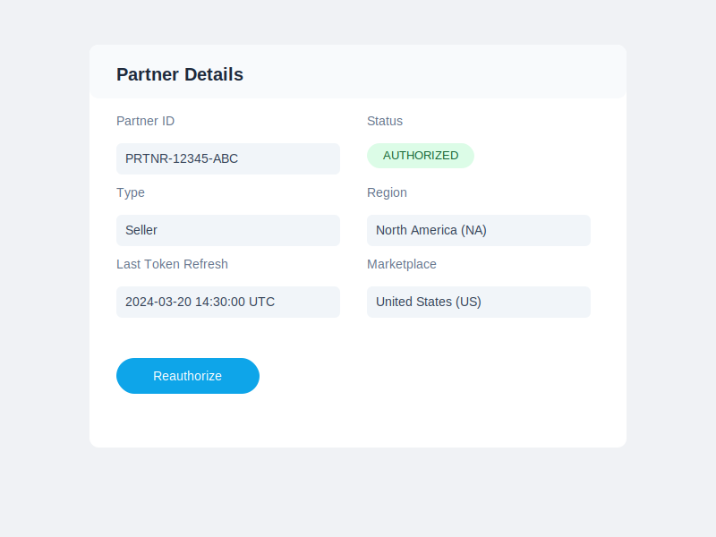
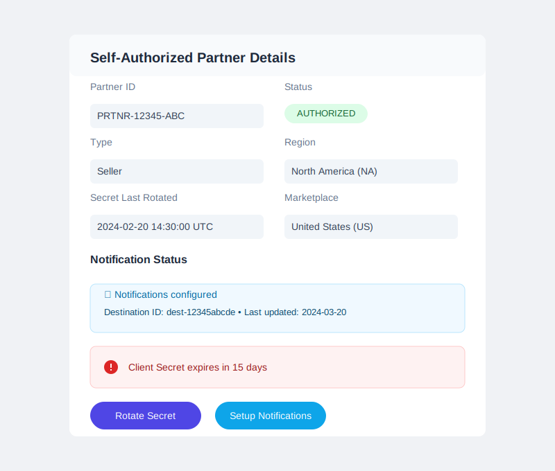
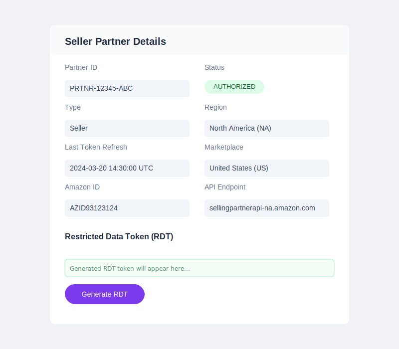
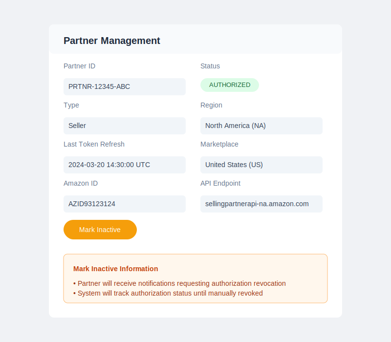

# Sample Application for Lifecycle management of SP-API Authorization

## Table of Contents

1. [Introduction](#introduction)
2. [Features](#features)
3. [Quick Start](#quick-start)
   - [Prerequisites](#prerequisites)
   - [Installation](#installation)
   - [Configuration](#configuration)
   - [Deployment](#deployment)

4. [Setting Up Root Credentials for SP-API Partner Management](#setting-up-root-credentials-for-sp-api-partner-management)
   - [Prerequisites](#prerequisites-1)
   - [Initial Setup](#initial-setup)

5. [Creating SP-API Partners: Understanding Authorization Methods](#creating-sp-api-partners-understanding-authorization-methods)
   - [Website Auth (OAuth Direct)](#website-auth-oauth-direct)
   - [Self Auth](#self-auth)
   - [App Store Auth](#app-store-auth)
   - [Operation Matrix of Lifecycle Management](#operation-matrix-of-lifecycle-management)

6. [Reauthorize](#reauthorize)
   - [The Reauthorization Flow](#the-reauthorization-flow)
   - [Security Considerations](#security-considerations)
   - [Partner Experience](#partner-experience)
   - [Behind the Scenes](#behind-the-scenes)

7. [Client Secret Rotation and Notifications Guide](#client-secret-rotation-and-notifications-guide)
   - [Understanding Secret Rotation](#understanding-secret-rotation)
   - [The Rotation Process](#the-rotation-process)
   - [Setting Up Notifications](#setting-up-notifications)
   - [Handling New Secret from SQS Queue](#handling-new-secret-from-sqs-queue)

8. [Restricted Data Tokens (RDT)](#restricted-data-tokens-rdt)
   - [Behind "Generate RDT"](#behind-generate-rdt)
   - [Backend Processing](#backend-processing)

9. [Revoke Authorization](#revoke-authorization)
   - [The Challenge of Authorization Management](#the-challenge-of-authorization-management)
   - [How It Works](#how-it-works)
   - [Key Features](#key-features)
   - [Implementation Best Practices](#implementation-best-practices)

A comprehensive sample application for managing Amazon Selling Partner API authorizations, including OAuth flows, App Store integrations, credential management and authorization revocation.

## Features

- Public App Client configuration
- Multiple authorization methods support:
  - Website Auth Authorization
  - App Store Authorization
  - Self Authorization
- Client Secret rotation and management
- Partner Authorization status tracking
- Restricted Data Token (RDT) generation
- Authorization Revocation

## Quick Start

### Prerequisites

- Node.js (v14 or later)
- AWS CLI configured with appropriate credentials
- AWS CDK CLI installed (`npm install -g aws-cdk`)


### Installation

1. Clone the repository:
```bash
git clone [repository-url]
cd [project-directory]
```

2. Install dependencies:
```bash
npm install
```

3. Install Lambda function dependencies:
```bash
cd lambda
npm install
cd ..
```

### Configuration

Configure AWS credentials:
```bash
aws configure
```

### Deployment

Deploy the stack using the provided script:
```bash
npm run deploy
```

Or deploy to a specific instance:
```bash
npm run deploy [instance-name]
```


## Setting Up Root Credentials for SP-API Partner Management

The first step in managing SP-API integrations is setting up your root credentials. These credentials are essential for handling OAuth flows and managing partner authorizations. Here's how to initialize the application with your SP-API credentials.

### Prerequisites

Before starting, ensure you have:
- An Amazon Seller Central or Vendor Central developer account
- An approved SP-API application with:
  - Application ID
  - Client ID
  - Client Secret

### 1. Initial Setup

The application uses AWS Secrets Manager to securely store your root credentials. When you first access the application, you'll see the "SP-API Partner Management" interface with a "Update Root Credentials" section at the top:




## Creating SP-API Partners: Understanding Authorization Methods

When integrating with Amazon's Selling Partner API (SP-API), you have three distinct methods for authorizing access. Let's explore each method and its setup process.

### 1. Website Auth (OAuth Direct)



The Website Auth method is ideal for applications that need to connect with multiple sellers through a web interface. This flow follows the standard OAuth authorization process.

#### Setup Process:
1. Enter a descriptive name for the partner integration
2. Select "Website Auth" as the Authorization Method
3. Choose the partner type:
   - Seller: For Seller Central integrations
   - Vendor: For Vendor Central integrations
4. Select the appropriate Region and Marketplace
5. Click "Create Partner"

After creation, you'll be redirected to the Amazon authorization page where the seller/vendor can grant access to your application.


### 2. Self Auth




Self Auth is designed for developers who already have their SP-API credentials and want direct integration without the OAuth flow.

#### Setup Process:
1. Enter a partner name
2. Select "Self Auth" as the Authorization Method
3. Provide your SP-API credentials:
   - Refresh Token: Your long-lived token for API access
   - Client ID: Your application's client identifier
   - Client Secret: Your application's secret key
4. Select Region and Marketplace
5. Click "Create Partner"

The connection is established immediately using the provided credentials.


### 3. App Store Auth



App Store Auth is specifically for applications listed in the Amazon Marketplace Appstore, providing a streamlined authorization process for sellers.

#### Setup Process:
1. Enter the partner name
2. Select "App Store Auth" as the Authorization Method
3. Choose Region and Marketplace
4. Optional: Enable Beta Mode for testing
5. Click "Create Partner"

This method integrates with Amazon's Appstore workflow, handling the OAuth process through the Appstore interface.


### Operation Matrix of Lifecycle Mangement

| Operation                 | Website Auth | Self Auth (App Client) | App Store Auth |
|--------------------------|---------------------|------------|----------------|
| Initialize OAuth         | ✅                  | ❌         | ✅             | 
| Set App Client Credentials         | ❌                  |      ✅     | ❌         | 
| Refresh token           | ✅                  | ✅ Manual         | ✅             | 
| Rotate client secret    | ❌                  | ✅         | ❌             | 
| Generate RDT tokens     | ✅                  | ✅         | ✅             | 
| Authorization Revocation| ✅            | ✅   | ✅         | 


# Reauthorize

When managing Amazon SP-API integrations, maintaining valid authorization is crucial for uninterrupted service. Today, let's explore what happens behind the scenes when clicking that "Reauthorize" button in your partner management dashboard.

## The Reauthorization Flow



### 1. Initiating the Process
When a user clicks the "Reauthorize" button, several important steps kick off simultaneously:

```javascript
async function initializeAuth(partnerId) {
  try {
    const response = await fetch(`${API_ENDPOINT}/partners/${partnerId}/oauth/init`, {
      method: 'POST'
    });
    const data = await response.json();
    window.location.href = data.authorizationUrl;
  } catch (error) {
    console.error('Authorization failed:', error);
  }
}
```

### 2. Backend State Management
The backend system:
- Generates a secure state token
- Records the current authorization state
- Stores the existing refresh token for backup
- Prepares the redirect URL for Amazon's OAuth consent page

### 3. Seller/Vendor Central Redirection
The partner is redirected to either Seller Central or Vendor Central (depending on their type) with specific parameters:
```
https://{sellercentral-domain}/apps/authorize/consent?
  application_id={your-app-id}
  &state={secure-state-token}
  &version=beta
```

## Security Considerations

During reauthorization, several security measures are in place:

1. **State Validation**: Prevents CSRF attacks by validating the state parameter
2. **Token History**: Previous tokens are archived for audit purposes
3. **Concurrent Request Handling**: Prevents multiple simultaneous reauthorization attempts

## Partner Experience

From the partner's perspective, the process is straightforward:

1. Click "Reauthorize" in the dashboard
2. Log into their Amazon account (if not already logged in)
3. Review and confirm the permission scope
4. Get automatically redirected back to the dashboard

## Behind the Scenes

Here's what happens in the background:

```javascript
// Backend code handling the callback
async function handleReauthorizationCallback(params, stateData) {
  const { spapi_oauth_code, state } = params;
  
  // Verify the state matches our records
  if (!await verifyState(state)) {
    throw new Error('Invalid state token');
  }
  
  // Exchange the code for new tokens
  const tokens = await exchangeAuthorizationCode(spapi_oauth_code);
  
  // Store token history
  await storeTokenHistory(
    stateData.partnerId,
    stateData.previousRefreshToken,
    tokens.refresh_token,
    'reauthorization'
  );
  
  // Update partner with new tokens
  await updatePartnerTokens(stateData.partnerId, tokens);
  
  return {
    status: 'AUTHORIZED',
    message: 'Reauthorization successful'
  };
}
```


# Client Secret Rotation and Notifications Guide

## Understanding Secret Rotation




When you click the "Rotate Secret" button, it triggers Amazon's Application Management API (v2023-11-30) to initiate a credential rotation process:

```javascript
async function rotateSecret(partnerId) {
    try {
        // Call SP-API endpoint with required scope
        const response = await fetch(`${SP_API_ENDPOINT}/applications/2023-11-30/clientSecret`, {
            method: 'POST',
            headers: {
                'x-amz-access-token': accessToken
            }
        });

        if (response.status === 204) {
            showSuccess("Secret rotation initiated - check SQS for new credentials");
        }
    } catch (error) {
        handleError("Secret rotation failed", error);
    }
}
```

### The Rotation Process

1. **Initiation**
   - System sends request to SP-API endpoint
   - Returns 204 status on success
   - No response body returned

2. **New Secret Delivery**
   You'll receive a notification in your SQS queue:
   ```json
   {
     "notificationType": "APPLICATION_OAUTH_CLIENT_NEW_SECRET",
     "payload": {
       "applicationOAuthClientNewSecret": {
         "clientId": "amzn1.application-oa2-client.xxx",
         "newClientSecret": "amzn1.oa2-cs.v1.xxx",
         "newClientSecretExpiryTime": "2024-07-08T22:09:17.198Z",
         "oldClientSecretExpiryTime": "2024-01-17T22:09:17.180Z"
       }
     }
   }
   ```

3. **Transition Period**
   - Old secret remains valid for 7 days
   - Must update application before old secret expires

## Setting Up Notifications

The "Setup Notifications" button configures your SQS queue for credential-related notifications:

### Prerequisites
1. Amazon SQS queue must be created
2. Proper permissions granted to SP-API (Principal: 437568002678)
3. Queue ARN registered in Developer Console

**IMPORTANT:** Before initiating secret rotation, you must manually subscribe to notifications in the Developer Portal. There is no API available for subscription setup for rotating client secret.

### Notification Types You'll Receive

1. **Secret Expiry Warnings**
   ```json
   {
     "notificationType": "APPLICATION_OAUTH_CLIENT_SECRET_EXPIRY",
     "payload": {
       "applicationOAuthClientSecretExpiry": {
         "clientId": "amzn1.application-oa2-client.xxx",
         "clientSecretExpiryTime": "2024-03-03T22:06:39.224Z",
         "clientSecretExpiryReason": "PERIODIC_ROTATION"
       }
     }
   }
   ```

2. **New Secret Notifications**
   - Delivered after successful rotation
   - Contains new and old secret expiry times
   - Includes new client secret


### Handling New Secret from SQS Queue

When a new secret is delivered to your SQS queue, here's how to handle it securely:

```javascript
async function handleNewSecretNotification(sqsMessage) {
    try {
        const notification = JSON.parse(sqsMessage.Body);
        
        // Verify it's a new secret notification
        if (notification.notificationType !== 'APPLICATION_OAUTH_CLIENT_NEW_SECRET') {
            return;
        }

        const {
            clientId,
            newClientSecret,
            newClientSecretExpiryTime,
            oldClientSecretExpiryTime
        } = notification.payload.applicationOAuthClientNewSecret;

        // 1. Store new secret securely
        await storeNewSecret({
            clientId,
            secret: newClientSecret,
            expiryTime: newClientSecretExpiryTime
        });

        // 2. Configure transition period
        await configureSecretTransition({
            oldExpiryTime: oldClientSecretExpiryTime,
            newSecret: newClientSecret
        });

        // 3. Validate new secret works
        await validateNewSecret(clientId, newClientSecret);

    } catch (error) {
        handleSecretUpdateError(error);
    }
}
```


# Restricted Data Tokens (RDT)

## Behind "Generate RDT"




When a developer or system administrator clicks the "Generate RDT" button in their partner management interface, a cascade of processes kicks off behind the scenes. Let's break it down step by step:

### 1. Initiating the Request

```javascript
async function generateRDT(partnerId, resource) {
  try {
    const response = await fetch(`${API_ENDPOINT}/partners/${partnerId}/tokens/rdt`, {
      method: 'POST',
      headers: {
        'Content-Type': 'application/json'
      },
      body: JSON.stringify({
        restrictedResources: [{
          method: 'GET',
          path: '/orders/v0/orders'  // Example for Orders API
        }]
      })
    });
    const data = await response.json();
    displayRDTToken(data.restrictedDataToken);
  } catch (error) {
    console.error('RDT generation failed:', error);
  }
}
```

This function sends a request to our backend service, specifying the partner ID and the desired API resource.

### 2. Backend Processing

On the server side, several critical steps occur:

1. **Partner Validation**: The system verifies that the partner is authorized and in good standing.
2. **Access Token Refresh**: If necessary, the system refreshes the partner's access token.
3. **SP-API Interaction**: A request is made to Amazon's SP-API to generate the RDT.

```javascript
async function generateRDTToken(partnerId, resources) {
  const partner = await getPartnerDetails(partnerId);
  const accessToken = await refreshAccessTokenIfNeeded(partner);
  
  const response = await axios.post(
    `${partner.apiEndpoint}/tokens/2021-03-01/restrictedDataToken`,
    { restrictedResources: resources },
    {
      headers: {
        'x-amz-access-token': accessToken,
        'Content-Type': 'application/json'
      }
    }
  );
  
  return response.data;
}
```

# Revoke Authorization

## The Challenge of Authorization Management

When building integrations with Amazon's Selling Partner API, one common challenge is maintaining clean and active authorization states. Partners may stop using your integration, but their authorizations remain active, potentially causing:

- Unnecessary API quota consumption
- Security risks from unused but active authorizations
- Difficulty tracking actually active integrations

## Introducing Mark Inactive

To address these challenges, we've implemented a comprehensive authorization lifecycle management system, with the Mark Inactive feature at its core.



### How It Works

1. **Identifying Inactive Partners**
When you notice a partner hasn't been actively using your integration, you can mark them as inactive through our dashboard:

```javascript
// Example API call to mark a partner inactive
await fetch(`${API_ENDPOINT}/partners/${partnerId}/status`, {
    method: 'PUT',
    body: JSON.stringify({ status: 'inactive' })
});
```

2. **Automated Communication**
Once marked inactive, the system:
- Sends notifications to the partner through Amazon's App Integration API
- Notifies them about the unused authorization
- Provides clear steps for authorization revocation

3. **Status Tracking**
The system maintains detailed status tracking:
```json
{
    "partnerId": "PRTNR-12345-ABC",
    "status": "MARKED_INACTIVE",
    "markedInactiveAt": "2025-03-24T10:30:00Z",
    "lastReminderSent": "2025-03-24T10:30:00Z"
}
```

### Key Features

- **Automated Reminders**: The system periodically sends reminders to partners who haven't revoked their authorization
- **Status History**: Track the complete lifecycle of partner authorizations
- **Compliance**: Helps maintain compliance with Amazon's best practices for SP-API integration
- **Clean Management**: Clear separation between active and inactive integrations

## Implementation Best Practices

### 1. When to Mark as Inactive

Consider marking a partner as inactive when:
- No API calls for an extended period (e.g., 90 days)
- Partner has communicated they're no longer using the integration
- Failed authorization refresh attempts

### 2. Monitoring and Tracking

```javascript
// Example status check
const partnerStatus = await checkPartnerStatus(partnerId);
if (partnerStatus.daysSinceLastActivity > 90) {
    await sendInactiveWarning(partnerId);
}
```

### 3. Handling Revocation

When a partner revokes their authorization:
```javascript
// System automatically updates status
{
    "status": "AUTHORIZATION_REVOKED",
    "authorizationRevokedAt": "2025-03-24T15:45:00Z",
    "previousStatus": "MARKED_INACTIVE"
}
```


