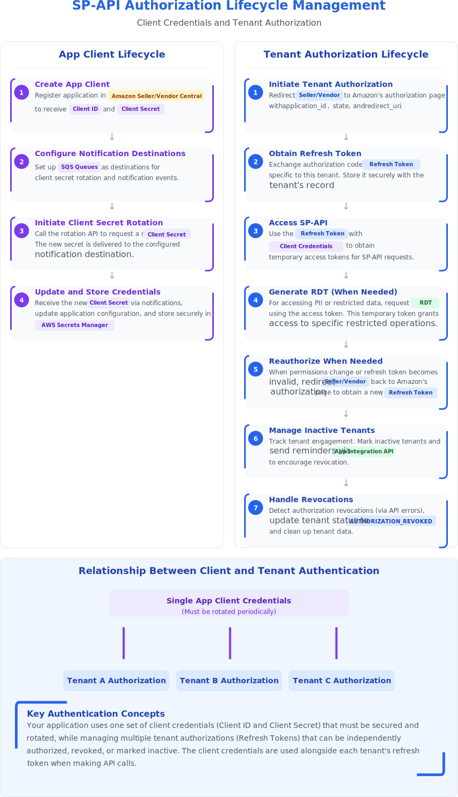
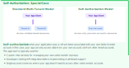
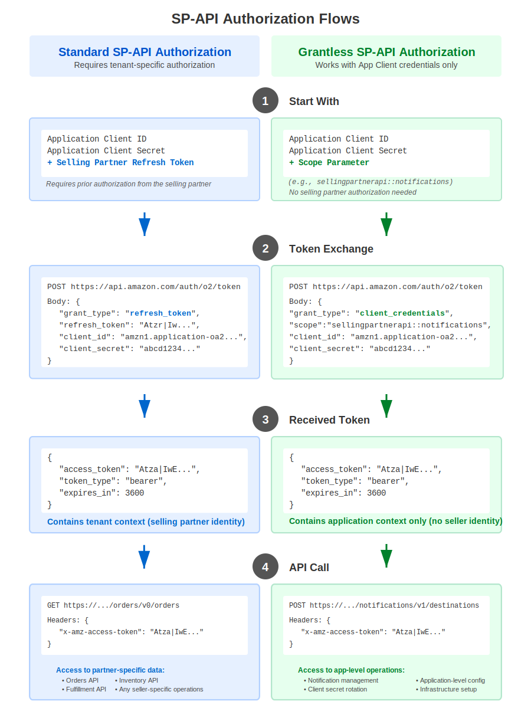
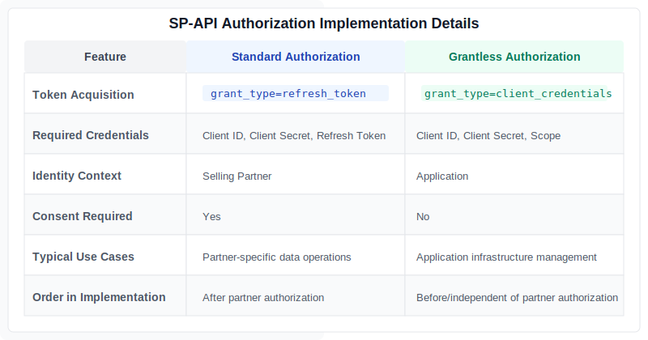
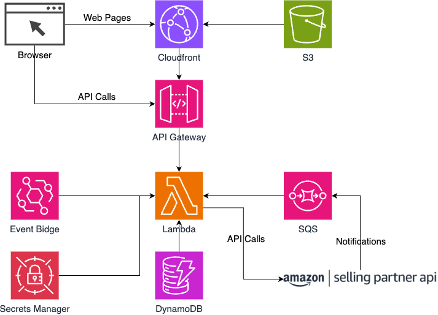

# SP-API Authorization Lifecycle Management

## Introduction


Managing authorization for Amazon's Selling Partner API (SP-API) presents unique challenges for developers and organizations building SP-API integrations. With multiple authorization flows, credential rotation requirements, and security considerations, implementing a robust authorization lifecycle management system is crucial for maintaining reliable API access.

This comprehensive guide explores the various aspects of SP-API authorization lifecycle management, from initial setup to ongoing maintenance. Whether you're building a multi-tenant application serving thousands of sellers, developing internal tools for your own seller account, or implementing SP-API integrations for enterprise clients, understanding these authorization patterns is essential for success.


## Key Topics Covered:


* Authorization architectures and patterns
* Multiple authorization flows (Self-Auth, Website, and App Store)
* Credential management and rotation
* Security best practices and compliance requirements
* Serverless implementation approaches
* Monitoring and maintenance strategies

Throughout this article, we'll examine both theoretical concepts and practical implementations, providing you with actionable insights for building resilient SP-API integrations. We'll also explore real-world scenarios and common challenges, equipping you with the knowledge to handle various authorization scenarios effectively.

While SP-API documentation covers individual authorization components, this guide focuses on the complete lifecycle management perspective, helping you design and implement a comprehensive authorization strategy that scales with your business needs.


## Understanding SP-API Authorization Architecture

The SP-API integration architecture manages two distinct but interconnected authorization lifecycles:

### App Client Lifecycle:

* Maintains a single set of client credentials (Client ID and Secret)
* Requires periodic client secret rotation for security compliance
* Configures SQS notification destinations for client secret management
* Stores updated client secret securely in AWS Secrets Manager

### Tenant Authorization Lifecycle:

* Handles multiple independent seller/vendor authorizations
* Obtains and manages refresh tokens for each connected partner
* Generates standard access tokens for regular API operations
* Creates specialized Restricted Data Tokens (RDTs) when accessing PII
* Supports reauthorization when permissions change
* Manages inactive authorizations with timely reminders
* Processes authorization revocations efficiently

```  
Tenant: A seller or vendor who authorizes a public developer to access the Selling Partner API (SP-API) on their behalf.
Each tenant represents an independent business entity that grants permission for the application to interact with their
Amazon selling account data.
```


These two lifecycles operate in tandem to ensure security compliance while facilitating reliable API access for connected selling partners. Each API request combines the application's client credentials with tenant-specific tokens to authenticate properly with Amazon SP-API.




## Self-Authorization: A Special Case in SP-API Authorization

### What is Self-Authorization?

Self-authorization is a distinct approach to SP-API authorization where your application uses credentials associated with your own Amazon Seller or Vendor account. Unlike the standard multi-tenant model, self-authorization establishes a direct connection between your application and your own account, bypassing the typical OAuth flows used for third-party authorization.




### Key Characteristics

* Direct Access: Your application directly accesses only your own seller/vendor account resources
* Simplified Flow: No need for OAuth redirects or authorization from external users
* Self-Generated Credentials: Credentials are created within your own Seller/Vendor Central account
* Limited Scope: Can only access data from your own account, not from other sellers or vendors

### Common Use Cases

* Building custom internal tools for managing your own Amazon selling business
* Development and testing environment before implementing full multi-tenant support
* Single-account applications where accessing multiple seller accounts isn't required

### Implementation Considerations

While self-authorization simplifies certain aspects of SP-API integration, it still requires proper credential management. Your application must securely store its refresh token, client ID, and client secret. Client secret rotation policies still apply, ensuring your long-term security and compliance with Amazon's requirements.


## Grantless Operations: Bridging App Client and Tenant Authorization

### What Are Grantless Operations?

Grantless operations represent a specialized subset of SP-API endpoints that operate purely within the App Client Lifecycle, requiring no tenant-specific authorization. These operations can be executed using only your application's credentials (Client ID and Client Secret), without needing refresh tokens from any selling partner.
This creates a critical third authorization pattern that bridges your application's infrastructure management and tenant-specific operations.

### Where Grantless Operations Fit in SP-API Authorization Architecture

Your SP-API integration manages two authorization lifecycles, with grantless operations fitting distinctly within this structure:
App Client Lifecycle:

* Maintains application credentials
* Handles client secret rotation (grantless)
* Sets up notification infrastructure (grantless)
* Configures destinations for system events
* Operates independently of tenant authorizations

### Tenant Authorization Lifecycle:

* Manages partner-specific refresh tokens
* Generates access tokens for API operations
* Requires explicit selling partner authorization
* Cannot use grantless authorization

### Authorization Differences






The key difference is replacing the seller-specific refresh token with a predefined scope value. This distinction makes grantless operations completely independent from any tenant authorization process.

### Strategic Application in Your Integration

Grantless operations provide critical infrastructure capabilities that should be implemented in your initial application setup:

1. Notification Management: Establish notification endpoints before any tenant authorization

    * Create destinations for receiving credential rotation events
    * Set up infrastructure to handle client secret updates

1. Credential Management: Handle application-level security independently

    * Rotate client secrets when necessary
    * Process credential updates without dependency on tenant authorizations

### Implementation Within Your Current Architecture

To properly incorporate grantless operations:

1. Update your authorization service to support both scope-based and refresh-based token acquisition
2. Implement notification infrastructure using grantless operations as part of your initial app setup
3. Use grantless credential rotation endpoints to maintain your client secret lifecycle
4. Create clear separation between app-level operations and tenant-specific functionality

By properly positioning grantless operations within your authorization architecture, you create a more resilient SP-API integration that clearly separates application infrastructure concerns from tenant-specific authorization management.


## From Authorization Patterns to Implementation


While understanding the various SP-API authorization patterns is crucial, implementing them in a scalable, maintainable way presents its own set of challenges. A serverless architecture offers an ideal approach for managing these complex authorization workflows, providing the flexibility and scalability needed for handling varying loads of API integrations. By leveraging AWS's managed services, we can build a robust system that handles everything from initial authorization to credential rotation, while minimizing operational overhead. Let's explore how different AWS services work together to create a comprehensive SP-API authorization management solution.


### Architecture Overview




The SP-API Authorization Lifecycle Management solution implements a serverless architecture on AWS designed specifically for handling Amazon Selling Partner API integrations. The infrastructure consists of several interconnected AWS services, each fulfilling a distinct role in the authorization lifecycle.

### Core Components

* Content Delivery: Amazon S3 stores the static frontend assets, while CloudFront distributes this content globally with low latency and HTTPS security.
* API Processing: API Gateway provides RESTful endpoints that trigger Lambda functions, which contain all the business logic for authorization flows and partner management.
* Data Persistence: DynamoDB tables store partner information, OAuth state tokens, and authorization history with automatic scaling and consistent performance.
* Security Management: Secrets Manager securely stores and manages API credentials, while SQS queues receive and process notifications about credential changes from Amazon.
* Event Processing: SQS queues handle asynchronous message processing for notifications, while EventBridge schedules and triggers periodic tasks like reminder notifications.

### Authorization Lifecycle Management

This architecture supports the complete SP-API authorization journey:

1. Initial Authorization: Managing OAuth flows and token exchange with Amazon's Selling Partner API
2. Token Management: Securely storing and refreshing access tokens
3. Status Monitoring: Tracking partner authorization status and activity levels
4. Credential Rotation: Handling the secure rotation of client secrets
5. Revocation Management: Sending reminders for inactive integrations and managing the revocation process

The event-driven design enables the system to respond to both user actions and Amazon SP-API notifications, creating a resilient and responsive solution that maintains proper security practices throughout the entire authorization lifecycle.
By eliminating server management and leveraging managed AWS services, this solution provides a scalable, secure foundation for SP-API integration that can accommodate anywhere from a few partners to enterprise-scale deployments.


After reviewing your project files and the blog post, I'll create a suitable ending that wraps up the key points while providing actionable next steps for readers interested in SP-API authorization lifecycle management.

## Conclusion: Building a Sustainable SP-API Integration Strategy

Implementing robust authorization lifecycle management for SP-API is essential for any organization building Amazon SP-API integrations. Throughout this guide, we've explored the various authorization patterns, security considerations, and implementation approaches that form the foundation of a reliable SP-API integration.

### Key Takeaways

1. **Separation of Concerns**: Understanding the distinction between app client lifecycle and tenant authorization lifecycle creates clearer architecture and more maintainable code.

2. **Multiple Authorization Flows**: Supporting self-authorization, OAuth website flow, and App Store integration provides flexibility to meet diverse business requirements.

3. **Serverless Architecture Benefits**: By leveraging AWS services like Lambda, DynamoDB, API Gateway, and SQS, you can build a scalable, resilient system that handles the complex authorization workflows with minimal operational overhead.

4. **Security and Compliance**: Proper credential rotation, token management, and notification handling ensure your integration remains secure and compliant with Amazon's requirements.

5. **Lifecycle Monitoring**: Implementing status tracking, revocation management, and inactivity reminders helps maintain the health of your integrations over time.

### Getting Started

The sample implementation provided in this repository offers a starting point for building your own SP-API authorization management system. By deploying the CDK stack, you'll have a functional foundation that handles:

- Partner registration and management
- OAuth flow implementation for all authorization types
- Secure storage of credentials and tokens
- Client secret rotation via SQS notifications
- Test connectivity for both seller and vendor accounts
- Status management with inactivity tracking and reminders


By taking a comprehensive approach to SP-API authorization lifecycle management, you'll build more reliable, secure, and scalable SP-API integrations that can grow with your business needs. Whether you're supporting a handful of accounts or thousands of partners, the foundation principles and serverless architecture described in this guide provide a path to successful SP-API integration.

We hope this guide helps you navigate the complexities of SP-API authorization and build integration solutions that deliver long-term value for your organization and your customers.
