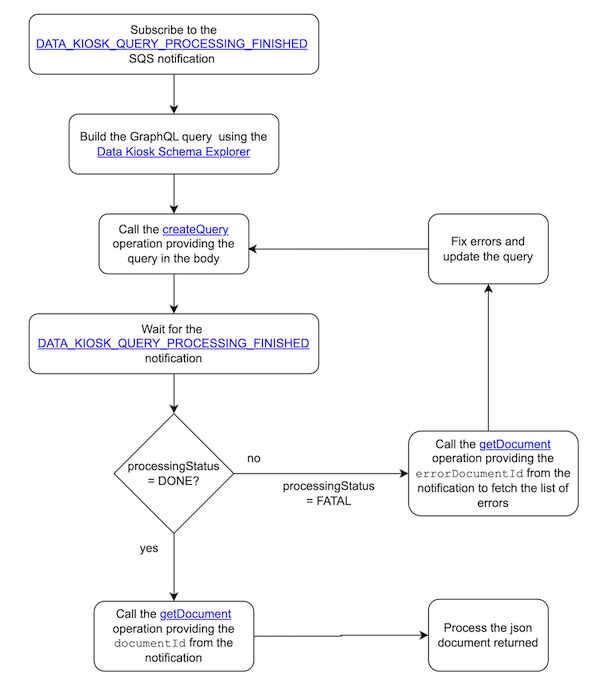

## Data Kiosk API
The Selling Partner API for Data Kiosk helps you programmatically submit GraphQL queries from a variety of schemas to help selling partners manage their businesses.

If you haven't already, we recommend you to navigate the following resources:
* [Data Kiosk API v2023-11-15 reference](https://developer-docs.amazon.com/sp-api/v0/docs/data-kiosk-api-v2023-11-15-reference)
* [Data Kiosk Use Case Guide](https://developer-docs.amazon.com/sp-api/v0/docs/data-kiosk-api-v2023-11-15-use-case-guide)
* [Building Data Kiosk workflows guide](https://developer-docs.amazon.com/sp-api/docs/data-kiosk-workflow-guide)
* [Data Kiosk API FAQ](https://developer-docs.amazon.com/sp-api/docs/data-kiosk-faq)

## Sample Solution
The Data Kiosk Sample Solution App provides all required resources to deploy to the AWS cloud a fully functional SP-API application that implements the Data Kiosk use case end-to-end.  
If you want to test the proposed solution, do changes and/or integrate it to your own product, follow the steps under [Deployment Guide](docs/DEPLOYMENT.md).

## Workflow
A well-architected Data Kiosk workflow includes subscribing to the `DATA_KIOSK_QUERY_PROCESSING_FINISHED` notification for automatic reception of query results.  
The query submission workflow starts by constructing a GraphQL query using the [Data Kiosk Schema Explorer](https://sellercentral.amazon.com/datakiosk-schema-explorer?schema=analytics_salesAndTraffic_2023_11_15) and sending it to the Selling Partner API via the `createQuery` operation.  
After a notification is received, the result status is verified to confirm a successful or failed processing. The `getDocument` operation is invoked to retrieve the query result document url, which is then used to obtain the query document.



## Sample Code
Below you can find sample code for the most relevant Data Kiosk operations:
* [Create Data Kiosk query](#create-data-kiosk-query)
* [Retrieve document details](#retrieve-document-details)
* [Cancel active query](#cancel-active-query)

### Create Data Kiosk query
How to create queries that were formed in the [Data Kiosk Schema Explorer](https://sellercentral.amazon.com/datakiosk-schema-explorer?schema=analytics_salesAndTraffic_2023_11_15)

#### Python:
*Find the full code [here](https://github.com/amzn/selling-partner-api-samples/blob/main/use-cases/data-kiosk/code/python/src/create_query_handler.py)*
```python
api_utils = ApiUtils(refresh_token, region_code, constants.DATA_KIOSK_API_TYPE)

body = {
    "query": query_code
}

create_query_result = api_utils.call_datakiosk_api('create_query', body=body)

logger.info(f"CreateQuery API Response: {create_query_result}")
```

#### Java:
*Find the full code [here](https://github.com/amzn/selling-partner-api-samples/blob/main/use-cases/data-kiosk/code/java/src/main/java/lambda/CreateQueryHandler.java)*
```java
QueriesApi dataKioskApi = ApiUtils.getDataKioskApi(regionCode, refreshToken);

CreateQuerySpecification request = new CreateQuerySpecification();
request.setQuery(queryCode);

CreateQueryResponse response = dataKioskApi.createQuery(request);
logger.log(String.format("CreateQuery API response: %s", new Gson().toJson(response)));
```

#### Step-by-step:
1. **Set up the API client:** Initialize the Data Kiosk API client by providing the refresh token and region code.
2. **Build the createQuery body:** Build the `createQuery` request payload using the query string code extracted from the input payload.
3. **Call the createQuery operation:** Call the `createQuery` operation passing the query string code in the request.
4. **Inspect the response:** Inspect the response returned by the `createQuery` operation. The response should include a query ID.

### Retrieve document details
How to retrieve processes document details that include the document URL and the document ID

#### Python:
*Find the full code [here](https://github.com/amzn/selling-partner-api-samples/blob/main/use-cases/data-kiosk/code/python/src/get_document_handler.py)*
```python
api_utils = ApiUtils(refresh_token, region_code, constants.DATA_KIOSK_API_TYPE)

get_document_response = api_utils.call_datakiosk_api(method='get_document',
                                                     document_id=dk_lambda_input.document.documentId)

logger.info(f"Data Kiosk API Response: {get_document_response}")

issues_str = "" if get_document_response else (f"DOCUMENT IS EMPTY, "
                                               f"NO DATA IS AVAILABLE FOR THE GIVEN TIME RANGE")
```

#### Java
*Find the full code [here](https://github.com/amzn/selling-partner-api-samples/blob/main/use-cases/data-kiosk/code/java/src/main/java/lambda/GetDocumentHandler.java)*
```java
QueriesApi dataKioskApi = ApiUtils.getDataKioskApi(regionCode, refreshToken);

GetDocumentResponse response = dataKioskApi.getDocument(input.getDocument().getDocumentId());
logger.log("Data Kiosk API Response: " + new Gson().toJson(response));

if (response  != null) {
    return Document.builder()
            .documentId(response.getDocumentId())
            .documentUrl(response.getDocumentUrl())
            .build();
} else {
    return Document.builder()
            .issues("DOCUMENT IS EMPTY, NO DATA IS AVAILABLE FOR THE GIVEN TIME RANGE")
            .build();
}
```

#### Step-by-step:
1. **Set up the API client:** Initialize the Data Kiosk API client by providing the refresh token and region code.
2. **Call the getDocument operation:** Call the `getDocument` operation, passing the document ID in the request.
3. **Inspect the response:** Inspect the response returned by `getDocument`. The response should include a document ID and document URL.
4. **Address empty documents:** Log a message for when no document data is returned by `getDocument`. In this case, it means that no data is available for the specified range.

### Cancel active query
How to cancel queries that are in processing status

#### Python:
*Find the full code [here](https://github.com/amzn/selling-partner-api-samples/blob/main/use-cases/data-kiosk/code/python/src/cancel_query_handler.py)*
```python
api_utils = ApiUtils(refresh_token, region_code, constants.DATA_KIOSK_API_TYPE)

api_utils.call_datakiosk_api('cancel_query', query_id=query_id)
```

#### Java
*Find the full code [here](https://github.com/amzn/selling-partner-api-samples/blob/main/use-cases/data-kiosk/code/java/src/main/java/lambda/CancelQueryHandler.java)*
```java
QueriesApi dataKioskApi = ApiUtils.getDataKioskApi(regionCode, refreshToken);

dataKioskApi.cancelQuery(queryId);
```

#### Step-by-step:
1. **Set up the API client:** Initialize the Data Kiosk API client by providing the refresh token and region code.
2. **Call the cancelQuery operation:** Call the `cancelQuery` operation using the query ID extracted from the input payload.