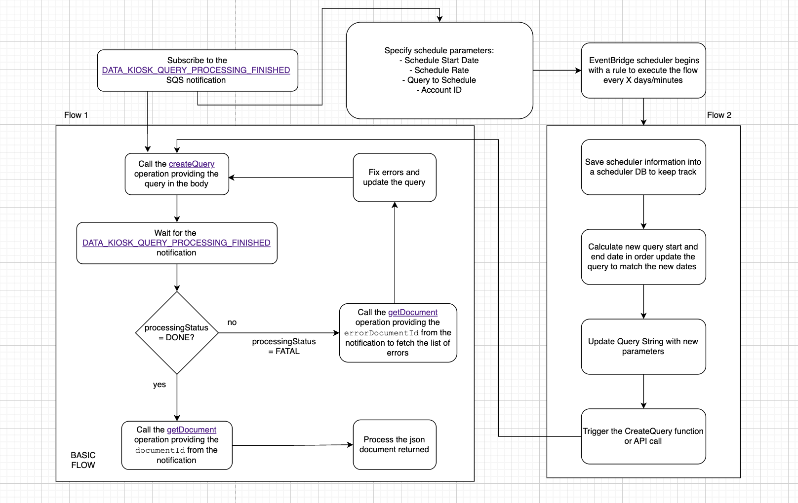
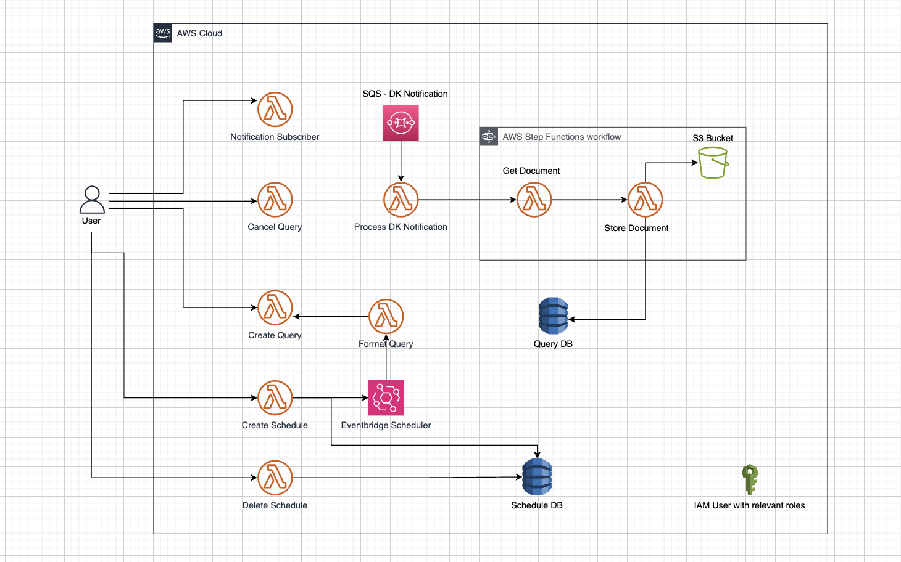

## Data Kiosk API

The Selling Partner API for Data Kiosk lets you submit GraphQL queries from a variety of schemas to help selling partners manage their businesses.

If you haven't already, we recommend you to navigate the following resources:
* [Data Kiosk API v2023-11-15 Reference](https://developer-docs.amazon.com/sp-api/docs/data-kiosk-api-v2023-11-15-reference)
* [Data Kiosk Use Case Guide](https://developer-docs.amazon.com/sp-api/docs/data-kiosk-api-v2023-11-15-use-case-guide)
* [Building Data Kiosk workflows guide](https://developer-docs.amazon.com/sp-api/docs/data-kiosk-workflow-guide)
* [Data Kiosk Schema Explorer User Guide](https://developer-docs.amazon.com/sp-api/docs/schema-explorer-guide)


## Solution
This Sample Solution implements the following data kiosk operations:
* [Create Data Kiosk Query](#create-data-kiosk-query)
* [Retrieve Document Details](#retrieve-document-details)
* [Cancel Data Kiosk Query](#cancel-data-kiosk-query)
* [Scheduling Data Kiosk Queries](#scheduling-data-kiosk-queries)

If you want to test the proposed solution, do changes and/or integrate it to your own product, follow the steps under [Deployment Guide](docs/DEPLOYMENT.md).

## Create Data Kiosk Query
To fetch Data Kiosk data, formulate queries in the Data Kiosk Schema Explorer, set up the API client, build the createQuery body with your query, and submit the request.

### Sample Code
Below you can find sample code for the create query operation.

#### Step-by-step:
1. **Set up the API client:** Initialize the Data Kiosk API client by providing the refresh token and region code.
2. **Build the request body:** Build the `createQuery` request payload using the query string code extracted from the input payload.
3. **Execute the call:** Call the createQuery operation passing the query string code in the request.


#### Python
*Find the full code [here](https://github.com/amzn/selling-partner-api-samples/blob/main/use-cases/data-kiosk/code/python/src/create_query_handler.py)*

```python
api_utils = ApiUtils(refresh_token, region_code, constants.DATA_KIOSK_API_TYPE)

body = {
    "query": query_code
}

create_query_result = api_utils.call_datakiosk_api('create_query', body=body)

logger.info(f"CreateQuery API Response: {create_query_result}")
```

#### Java
*Find the full code [here](https://github.com/amzn/selling-partner-api-samples/blob/main/use-cases/data-kiosk/code/java/src/main/java/lambda/CreateQueryHandler.java)*

```java
QueriesApi dataKioskApi = ApiUtils.getDataKioskApi(regionCode, refreshToken);

CreateQuerySpecification request = new CreateQuerySpecification();
request.setQuery(queryCode);

CreateQueryResponse response = dataKioskApi.createQuery(request);
logger.log(String.format("CreateQuery API response: %s", new Gson().toJson(response)));
```

## Retrieve Document Details
How to retrieve processes document details that include the document URL and the document ID.

### Sample Code
Below you can find sample code for the get document operation.

#### Step-by-step:
1. **Set up the API client:** Initialize the Data Kiosk API client by providing the refresh token and region code.
2. **Execute the call:** Call the getDocument operation, passing the document ID in the request.
3. **Address empty documents:** Log a message for when no document data is returned by getDocument. In this case, it means that no data is available for the specified range.

#### Python
*Find the full code [here](https://github.com/amzn/selling-partner-api-samples/blob/main/use-cases/data-kiosk/code/python/src/get_document_handler.py)*

```python
api_utils = ApiUtils(refresh_token, region_code, constants.DATA_KIOSK_API_TYPE)

get_document_response = api_utils.call_datakiosk_api(method='get_document',
                                                     document_id=dk_lambda_input.document.documentId)

logger.info(f"Data Kiosk API Response: {get_document_response}")

issues_str = "" if get_document_response else (f"DOCUMENT IS EMPTY, "
                                               f"NO DATA IS AVAILABLE FOR THE GIVEN TIME RANGE")
```

#### Java
*Find the full code [here](https://github.com/amzn/selling-partner-api-samples/blob/main/use-cases/data-kiosk/code/java/src/main/java/lambda/GetDocumentHandler.java)*

```java
QueriesApi dataKioskApi = ApiUtils.getDataKioskApi(regionCode, refreshToken);

GetDocumentResponse response = dataKioskApi.getDocument(input.getDocument().getDocumentId());
logger.log("Data Kiosk API Response: " + new Gson().toJson(response));

if (response  != null) {
    return Document.builder()
            .documentId(response.getDocumentId())
            .documentUrl(response.getDocumentUrl())
            .build();
} else {
    return Document.builder()
            .issues("DOCUMENT IS EMPTY, NO DATA IS AVAILABLE FOR THE GIVEN TIME RANGE")
            .build();
}
```

## Cancel Data Kiosk Query
How to cancel queries that are in processing status. 

### Sample Code
Below you can find sample code for the cancel query operation.

#### Step-by-step:
1. **Set up the API client:** Initialize the Data Kiosk API client by providing refresh token and region code.
2. **Call the cancelQuery operation:** Call the cancelQuery operation using the query ID extracted from the input payload.

#### Python
*Find the full code [here](https://github.com/amzn/selling-partner-api-samples/blob/main/use-cases/data-kiosk/code/python/src/cancel_query_handler.py)*
```python
api_utils = ApiUtils(refresh_token, region_code, constants.DATA_KIOSK_API_TYPE)

api_utils.call_datakiosk_api('cancel_query', query_id=query_id)
```

#### Java
*Find the full code [here](https://github.com/amzn/selling-partner-api-samples/blob/main/use-cases/data-kiosk/code/java/src/main/java/lambda/CancelQueryHandler.java)*
```java
QueriesApi dataKioskApi = ApiUtils.getDataKioskApi(regionCode, refreshToken);

dataKioskApi.cancelQuery(queryId);
```

## Scheduling Data Kiosk Queries
* * *
When working with the Amazon Selling Partner API (SP-API), particularly the Data Kiosk, automating the execution of queries can significantly streamline workflows. In this post, we will explore how to set up a scheduling mechanism that not only triggers the create query functionality at regular intervals but also dynamically adjusts query parameters to avoid redundant data requests.

### The Data Kiosk Basic Workflow Overview

The solution is based on the Data Kiosk Basic workflow sample solution,  so before diving into the scheduling mechanism, let’s briefly review the core components. The explanation will be based on the [Data Kiosk Basic Sample Solution](https://github.com/amzn/selling-partner-api-samples/tree/main/use-cases/data-kiosk).  For a more detailed explanation of the basic Data Kiosk Workflow please check the [Data Kiosk Workflow Guide](https://developer-docs.amazon.com/sp-api/v0/docs/data-kiosk-workflow-guide).

The Data Kiosk workflow begins with the `SPAPISubscribeNotificationsLambdaFunction`, which subscribes an SQS queue to the Data Kiosk Notification using the - `DATA_KIOSK_QUERY_PROCESSING_FINISHED`.  This step is crucial as it notifies when data processing is complete, allowing for the automated retrieval and storage of document data.

Next, for each query, the Schema Explorer is used to generate a GraphQL query, which is then pasted into the `SPAPICreateQueryLambdaFunction`. It is essential to handle any quotation mark inconsistencies to ensure query validity. This function triggers the [createQuery](https://developer-docs.amazon.com/sp-api/v0/docs/data-kiosk-api-v2023-11-15-reference#createquery) operation to submit the query. Once the query is submitted, the automated workflow begins.

The workflow then waits for the `DATA_KIOSK_QUERY_PROCESSING_FINISHED` notification, which triggers the `SPAPIProcessNotificationLambdaFunction` to parse the notification message. If no `documentId` is returned, a "no data" message is generated. Otherwise, the `documentId` is parsed, triggering the state machine's execution. Note that the document could be an `errorDocumentId` in the case of Fatal errors. The execution will still flow and you can find the issues in the returned document.

In the background, the `SPAPIGetDocumentLambdaFunction` uses the `documentId` to fetch the  `documentUrl` via the [getDocument](https://developer-docs.amazon.com/sp-api/v0/docs/data-kiosk-api-v2023-11-15-reference#getdocument) operation then passing them to the `SPAPIStoreDocumentLambdaFunction` for storage and processing. 

The `SPAPIStoreDocumentLambdaFunction` retrieves the JSONL file from the `documentUrl`, stores it in an S3 bucket, and generates an item in DynamoDB with the relevant data and S3 URI, concluding the execution.

Post-execution, all document IDs and S3 links are stored in DynamoDB. Developers can access this content from S3 as needed, ensuring an efficient and structured workflow.

To summarize the core components:

1. **[SPAPISubscribeNotificationsLambdaFunction](https://developer-docs.amazon.com/sp-api/v0/recipes/subscribe-to-a-notification)**: Subscribes SQS to notifications.
2. **[SPAPICreateQueryLambdaFunction](https://developer-docs.amazon.com/sp-api/v0/recipes/create-data-kiosk-query)**: Generates and submits GraphQL queries.
3. **SPAPIProcessNotificationLambdaFunction**: Processes notifications.
4. **[SPAPIGetDocumentLambdaFunction](https://developer-docs.amazon.com/sp-api/v0/recipes/retrieve-document-details)**: Fetches document details.
5. **SPAPIStoreDocumentLambdaFunction**: Stores data in S3 and DynamoDB.

This is an architecture diagram highlighting the basic sample solution workflow, the API workflow can be found [here](https://developer-docs.amazon.com/sp-api/v0/docs/data-kiosk-workflow-guide#tutorial-create-and-process-data-kiosk-queries):
The workflow is triggered by the `DATA_KIOSK_QUERY_PROCESSING_FINISHED` notification, initiating document retrieval and storage. Now, let's extend this setup with a scheduler to automate query submissions.

### Introducing Data Kiosk Scheduling Mechanisms

>**Note:** We will be using the Data Kiosk Sample Solution to explain the scheduling logic and how to implement. A full code sample for the scheduling mechanism is also published in our [Samples Github Repository](https://github.com/amzn/selling-partner-api-samples/tree/main/use-cases/data-kiosk). Feel free to rely on this solution or developer you own based on this logic.


To enhance the Data Kiosk workflow with automation, a scheduling mechanism can be implemented to streamline query submissions and have a continuous data retrieval functionality. This process begins by defining the schedule with a start date and a schedule rate, such as daily or weekly intervals. Before each scheduled execution, the scheduler dynamically adjusts the query's start and end dates, ensuring that each request is fetching a set of new data. By shifting these dates according to the schedule rate, the system prevents redundant data requests. On each scheduled instance, the scheduler triggers the SPAPICreateQueryLambdaFunction with the updated query parameters. This automated approach maintains a seamless and efficient data flow, ensuring that every execution retrieves fresh data.

For an efficient solution, leverage the pre-existing Basic Sample Solution explained in the section [above](#the-data-kiosk-basic-workflow-overview). The scheduling component will be a block that sits on top of the Basic Sample Solution. It will leverage the AWS EventBridge scheduling features to trigger the Basic Sample Solution at a schedule rate. Edit the query string before submitting it to the createQuery operation by shifting the start and end dates according to the schedule rate to prevent redundant data requests or creating the same query every scheduled instance. Additionally, save the schedule information in a database to keep track of the created schedules or if there's a need to cancel or delete a schedule.

Below is a diagram explaining the flow:



The box highlighting Flow 1 represents the Basic Data Kiosk workflow, which is automated in the Basic Data Kiosk Sample Solution. The box highlighting Flow 2 represents the scheduling mechanism. Both flows rely on a crucial component: subscribing to the Data Kiosk notification to be alerted when query processing is complete.

The scheduling flow starts by specifying several parameters: a Schedule Start Date, Schedule Rate, the query string to be scheduled, and the account ID. Following this, an EventBridge Scheduler is triggered using the schedule start date and the rate. The schedule information is then saved to the database, which is used to track ongoing active schedules and to delete schedules if needed. The scheduler should trigger Flow 1, passing the query string as an input.


>**[AWS EventBridge](https://aws.amazon.com/blogs/compute/introducing-amazon-eventbridge-scheduler/)** is a serverless event bus service that makes it easy to connect application data from various sources and route that data to AWS services. It is designed to facilitate event-driven architectures by allowing the creation of rules to trigger specific actions in response to events. EventBridge's scheduling features enable users to set up automated, recurring tasks using cron expressions or rate expressions (e.g., every 5 minutes, hourly, daily). These scheduling capabilities are particularly useful for automating workflows and processes that need to occur at regular intervals, without requiring manual intervention. EventBridge integrates seamlessly with other AWS services, allowing for the execution of functions, such as triggering AWS Lambda functions, based on the defined schedules. To learn more about EventBridge please refer to this page [here](https://docs.aws.amazon.com/scheduler/latest/UserGuide/what-is-scheduler.html). 


To avoid scheduling the same query every time, the query string needs to be modified at every schedule trigger to change the query start and end date. These modifications occur in a separate function called SPAPIFormatScheduleLambdaFunction. The scheduler will trigger the SPAPIFormatScheduleLambdaFunction, which will adjust the query start and end dates. 

Then, the SPAPIFormatScheduleLambdaFunction will trigger the SPAPICreateQueryLambdaFunction to start Flow 1, passing the updated query string as an input. The query start and end dates will be shifted each time by the factor of the schedule rate.

To summarize the core components:

1. [**SPAPICreateScheduleLambdaFunction**](https://developer-docs.amazon.com/sp-api/v0/recipes/subscribe-to-a-notification): Creates an EventBridge schedule that triggers the `SPAPIFormatScheduleLambdaFunction` **** with a start date and rate.
2. [**SPAPIDeleteScheduleLambdaFunction**](https://developer-docs.amazon.com/sp-api/v0/recipes/create-data-kiosk-query)**: Deletes the EventBridge schedule and the DB record.
3. **SPAPIFormatScheduleLambdaFunction**: Formats the query string to fix the query StartDate and EndDate, then triggers the `SPAPICreateQueryLambdaFunction`.

This is an architecture diagram highlighting the scheduler sample solution workflow within the basic sample solution:





This scheduler workflow is provided as a full code solution in our Github Repository. You can download, deploy and start testing out the scheduling mechanism. You can also rely on this solution as a guide to customize your own schedule that will suit your exact needs.
