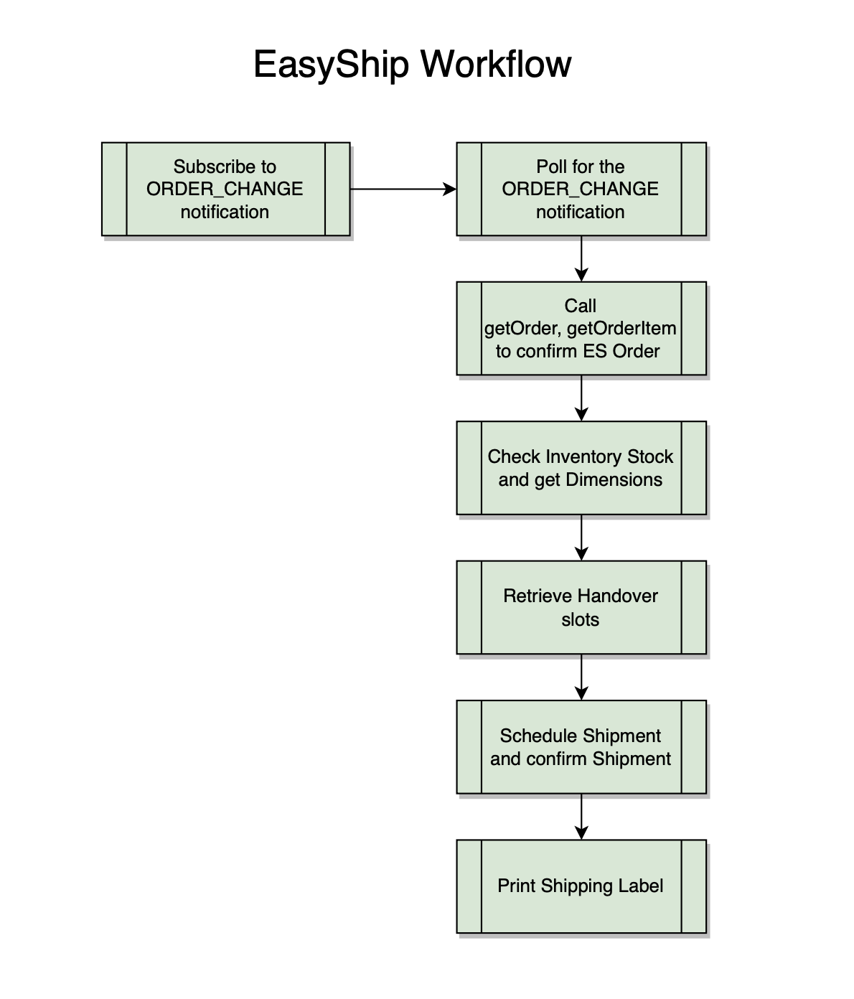
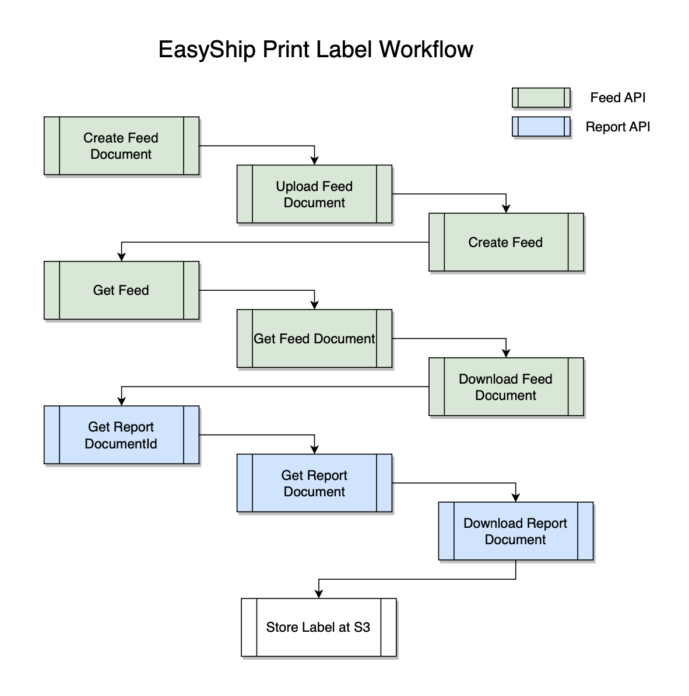

gi# Overview
This Sample Solution provides all required resources to deploy to the AWS cloud a fully functional SP-API application that implements the [Easy Ship API v2022-03-23 Use Case Guide](https://developer-docs.amazon.com/sp-api/docs/easyship-api-v2022-03-23-use-case-guide) end-to-end.
Use this application to test the proposed solution, do changes and/or integrate it to your own product.

## Solution
This Sample Solution offers a streamlined Buy Shipping from Amazon workflow based on the ORDER_CHANGE notification from the Selling Partner API. The key components include:

The solution consists of the following components:
* A [Step Functions](https://aws.amazon.com/step-functions/) state machine with a fully functional Merchant Fulfillment workflow
* [Lambda](https://aws.amazon.com/lambda/) functions that support each of the steps of the state machine
* An [SQS](https://aws.amazon.com/sqs/) queue to receive notifications for new or updated Amazon orders
* [DynamoDB](https://aws.amazon.com/dynamodb/) tables to store SKU and shipment information
* An [S3](https://aws.amazon.com/s3/) bucket to store generated shipping labels
* An [SNS](https://aws.amazon.com/sns/) topic to send email notifications when new shipping labels are generated
* A [Secrets Manager](https://aws.amazon.com/secrets-manager/) secret to securely store SP-API app credentials

## Workflow
To kickstart the solution, begin by executing the EASYSHIPSubscribeNotificationsLambdaFunction, providing the lambda with the necessary input containing the notificationType - ORDER_CHANGE - thereby subscribing the SQS queue to the Order Change Notification and obtaining the subscription_id and destination_id. 
After submission, the automated workflow will begin. Waiting for the ORDER_CHANGE notification message to be received, this will trigger the EASYSHIPProcessNotificationLambdaFunction and parse the message. 
After processing the notification, the EASYSHIPRetrieveOrderLambdaFunction retrieves the order information needed. 
Then, we will check the item inventory availability using the EASYSHIPInventoryCheckLambdaFunction. 
Next step is finding available time slots for shipments using item dimensions and AmazonOrderId with the EASYSHIPListHandoverSlotsLambdaFunction. 
Upon receiving the available time slots, the solution will execute the EASYSHIPCreateScheduledPackageLambdaFunction to schedule the preferred time slot.
After scheduling time slot, the solution will execute the EASYSHIPGetScheduledPackageLambdaFunction to confirm scheduled information.
It will then proceed to print the shipping label with the EASYSHIPSubmitFeedRequestLambdaFunction and EASYSHIPGetFeedDocumentLambdaFunction. 
Continuing the flow, the EASYSHIPGetReportDocumentLambdaFunction will pre-sign the S3 label and then share the label generated via email.




## Pre-requisites
The pre-requisites for deploying the Sample Solution App to the AWS cloud are:
* [Registering as a developer for SP-API](https://developer-docs.amazon.com/sp-api/docs/registering-as-a-developer), and [registering an SP-API application](https://developer-docs.amazon.com/sp-api/docs/registering-your-application)
* An [IAM user](https://docs.aws.amazon.com/IAM/latest/UserGuide/id_users.html) with permissions to create a new user, a policy, and attach it to the user
   * If you don't have one, you can create it following the steps  under **Usage - 2. Configure Sample Solution App's IAM user**
* The [AWS CLI](https://aws.amazon.com/cli/)
   * If not present, it will be installed as part of the deployment script
* [NodeJS 14.15.0 or later](https://nodejs.org/en/download/package-manager)
   * Required by AWS CDK stack for the sample solution deployment.
   * If not present, it will be installed as part of the deployment script.
* [Maven](https://maven.apache.org/)
   * Just for deploying a Java-based application
   * If not present, it will be installed as part of the deployment script
* [GitBash](https://git-scm.com/download/win)
   * in case you use Windows in order to run the deployment script.

## Usage
### 1. Update config file
To allow the Sample Solution App to connect to SP-API, the config file has to be updated to match the set-up of your SP-API application.
1. Open [app.config](app/app.config) file and replace all occurrences of `<dev_value>` following the instructions below:
2. Update `ClientId` and `ClientSecret` attribute values with [Client Id and Client Secret of the SP-API application](https://developer-docs.amazon.com/sp-api/docs/viewing-your-application-information-and-credentials) respectively
3. Update `RefreshToken` attribute value with the refresh token of the selling partner you will be using for testing
4. Update `RegionCode` attribute value with the region of the selling partner you will be using for testing. Valid values are `NA`, `EU`, and `FE`
5. Update `NotificationEmail` attribute value with the email address where you want to receive shipping labels generated during testing
   To allow the Sample Solution App to connect to SP-API, the config file has to be updated to match the set-up of your SP-API application.

Note: While updating the config file, don't leave blank spaces before and after =, and don't use quotation marks

#### Sample config file:
```
ClientId=amzn1.application-oa2-client.abc123def456xyz789
ClientSecret=amzn1.oa2-cs.v1.abc123def456xyz789
RefreshToken=Atzr|Abc123def456xyz789......
RegionCode=FE
NotificationEmail=login@mydomain.com
```

### 2. Configure Sample Solution App's IAM user
#### I. Create IAM policy
In order to execute the deployment script, an IAM user with the appropriate permissions is needed.
To create a new IAM policy with the required permissions, follow the steps below.

1. Open the [AWS console](https://console.aws.amazon.com/)
2. Navigate to [IAM Policies console](https://us-east-1.console.aws.amazon.com/iamv2/home#/policies)
3. Click **Create policy**
4. Next to **Policy editor**, select **JSON** and replace the default policy with the JSON below. Make sure to replace `<aws_account_id_number>` your AWS account id number
5. Replace with your account id as needed.
#### IAM policy:
```
{
    "Version": "2012-10-17",
    "Statement": [
        {
            "Sid": "SPAPISampleAppIAMPolicy",
            "Effect": "Allow",
            "Action": [
                "iam:CreateUser",
                "iam:DeleteUser",
                "iam:CreatePolicy",
                "iam:DeletePolicy",
                "iam:AttachUserPolicy",
                "iam:DetachUserPolicy",
                "iam:CreateAccessKey",
                "iam:DeleteAccessKey",
                "iam:GetRole",
                "iam:CreateRole",
                "iam:TagRole",
                "iam:AttachRolePolicy",
                "iam:PutRolePolicy",
                "iam:DeleteRole",
                "iam:DeleteRolePolicy",
                "iam:DetachRolePolicy",
                "iam:PassRole",
                "sts:AssumeRole"
            ],
            "Resource": [
                "arn:aws:iam::417650863749:user/*",
                "arn:aws:iam::417650863749:policy/*",
                "arn:aws:iam::417650863749:role/*"
            ]
        },
        {
            "Sid": "SPAPISampleAppCloudFormationPolicy",
            "Effect": "Allow",
            "Action": [
                "cloudformation:*",
                "ecr:*",
                "ssm:*"
            ],
            "Resource": [
                "arn:aws:cloudformation:*:417650863749:stack/CDKToolkit/*",
                "arn:aws:ecr:*:417650863749:repository/cdk*",
                "arn:aws:ssm:*:417650863749:parameter/cdk-bootstrap/*",
                "arn:aws:cloudformation:*:417650863749:stack/sp-api-app*"
            ]
        },
        {
            "Sid": "SPAPISampleAppCloudFormationS3Policy",
            "Effect": "Allow",
            "Action": [
                "s3:*"
            ],
            "Resource": [
                "arn:aws:s3:::cdk*",
                "arn:aws:s3:::sp-api-app-bucket*"
            ]
        }
    ]
}
```
5. Click **Next**
6. Select a name for your policy. Take note of this value as you will need it in the next section.
7. Review the changes and click **Create policy**

#### II. Create IAM user
To create a new IAM user with the required permissions, follow the steps below.
1. Open the [AWS console](https://console.aws.amazon.com/)
2. Navigate to [IAM Users console](https://us-east-1.console.aws.amazon.com/iamv2/home#/users)
3. Click **Create user**
4. Select a name for your user
5. In the **Set permissions** page, select **Attach policies directly**
6. In the **Permissions policies**, search for the policy created in **I. Create IAM policy** section. Select the policy, and click **Next**
7. Review the changes and click **Create user**

#### III. Retrieve IAM user credentials
Security credentials for the IAM user will be requested during the deployment script execution.
To create a new access key pair, follow the steps below. If you already have valid access key and secret access key, you can skip this section.
1. Open the [AWS console](https://console.aws.amazon.com/)
2. Navigate to [IAM Users console](https://us-east-1.console.aws.amazon.com/iamv2/home#/users)
3. Select the IAM user created in **II. Create IAM user**
4. Go to **Security credentials** tab
5. Under **Access keys**, click **Create access key**
6. In **Access key best practices & alternatives** page, select **Command Line Interface (CLI)**
7. Acknowledge the recommendations, and click **Next**
8. Click **Create access key**
9. Copy `Access key` and `Secret access key`. This is the only time that these keys can be viewed or downloaded, and you will need them while executing the deployment script
10. Click **Done**

### 3. Execute the deployment script
The deployment script will create a Sample Solution App in the AWS cloud.
To execute the deployment script, follow the steps below.
1. Identify the deployment script for the programming language you want for your Sample Solution App.
   1. For the Java application the file is [app/scripts/java/java-app.sh](app/scripts/java/java-app.sh)
   2. For the PHP application the file is [app/scripts/php/php-app.sh](app/scripts/php/php-app.sh)
2. Execute the script from your terminal or Git Bash
   1. To execute the Java deployment script in a Unix-based system or using Git Bash, run `bash java-app.sh` at `app/script/java`
   2. To execute the PHP deployment script in a Unix-based system or using Git Bash, run `bash php-app.sh` at `app/script/php`
3. Wait for the CloudFormation stack creation to finish
   1. Navigate to [CloudFormation console](https://console.aws.amazon.com/cloudformation/home)
   2. Wait for the stack named **sp-api-app-cdk-*random_suffix*** to show status `CREATE_COMPLETE`
4. Confirm the subscription to Amazon SNS that you received via email. This subscription will notify you about new shipping labels generated during testing


### 4. Test the Sample Solution
The deployment script creates a Sample Solution App in the AWS cloud.
To test it, follow the steps below.
#### A. Subscribe to the ORDER_CHANGE Notification
1. Open the [AWS console](https://console.aws.amazon.com/).
2. Navigate to [Lambda console](https://console.aws.amazon.com/lambda/home).
3. Select the notification subscriber function, named **EASYSHIPSubscribeNotificationsLambdaFunction-*random_suffix***.
4. Select **Test** tab.
5. Under **Event JSON**, insert the following payload. Replace `NotificationType` with the notification type you want to subscribe to.
    ```
    {
        "NotificationType": "ORDER_CHANGE"
    }
    ```
6. Click **Test**.
7. The function will return `destination Id` and `subscription Id`.

#### B. Create a test data in DynamoDB
1. Open the [AWS console](https://console.aws.amazon.com/)
2. Navigate to [DynamoDB console](https://console.aws.amazon.com/dynamodbv2/home)
3. Under **Tables**, click on **Explore items**
4. Select the table created by the deployment script, named **SPAPIInventory-*random_suffix***
5. Select **Create new item** and add the following attributes with the corresponding value:
   1. **SKU** (Type `String`): The SKU that you will use for testing
   2. **Height** (Type `Number`): The height of the item that you will use for testing
   3. **Length** (Type `Number`): The length of the item that you will use for testing
   4. **Width** (Type `Number`): The width of the item that you will use for testing
   5. **SizeUnit** (Type `String`): The size unit. Must be `CENTIMETERS` or `INCHES`
   6. **WeightValue** (Type `Number`): The weight of the item that you will use for testing
   7. **WeightUnit** (Type `String`): The weight unit. Must be `G` or `OZ`.
   8. **Stock** (Type `Number`): The available stock of the item that you will use for testing. Must be greater than zero.
#### Sample DynamoDB data:
```
{
   "SKU":{
      "S":"TEST-SKU-001"
   },
   "Height":{
      "N":"12"
   },
   "Length":{
      "N":"10"
   },
   "SizeUnit":{
      "S":"CM"
   },
   "Stock":{
      "N":"10"
   },
   "WeightUnit":{
      "S":"G"
   },
   "WeightValue":{
      "N":"100"
   },
   "Width":{
      "N":"20"
   }
}
```
Alternatively you can run the AWS CLI command below and create the item in DynamoDB. To do that, include in your IAM User the permission AmazonDynamoDBFullAccess to perform this action. Also, change the updateRandomSuffix string for the value of your SPAPIInventory table. You can get this information in your CloudFormation stack.
```
aws dynamodb put-item --table-name SPAPIInventory-updateRandomSuffix --item '{"SKU":{"S":"TEST-SKU-001"},"Height":{"N":"12"},"Length":{"N":"10"},"SizeUnit":{"S":"CM"},"Stock":{"N":"10"},"WeightUnit":{"S":"G"},"WeightValue":{"N":"100"},"Width":{"N":"20"}}'
```

#### C. Send a message to SQS to initiate testing
1. Navigate to [SQS console](https://console.aws.amazon.com/sqs/v2/home)
2. Select the SQS queue created by the deployment script, named **sp-api-notifications-queue-*random_suffix***
3. Select **Send and receive messages**
4. Under **Message body**, insert the following simplified notification body. Replace `AmazonOrderId` and `MarketplaceID` with the Id of the order that you will use for testing

#### Sample ORDER_CHANGE Notification:
```
 {
    "NotificationType":"ORDER_CHANGE",
    "EventTime":"2024-11-18T05:30:00.000Z",
    "Payload":{
       "OrderChangeNotification":{
          "NotificationLevel":"OrderLevel",
          "AmazonOrderId":"503-0151506-6094220",
          "Summary":{
             "MarketplaceID":"A1VC38T7YXB528",
             "OrderStatus":"Unshipped",
             "FulfillmentType":"MFN"
          }
       }
    }
 }
```
5. Click **Send message**
6. Navigate to [Step Functions console](https://console.aws.amazon.com/states/home)
7. Select the state machine created by the deployment script, named **SPAPIStateMachine-*random_suffix***
8. Under **Executions**, you will see a workflow for the order submitted through SQS
9. To check the workflow status and navigate into the individual steps, select the workflow and use the **Graph view** and **Step Detail** panels
10. After the order is processed and a shipping label is generated, you will receive an email with a presigned url. Open the link in your browser to view the label

### 5. Clean-up
The deployment script creates a number of resources in the AWS cloud which you might want to delete after testing the solution. 
To clean up these resources, follow the steps below.

1. Clean up the S3 bucket with the shipping labels created during testing.
   1. Navigate to [S3 console](https://console.aws.amazon.com/S3/v2/home)
   2. Select the shipping labels bucket, named **sp-api-easy-ship-documents-s3-bucket-*random_suffix***.
   3. Select all objects, and click Delete.
   4. Confirm the objects deletion.
2. Identify the clean-up script for the programming language of the Sample Solution App deployed to the AWS cloud.
   1. For example, for the Java application the file is [app/scripts/java/java-app-clean.sh](app/scripts/java/java-app-clean.sh)
3. Execute the script from your terminal or Git Bash
   1. For example, to execute the Java clean-up script in a Unix-based system or using Git Bash, run `bash java-app-clean.sh`
   2. Wait for the script to finish

### 6. Troubleshooting
If the state machine execution fails, follow the steps below to identify the root-cause and retry the workflow
1. Navigate to [Step Functions console](https://console.aws.amazon.com/states/home)
2. Select the state machine created by the deployment script, named **SPAPIStateMachine-*random_suffix***
3. Under **Executions**, you can use the **Status** column to identify failed executions
4. To troubleshoot errors, select the corresponding workflow execution and use the **Graph view** and **Step Detail** panels
5. After fixing the issues that caused the error, retry the workflow by clicking on **New execution**. The original input parameters will be automatically populated
6. Click **Start execution**, and validate the results