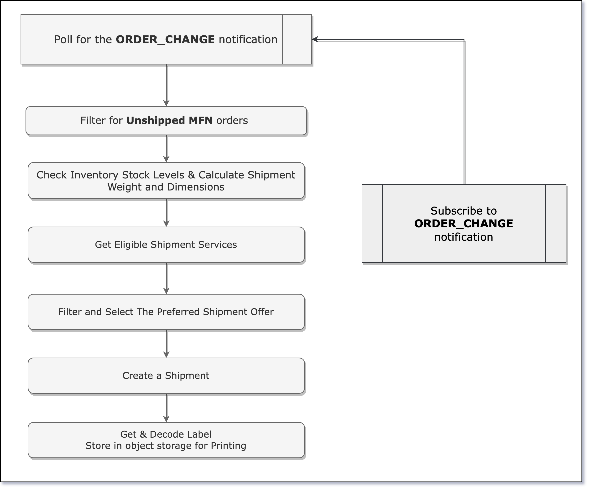

## Merchant Fulfillment API
The Merchant Fulfillment API helps you to build applications that allows sellers to use Amazon's Buy Shipping Services to purchase shipping for non-Prime and Prime orders.
With this API you can build applications that can preview shipping service offers based on shipping requirements, create shipments, automatically pay for shipping, and receive and print shipping labels.

If you haven't already, we recommend you to navigate the following resources:
* [Merchant Fulfillment API Use Case Guide](https://developer-docs.amazon.com/sp-api/docs/merchant-fulfillment-api-v0-use-case-guide)
* [Merchant Fulfillment API v0 reference](https://developer-docs.amazon.com/sp-api/docs/merchant-fulfillment-api-v0-reference)
* [Merchant Fulfillment Solution: Setup and Installation Tutorial](https://www.youtube.com/watch?v=lUSKvRhK3AQ)

## Sample Solution
This Sample Solution provides all the required resources to deploy a fully functional SP-API application on AWS that implements the [Merchant Fulfillment use case](https://developer-docs.amazon.com/sp-api/docs/merchant-fulfillment-api-v0-use-case-guide) end-to-end.
Use this application to test the proposed solution, do changes and/or integrate it to your own product.

## Workflow

A well-architected Merchant Fulfillment workflow includes subscribing to the `ORDER_CHANGE` notification for automatic reception of new MFN orders.
Alternatively, new orders can be identified from incoming order reports.



## Sample Code

Below are the code steps for the Merchant Fulfillment service workflow.

The process for the steps belows should start by monitoring [ORDER_CHANGE](https://developer-docs.amazon.com/sp-api/docs/notifications-api-v1-use-case-guide#order_change) notifications. To subscribe to MFN Notifications, refer to [Tutorial 5: Subscribe to MFN Notifications](https://developer-docs.amazon.com/sp-api/docs/merchant-fulfillment-api-v0-use-case-guide#tutorial-5-subscribe-to-mfn-notifications) of the use case guide.

### 1 - Retrieve an order

Upon an ORDER_CHANGE notification for unshipped MFN orders, the Orders API is used to retrieve the order details.

#### Step-by-step:
1. **Initialize API Client:** The API client of OrdersAPI is initialized with the Refresh Token and the Region.
2. **Get Order:** The Orders API getOrder operation is called using the orderId from the ORDER_CHANGE notification.
3. **Create the order processing class:** The MfnOrder class is instantiated with the order items from getOrder and the shipping address.
4. **Return MfnOrder object** The MfnOrder object created is returned for further processing of the Merchant Fulfillment Workflow.

**Java**

*Find the full code [here](https://github.com/amzn/selling-partner-api-samples/blob/main/use-cases/merchant-fulfillment/code/java/src/main/java/lambda/RetrieveOrderHandler.java)*

```java
OrdersV0Api ordersApi = getOrdersApi(input.getRegionCode(), input.getRefreshToken());

// Get order and order items
GetOrderResponse order = ordersApi.getOrder(input.getOrderId());
GetOrderItemsResponse orderItems = ordersApi.getOrderItems(input.getOrderId(), null);

MfnOrder mfnOrder = new MfnOrder();
mfnOrder.setOrderItems(getOrderItemList(orderItems));
mfnOrder.setShipFromAddress(mapAddress(order.getPayload().getDefaultShipFromLocationAddress()));

return mfnOrder;
```

**Python**

*Find the full code [here](https://github.com/amzn/selling-partner-api-samples/blob/main/use-cases/merchant-fulfillment/code/python/src/retrieve_order_handler.py)*

```python
api_utils = ApiUtils(refresh_token, region_code, constants.ORDERS_API_TYPE)

order_id = event[constants.STATE_MACHINE_ORDER_ID_KEY_NAME]
mfn_email = os.environ.get(constants.SHIP_FROM_EMAIL_ENV_VARIABLE)

# Get order and order items
order_response = api_utils.call_orders_api(method='get_order', order_id=order_id)
order_items_response = api_utils.call_orders_api(method='get_order_items', order_id=order_id)

logger.info(f"Orders API Response: {order_response}")
logger.info(f"Order Items API  Response: {order_items_response}")

mfn_order_items = get_order_item_list(order_items=order_items_response)
mfn_ship_from_address = map_address(order_response.payload.default_ship_from_location_address, mfn_email=mfn_email)

mfn_order = MfnOrder(order_items=mfn_order_items, ship_from_address=mfn_ship_from_address)
```

### 2 - Check Inventory

After the order details are retrieved, the inventory is checked and order is validated.

#### Step-by-step:
1. **Process the order items:** A loop over all order items is created to execute inventory checks.
2. **Prepare the request:** Get the orderItem SKU and prepare the database (DynamoDB) request.
3. **Retrieve the Item from Inventory:** Using the database client, the item is retrieved from inventory table.
4. **Check stock:** The item stock quantity is checked. The order is aborted if quantity is insufficient.
5. **Calculate Order Weight and Dimensions:** The total order weight and dimensions are calculated and returned as part of the MFN order.

Find the full code here

**Java**

*Find the full code [here](https://github.com/amzn/selling-partner-api-samples/blob/main/use-cases/merchant-fulfillment/code/java/src/main/java/lambda/InventoryCheckHandler.java)*

```java
// Iterate over all order items and retrieve stock, size and weight from the database
for (MfnOrderItem orderItem : input.getOrderItems()) {
  // Retrieve the item from DynamoDB by SKU
  // Update this section to match your product's logic
  Map<String, AttributeValue> key = new HashMap<>();
  key.put(INVENTORY_TABLE_HASH_KEY_NAME, new AttributeValue(orderItem.getSku()));

  GetItemRequest getItemRequest = new GetItemRequest()
    .withTableName(System.getenv(INVENTORY_TABLE_NAME_ENV_VARIABLE))
    .withKey(key);

  AmazonDynamoDB dynamoDB = AmazonDynamoDBClientBuilder.defaultClient();
  GetItemResult getItemResult = dynamoDB.getItem(getItemRequest);
  Map<String, AttributeValue> item = getItemResult.getItem();

  String stock = item.get(INVENTORY_TABLE_STOCK_ATTRIBUTE_NAME).getN();
  if (parseLong(stock) < orderItem.getQuantity()) {
    throw new InternalError(
      String.format("Stock level for SKU {%s} is not enough to fulfill the requested quantity",
      orderItem.getSku()));
  }

  long itemWeightValue = parseLong(item.get(INVENTORY_TABLE_WEIGHT_VALUE_ATTRIBUTE_NAME).getN());
  // Valid values for the database records are uppercase: [OZ, G]
  String itemWeightUnit = item.get(INVENTORY_TABLE_WEIGHT_UNIT_ATTRIBUTE_NAME).getS();

  long itemLength = parseLong(item.get(INVENTORY_TABLE_LENGTH_ATTRIBUTE_NAME).getN());
  long itemWidth = parseLong(item.get(INVENTORY_TABLE_WIDTH_ATTRIBUTE_NAME).getN());
  long itemHeight = parseLong(item.get(INVENTORY_TABLE_HEIGTH_ATTRIBUTE_NAME).getN());
  // Valid values for the database records are uppercase: [INCHES, CENTIMETERS]
  String itemSizeUnit = item.get(INVENTORY_TABLE_SIZE_UNIT_ATTRIBUTE_NAME).getS();

  Weight itemWeight = new Weight();
  itemWeight.setValue(BigDecimal.valueOf(itemWeightValue));
  itemWeight.setUnit(UnitOfWeight.valueOf(itemWeightUnit));
  orderItem.setItemWeight(itemWeight);

  // Package weight is calculated by adding the individual weights
  // Update this section to match your selling partners' logic
  packageWeightValue += itemWeightValue;
  packageWeightUnit = itemWeightUnit;

  // Package size is calculated by adding the individual sizes
  // Update this section to match your selling partners' logic
  packageLength += itemLength;
  packageWidth += itemWidth;
  packageHeight += itemHeight;
  packageSizeUnit = itemSizeUnit;
}

input.setWeight(new Weight()
  .value(BigDecimal.valueOf(packageWeightValue))
  .unit(UnitOfWeight.valueOf(packageWeightUnit)));

input.setPackageDimensions(new PackageDimensions()
  .length(BigDecimal.valueOf(packageLength))
  .width(BigDecimal.valueOf(packageWidth))
  .height(BigDecimal.valueOf(packageHeight))
  .unit(UnitOfLength.valueOf(packageSizeUnit)));

return input;
```

Find the full code here

**Python**

*Find the full code [here](https://github.com/amzn/selling-partner-api-samples/blob/main/use-cases/merchant-fulfillment/code/python/src/inventory_check_handler.py)*

```python
for order_item in mfn_order.orderItems:
    # Retrieve the item from DynamoDB by SKU
    # Update this section to match your product's logic
    key = {constants.INVENTORY_TABLE_HASH_KEY_NAME: {"S": order_item.sku}}

    dynamodb = boto3.client(constants.AWS_DYNAMO_DB_CLIENT_KEY_NAME)
    get_item_result = dynamodb.get_item(TableName=os.environ.get(constants.INVENTORY_TABLE_NAME_ENV_VARIABLE),
                                        Key=key)
    item = get_item_result.get('Item', {})

    stock = int(item.get(constants.INVENTORY_TABLE_STOCK_ATTRIBUTE_NAME, {"N": "0"})["N"])
    if stock < order_item.quantity:
        raise Exception(f"Stock level for SKU {order_item.sku} is not enough to fulfill the requested quantity")

    item_weight_value = int(item.get(constants.INVENTORY_TABLE_WEIGHT_VALUE_ATTRIBUTE_NAME, {"N": "0"})["N"])

    # Valid values for the database records are uppercase: [OZ, G]
    item_weight_unit = item.get(constants.INVENTORY_TABLE_WEIGHT_UNIT_ATTRIBUTE_NAME, {"S": ""})["S"]

    item_length = int(item.get(constants.INVENTORY_TABLE_LENGTH_ATTRIBUTE_NAME, {"N": "0"})["N"])
    item_width = int(item.get(constants.INVENTORY_TABLE_WIDTH_ATTRIBUTE_NAME, {"N": "0"})["N"])
    item_height = int(item.get(constants.INVENTORY_TABLE_HEIGHT_ATTRIBUTE_NAME, {"N": "0"})["N"])

    # Valid values for the database records are uppercase: [INCHES, CENTIMETERS]
    item_size_unit = item.get(constants.INVENTORY_TABLE_SIZE_UNIT_ATTRIBUTE_NAME, {"S": ""})["S"]

    unit_of_weight_enum = UnitOfWeight.G if item_weight_unit == "G" else UnitOfWeight.OZ if item_weight_unit == "OZ" else None
    item_weight = Weight(unit=unit_of_weight_enum, value=Decimal(str(item_weight_value)))

    order_item.itemWeight = item_weight

    # Package weight is calculated by adding the individual weights
    # Update this section to match your selling partners' logic
    package_weight_value += item_weight_value
    package_weight_unit = item_weight_unit

    # Package size is calculated by adding the individual sizes
    # Update this section to match your selling partners' logic
    package_length += item_length
    package_width += item_width
    package_height += item_height
    package_size_unit = item_size_unit

event_unit_of_weight_enum = UnitOfWeight.G if package_weight_unit == "G" else UnitOfWeight.OZ if package_weight_unit == "OZ" else None
event_unit_of_length_enum = UnitOfLength.INCHES if package_size_unit == "INCHES" else UnitOfLength.CENTIMETERS if package_size_unit == "CENTIMETERS" else None

mfn_order.weight = Weight(unit=event_unit_of_weight_enum, value=Decimal(str(package_weight_value)))
mfn_order.packageDimensions = PackageDimensions(
    length=package_length,
    width=package_width,
    height=package_height,
    unit=event_unit_of_length_enum
)
return mfn_order.to_json()
```

### 3 - Get Shipping Service Offers

Once the inventory is checked and the order is validated for shipping, we use the [GetEligibleShipmentServices](https://developer-docs.amazon.com/sp-api/docs/merchant-fulfillment-api-v0-reference#geteligibleshipmentservices) operation to check for available shipping service offers.

#### Step-by-step:
1. **Initialize API Client:** The API client for MFN is initialized using the Refresh Token and the Region.
2. **Prepare the request:** The request for the getEligibleShipmentServices operation is prepared.
3. **Call the API:** The MFN Api getEligibleShipmentServices is called using the prepared request.
4. **Set the shipment service list:** Set the fetched eligible shipment services as part of the order and return it.

**Java**

*Find the full code [here](https://github.com/amzn/selling-partner-api-samples/blob/main/use-cases/merchant-fulfillment/code/java/src/main/java/lambda/EligibleShipmentHandler.java)*

```java
// Get eligible shipment services for the order
GetEligibleShipmentServicesRequest request = new GetEligibleShipmentServicesRequest()
  .shipmentRequestDetails(new ShipmentRequestDetails()
    .amazonOrderId(input.getOrderId())
    .itemList(getItemList(mfnOrder.getOrderItems()))
    .shipFromAddress(mfnOrder.getShipFromAddress())
    .packageDimensions(mfnOrder.getPackageDimensions())
    .weight(mfnOrder.getWeight())
    .shippingServiceOptions(getDefaultShippingServiceOptions()));

logger.log("API Request: " + new Gson().toJson(request));

MerchantFulfillmentApi mfnApi = getMFNApi(input.getRegionCode(), input.getRefreshToken());
GetEligibleShipmentServicesResponse response = mfnApi.getEligibleShipmentServices(request);

mfnOrder.setShippingServiceList(response.getPayload().getShippingServiceList());
return mfnOrder;
```

**Python**

*Find the full code [here](https://github.com/amzn/selling-partner-api-samples/blob/main/use-cases/merchant-fulfillment/code/python/src/eligible_shipment_handler.py)*

```python
# Create an instance of the ApiUtils class
api_utils = ApiUtils(refresh_token, region_code, constants.MFN_API_TYPE)

# Get eligible shipment services for the order
eligible_shipment_request = get_eligible_shipment_request_body(mfn_order=mfn_order, order_id=order_id)
logger.info(f"Merchant Fulfillment API - GetEligibleShipmentServices request: {eligible_shipment_request}")

eligible_shipment_response = api_utils.call_mfn_api('get_eligible_shipment_services', body=eligible_shipment_request)
mfn_order.shippingServiceList = [item for item in eligible_shipment_response.payload.shipping_service_list]

return mfn_order.to_json()
```

### 4 - Select the preferred shipment

After getting the eligible shipping services, the offers are filtered for the seller preferred one.
For instance, filtering criteria can be Price or Speed.

#### Step-by-step:
1. **Retrieve Shipment Settings:** The preferred shipment settings are retrieved from an environment variable.
2. **Filter shipment services:** The setting is used as criteria to filter the shipment offers collection.
3. **Return preferred shipment:** The shipment service remaining is returned.

**Java**

*Find the full code [here](https://github.com/amzn/selling-partner-api-samples/blob/main/use-cases/merchant-fulfillment/code/java/src/main/java/lambda/SelectShipmentHandler.java)*

```java
// Update this section to match your product's logic
String shipmentFilterType = System.getenv(SHIPMENT_FILTER_TYPE_ENV_VARIABLE);

if (shipmentFilterType.equals(SHIPMENT_FILTER_TYPE_CHEAPEST)) {
    Collections.sort(shippingServices, new PriceComparator());
} else if (shipmentFilterType.equals(SHIPMENT_FILTER_TYPE_FASTEST)){
    Collections.sort(shippingServices, new SpeedComparator());
}

return shippingServices.get(0);
```

**Python**

*Find the full code [here](https://github.com/amzn/selling-partner-api-samples/blob/main/use-cases/merchant-fulfillment/code/python/src/select_shipment_handler.py)*

```python
# Update this section to match your product's logic
shipment_filter_type = os.environ.get(constants.SHIPMENT_FILTER_TYPE_ENV_VARIABLE)

if shipment_filter_type == constants.SHIPMENT_FILTER_TYPE_CHEAPEST:
    shipping_services.sort(key=cmp_to_key(price_comparator))
elif shipment_filter_type == constants.SHIPMENT_FILTER_TYPE_FASTEST:
    shipping_services.sort(key=cmp_to_key(speed_comparator))

return shipping_services[0]


def price_comparator(ship_service1, ship_service2):
    return ship_service1['Rate']['Amount'] - ship_service2['Rate']['Amount']


def speed_comparator(ship_service1, ship_service2):
    date_format = '%Y-%m-%dT%H:%M:%SZ'
    date_key = 'EarliestEstimatedDeliveryDate'

    return datetime.strptime(ship_service1[date_key], date_format) - datetime.strptime(ship_service2[date_key], date_format)
```

### 5 - Create a shipment

After deciding on the preferred shipping service, it is now possible to create the order shipment and store the shipment id for the order in the database.

#### Step-by-step:
1. **Prepare the Create Shipment Request:** The CreateShipment request is created.
2. **Initialize API Client:** The MFN API is initialized using the Refresh Token and the Region.
3. **Call the CreateShipment operation** The createShipment operation is called using the request prepared.
4. **Store to Shipment ID:** The shipmentId part of the response payload is stored along the order handled.
5. **Return the label:** The label part of the response payload is returned.

**Java**

*Find the full code [here](https://github.com/amzn/selling-partner-api-samples/blob/main/use-cases/merchant-fulfillment/code/java/src/main/java/lambda/CreateShipmentHandler.java)*

```java
// Create shipment for the selected shipping service
CreateShipmentRequest request = new CreateShipmentRequest()
  .shipmentRequestDetails(new ShipmentRequestDetails()
    .amazonOrderId(input.getOrderId())
    .itemList(getItemList(input.getMfnOrder().getOrderItems()))
    .shipFromAddress(input.getMfnOrder().getShipFromAddress())
    .packageDimensions(input.getMfnOrder().getPackageDimensions())
    .weight(input.getMfnOrder().getWeight())
    .shippingServiceOptions(getDefaultShippingServiceOptions()))
  .shippingServiceId(input.getMfnOrder().getPreferredShippingService().getShippingServiceId())
  .shippingServiceOfferId(input.getMfnOrder().getPreferredShippingService().getShippingServiceOfferId());

logger.log("API Request: " + new Gson().toJson(request));

MerchantFulfillmentApi mfnApi = getMFNApi(input.getRegionCode(), input.getRefreshToken());
CreateShipmentResponse response = mfnApi.createShipment(request);

// Store ShipmentId in DynamoDB
// Update this section to match your product's logic
String shipmentId = response.getPayload().getShipmentId();
storeShipmentInformation(input.getOrderId(), shipmentId);

// Extract and Return the Shipment Label
return response.getPayload().getLabel();
```

**Python**

*Find the full code [here](https://github.com/amzn/selling-partner-api-samples/blob/main/use-cases/merchant-fulfillment/code/python/src/create_shipment_handler.py)*

```python
api_utils = ApiUtils(refresh_token, region_code, constants.MFN_API_TYPE)

# Create shipment for the selected shipping service
create_shipment_request = get_create_shipment_request_body(payload=event[constants.MFN_ORDER_KEY_NAME], order_id=order_id)

logger.info(f"Merchant Fulfillment API - CreateShipment request: {create_shipment_request}")

create_shipment_result = api_utils.call_mfn_api('create_shipment', body=create_shipment_request)

logger.info(f"Merchant Fulfillment API - CreateShipment response: {create_shipment_result}")

# Store ShipmentId in DynamoDB
# Update this section to match your product's logic
shipment_id = create_shipment_result.payload.shipment_id
store_shipment_information(order_id, shipment_id)

# Generating Label format
label = create_shipment_result.payload.label
result = {
    constants.LABEL_FORMAT_KEY_NAME: label.label_format,
    constants.LABEL_DIMENSIONS_KEY_NAME: label.dimensions.to_dict(),
    constants.LABEL_FILE_CONTENTS_KEY_NAME: label.file_contents.to_dict()
}

return result
```

```python
def get_create_shipment_request_body(payload, order_id):
    order_item_list = json.loads(mfn_utils.transform_keys_to_uppercase_first_letter(json.dumps([item for item in payload["orderItems"]])))
    ship_from_address = json.loads(mfn_utils.snake_to_pascal_case(json.dumps(payload["shipFromAddress"])))
    package_dimensions = json.loads(mfn_utils.snake_to_pascal_case(json.dumps(payload["packageDimensions"])))
    weight = json.loads(mfn_utils.snake_to_pascal_case(json.dumps(payload["weight"])))

    shipping_service_options = payload["preferredShippingService"]["ShippingServiceOptions"]
    shipping_service_id = payload["preferredShippingService"]["ShippingServiceId"]
    shipping_service_offer_id = payload["preferredShippingService"]["ShippingServiceOfferId"]

    request = {
        "ShipmentRequestDetails": {
            "AmazonOrderId": order_id,
            "ItemList": order_item_list,
            "ShipFromAddress": ship_from_address,
            "PackageDimensions": package_dimensions,
            "Weight": weight,
            "ShippingServiceOptions": shipping_service_options
        },
        "ShippingServiceId": shipping_service_id,
        "ShippingServiceOfferId": shipping_service_offer_id
    }

    return json.dumps(request)

def store_shipment_information(order_id, shipment_id):
    item = {
        constants.SHIPMENTS_TABLE_HASH_KEY_NAME: {'S': order_id},
        constants.SHIPMENTS_TABLE_SHIPMENT_ID_ATTRIBUTE_NAME: {'S': shipment_id}
    }

    put_item_request = {
        'TableName': os.environ.get(constants.SHIPMENTS_TABLE_NAME_ENV_VARIABLE),
        'Item': item
    }

    dynamodb = boto3.client(constants.AWS_DYNAMO_DB_CLIENT_KEY_NAME)
    dynamodb.put_item(**put_item_request)
```

### 6 - Presign and Print the shipment label

After the label extraction is done, the shipping label is decompressed and decoded for printing.

#### Step-by-step:
1. **S3 client and object are set up:** Prepare the S3 bucket details and the S3 client.
2. **Get the label content:** Get the label content returned from the previous step.
3. **Decode the label content** The label content returned by the api is decoded.
4. **Store to S3:** The decoded label is stored to S3.
5. **Pre-sign:** A pre-signed URL is generated on the label object on S3.

**Java**

*Find the full code [here](https://github.com/amzn/selling-partner-api-samples/blob/main/use-cases/merchant-fulfillment/code/java/src/main/java/lambda/PresignS3LabelHandler.java)*

```java
// Decompress and decode a shipping label
byte[] labelContentDecoded = Base64.getDecoder().decode(label.getFileContents().getContents());

try {
    ByteArrayInputStream inputStream = new ByteArrayInputStream(labelContentDecoded);
    GZIPInputStream gzipInputStream = new GZIPInputStream(inputStream);
    ByteArrayOutputStream byteArrayOutputStream = new java.io.ByteArrayOutputStream();
    
    int res = 0;
    byte buf[] = new byte[1024];
    while (res >= 0) {
      res = gzipInputStream.read(buf, 0, buf.length);
      if (res > 0) {
        byteArrayOutputStream.write(buf, 0, res);
      }
    }
    
    byte uncompressed[] = byteArrayOutputStream.toByteArray();
    return uncompressed;
} catch (IOException e) {
    throw new InternalError("Decoding and decompressing label failed", e);
}
```

```java
// The decoded label gets stored in S3 and pre-signed URL is generated
String s3BucketName = System.getenv(LABELS_S3_BUCKET_NAME_ENV_VARIABLE);
String objectKey = String.format("%s/%s", input.getOrderId(), UUID.randomUUID());

// Store the label in S3
storeLabel(s3BucketName, objectKey, input.getLabel());
logger.log("Label successfully stored");

// Generate a presigned url to browse the label
String presignedUrl = generatePresignedUrl(s3BucketName, objectKey);
logger.log("Presigned Url successfully generated");

return presignedUrl;
```

**Python**

*Find the full code [here](https://github.com/amzn/selling-partner-api-samples/blob/main/use-cases/merchant-fulfillment/code/python/src/presign_s3_label_handler.py)*

```python
# Decode the label content
label_content_decoded = base64.b64decode(label.file_contents.contents)
try:
    with gzip.GzipFile(fileobj=io.BytesIO(label_content_decoded), mode='rb') as gz:
        uncompressed = gz.read()
    return uncompressed
except Exception as e:
    raise Exception("Decoding and decompressing label failed", e)
```

```python
# The decoded label gets stored in S3 and pre-signed URL is generated 
s3_bucket_name = os.environ.get(constants.LABELS_S3_BUCKET_NAME_ENV_VARIABLE)
object_key = f"{order_id}/{uuid.uuid4()}"

label = get_label_content(label_content=event[constants.LABEL_NAME_KEY])

# Store the label in S3
store_label(s3_bucket_name, object_key, label)
logger.info("Label successfully stored")

# Generate a presigned URL to browse the label
presigned_url = generate_presigned_url(s3_bucket_name, object_key)
logger.info("Presigned URL successfully generated")

return presigned_url
```

The pre-signed URL is finally passed to next steps such as printing.
In this sample solution, the step functions last step provides the pre-signed URl to an SNS topic which triggers then sends it by Email.  