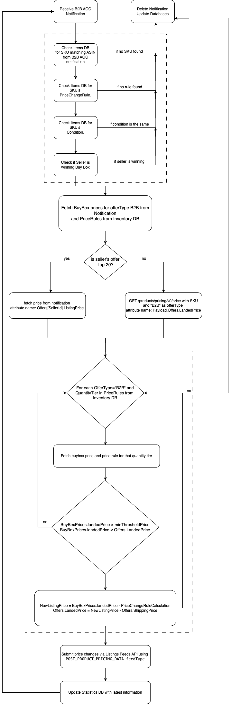

## Automating Business pricing decisions to become eligible to the Featured Offer (FO) using SP-API 

This blog presents best practices and a well architected workflow on how developers can automate business pricing decisions adjusting prices quickly and automatically against the competition. With it, you may increase seller`s chance of becoming the Featured Offer (aka Amazon Buy Box) and accelerating their sales. 

by Siva Durai, Sr. Solutions Architect, Amazon Business 3P and Leonardo N., Solutions Architect, Selling Partner Developer Services | June 20, 2024

## Overview

Pricing plays a critical role in achieving Featured Offer (FO) status on Amazon Business. Data indicates that securing the FO can boost sales by up to 50%. Implementing automated pricing strategies allows sellers to stay competitive by optimizing sales and margins without the need for constant manual price adjustments. Utilizing APIs and notifications for pricing tasks not only saves time but also minimizes human error and enables immediate reactions to market changes.
This blog post will delve into the complexities of using Pricing operations on the SP-API to automate pricing decisions. By subscribing to the B2B Any Offer Changed Notification (B2B AOCN), you can receive instant alerts when prices for relevant ASINs change, ensuring your B2B offers remain aligned with current market conditions. We will guide you through the process of handling B2B AOCN notifications, gathering additional information, applying pricing rules, and submitting new price updates. Sample code will be provided to illustrate these operations. The solution discussed here is designed to serve as an example of how to leverage pricing APIs, rather than a complete, standalone pricing application.

## What is Business Price and Quantity Discounts
Business pricing means offers that are lower than your retail prices and are intended to incentivize buyers to purchase in bulk. When you set a business price, these special offers are only available to registered Amazon Business buyers. While your products will be visible to all Amazon consumers, only registered Amazon Business buyers can see your business pricing. All other Amazon consumers will see your set consumer price. Business pricing cannot be higher than the consumer price on a product.
To encourage larger orders, you can set up to five pricing tiers on each of your products. Customers can see the price discounts for certain quantity orders, which are completely defined by you. For even larger quantities, customers can request pricing from all sellers who offer a specific product.

## Benefits for Seller selling on Amazon Business
Amazon Business unlocks new growth opportunities for sellers, as well as provides specialized tools that make selling to businesses more efficient. With Amazon Business, sellers can:

• Incentivize business customers with Business Prices and Quantity Discounts

• Participate in Bulk Purchase requests by Business Customers

• Differentiate their businesses with Business Profile and Credentials, which influences purchasing decisions of Business Buyers

• Sell smarter with B2B features like B2B Product Opportunities and Automated Business Pricing

## What is an Amazon product detail page and the benefits of becoming a FO?

When multiple sellers sell the same product, Amazon automatically consolidates the best product data submitted from various sellers into one details page to ensure customers get the best experience avoiding different pages and information for the same product. On this single product detail page, Amazon attaches all sellers' b2BOffers, making it easier for customers to find, compare, and buy items. Additionally, Amazon selects what it considers is the best offer for the customer browsing the marketplace, based on factors like price, condition, and shipping speed. This offer, the FO, is highlighted above the "Buy Now" button in the product details page. Qualifying b2BOffers for FO can be a strategic way to increase awareness and sales potential because it will be associated with a sale button and requires fewer clicks to complete the purchase.

### How does the FO look like and where I can check out the other B2B Offers?


### How an offer become eligible for the FO?

There are a number of factors that affect FO eligibility. For example, seller should have a professional sales account with a good reputation and good customer service metrics.
Products must be in stock and in new or like-new goods condition. Additionally, products with short delivery times are attractive to customers and a reason to qualify as FO.
Finally, it’s also worth mentioning that competitive pricing is really important here: FO prices are typically lower than or equal to similar options, so sellers are more likely to update the price to a competitive price, in order to increase their chances of winning and have their offer as FO.

## The recommended flow to achieve the FO with the tools and API 

As we know, competitive price is an important factor in achieving FO. With this in mind, the flow presented here uses SP-API tools as part of the process. It starts by reading the B2B AOC notification and calling the Product Pricing APIs to gather additional information if needed; it then executes logic to find the competitive prices for the product, and finally uses the Listings Feeds API to update the price.
Please note that FO is not guaranteed as competing Offers may change and other Offers may be highlighted due to other factors previously mentioned. However, maintaining competitive prices is one strategy to achieve this goal.

### The B2B AOC notification

By using the  [`B2B_ANY_OFFER_CHANGED`](https://developer-docs.amazon.com/sp-api/docs/notification-type-values#b2b_any_offer_changed) notification, you can receive information in real time about price changes from competitors for products a seller is selling on Amazon. Whenever there is price change in any of the top 20 b2BOffers a notification will be triggered and then you will be able to analyze the price data. THis notification also includes different quantity discount tiers.

#### The main B2B AOC components

There are some important attributes and nodes in the notification we are looking at carefully in the recommended flow:

* To know how to set up notifications (Amazon Simple Queue Service workflow) [access this tutorial ](https://developer-docs.amazon.com/sp-api/docs/notifications-api-v1-use-case-guide#tutorial-set-up-notifications-span-classnotranslateamazon-simple-queue-servicespan-workflow)


```

      "OfferChangeTrigger" : {
        "MarketplaceId" : "A2Q3Y263D00KWC",
        "ASIN" : "B092CZXSZB",
        "ItemCondition" : "new",
        "TimeOfOfferChange" : "2023-07-31T20:40:53.101Z"
      }
```

`OfferChangeTrigger.ASIN` = Informs the ASIN that suffered changes and that is triggering the notification.

`OfferChangeTrigger.MarketplaceId` = Informs the Marketplace where the ASIN that suffered the update is located.

`OfferChangeTrigger.ItemCondition` = Informs the condition of the ASIN that suffered the update.

```
BuyBoxPrices" : [  {
            "condition": "New",
            "fulfillmentChannel": "Merchant",
            "offerType": "B2B",
            "quantityTier": 1,
            "listingPrice": {
                "amount": 334.23,
                "currencyCode": "USD"
            },
            "shipping": {
                "amount": 4.49,
                "currencyCode": "USD"
            },
            "landedPrice": {
                "amount": 338.72,
                "currencyCode": "USD"
            }
        },
        {
            "condition": "New",
            "fulfillmentChannel": "Merchant",
            "offerType": "B2B",
            "quantityTier": 2,
            "listingPrice": {
                "amount": 332.99,
                "currencyCode": "USD"
            },
            "shipping": {
                "amount": 4.49,
                "currencyCode": "USD"
            }
        },
        {
            "condition": "New",
            "fulfillmentChannel": "Merchant",
            "offerType": "B2B",
            "quantityTier": 5,
            "discountType": "QUANTITY_DISCOUNT",
            "listingPrice": {
                "amount": 330.99,
                "currencyCode": "USD"
            },
            "shipping": {
                "amount": 4.49,
                "currencyCode": "USD"
            }
        } ],
```

`BuyBoxPrices` = This node informs all data related to the Buy Box offer. 

`BuyBoxPrices.Condition` =  Informs the condition of the offer that is winning the Buy Box.

`BuyBoxPrices.offerType` =  Informs the type of offer whether it is for B2B or B2C.

`BuyBoxPrices.quantityTier` =  Informs the quantity tier of the buy box price where 1 represents business discount and other values can be 2,5,10,25 representing quantity discounts.


```
 "Offers" : [ {
        "SellerId" : "A2ZPJ4TLUOSWY8",
        "SubCondition" : "new",
        "SellerFeedbackRating" : {
          "FeedbackCount" : 35,
          "SellerPositiveFeedbackRating" : 63
        },
        "ShippingTime" : {
          "MinimumHours" : 24,
          "MaximumHours" : 48,
          "AvailabilityType" : "NOW",
          "AvailableDate" : ""
        },
        "ListingPrice" : {
          "Amount" : 50.00,
          "CurrencyCode" : "BRL"
        },
        "Shipping" : {
          "Amount" : 4.43,
          "CurrencyCode" : "BRL"
        },
        "ShipsFrom" : {
          "Country" : "BR",
          "State" : ""
        },
        "IsFulfilledByAmazon" : false,
        "IsBuyBoxWinner" : false,
        "PrimeInformation" : {
          "IsOfferPrime" : false,
          "IsOfferNationalPrime" : false
        },
        "ShipsDomestically" : true
      } ]
```

`Offers` = Informs up to 20 active b2BOffers of sellers that are selling the same ASIN.

`Offers.SellerId` = Informs the seller id of the offer owner. Use this property to find your seller's offer. 

`Offers.IsBuyBoxWinner` = Informs if this offer is the Buy Box winner.

`Offers.IsFulfilledByAmazon.ListingPrice` = Informs seller item price.

`Offers.IsFulfilledByAmazon.Shipping` = Informs seller Shipping price.

### The Product Pricing API

By using the [`GetPricing`](https://developer-docs.amazon.com/sp-api/docs/product-pricing-api-v0-use-case-guide#step-1-call-getpricing) operation, you can retrieve price details of SKUs and ASINs. This endpoint returns the same information than the B2B AOC notification. We only use this API if the seller's offer is not being returned in the notification into the `Offers` node.
 

## The Listing Feeds API 

By using the [`POST_PRODUCT_PRICING_DATA`](https://developer-docs.amazon.com/sp-api/docs/feed-type-values#listings-feeds) Listings feed, you can update product prices after your analysis using the B2B AOC notification and GetPricing endpoint (when needed).


#### The XML feed components

```
<AmazonEnvelope
        xmlns:xsi="http://www.w3.org/2001/XMLSchema-instance">
    <Header>
        <DocumentVersion>1.01</DocumentVersion>
        <MerchantIdentifier>A3DUGAUYYGAN56</MerchantIdentifier>
    </Header>
    <MessageType>Price</MessageType>
    <Message>
        <MessageID>1</MessageID>
        <Price>
            <SKU>abcd</SKU>
            <BusinessPrice>25.49</BusinessPrice>
            <QuantityPriceType>fixed</QuantityPriceType>
            <QuantityPrice>
                <QuantityPrice1>25.36</QuantityPrice1>
                <QuantityLowerBound1>5</QuantityLowerBound1>
                <QuantityPrice2>25.24</QuantityPrice2>
                <QuantityLowerBound2>10</QuantityLowerBound2>
                <QuantityPrice3>24.85</QuantityPrice3>
                <QuantityLowerBound3>25</QuantityLowerBound3>
                <QuantityPrice4>24.73</QuantityPrice4>
                <QuantityLowerBound4>50</QuantityLowerBound4>
                <QuantityPrice5>24.22</QuantityPrice5>
                <QuantityLowerBound5>100</QuantityLowerBound5>
            </QuantityPrice>
        </Price>
    </Message>
</AmazonEnvelope>
```

`BusinessPrice` = The new business discount price that you are updating your offer.
`QuantityPrice` = The new quantity discount tiers that you are updating your offer.

## The flow used in this Sample Solution




## Conclusion

This blog provided you a reference solution and sample code to integrate and define a relevant B2B pricing strategy for the seller. This helps interested sellers have a greater chance of having their offer more visible on the product details page compared to other B2B Offers.