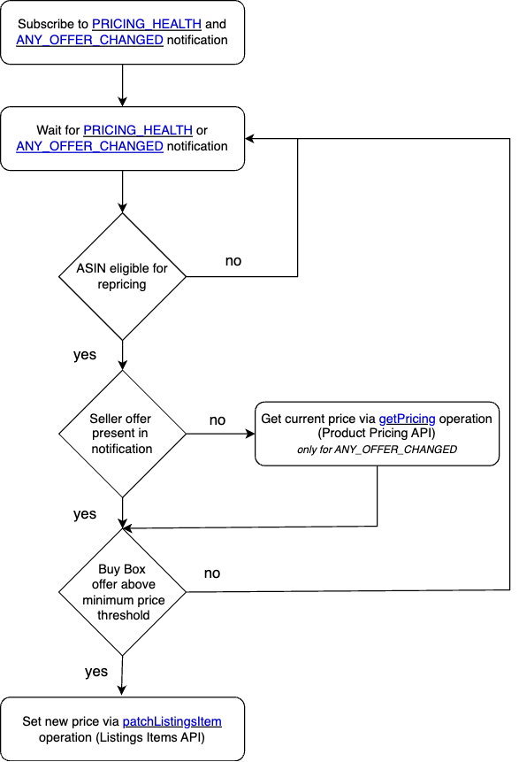

## Product Pricing API
The Selling Partner API for Pricing helps you programmatically retrieve product pricing and offer pricing information for Amazon Marketplace products.

If you haven't already, we recommend you to navigate the following resources:

* [Price Adjustment Automation Workflows Guide](https://developer-docs.amazon.com/sp-api/docs/price-adjustment-automation-workflows-guide)
* [Product Pricing API and Notifications Frequently Asked Questions](https://developer-docs.amazon.com/sp-api/docs/pricing-faqs)
* [Product Pricing API v2022-05-01 reference](https://developer-docs.amazon.com/sp-api/docs/product-pricing-api-v2022-05-01-reference)
* [Product Pricing API Use Case Guide](https://developer-docs.amazon.com/sp-api/docs/product-pricing-api-v2022-05-01-use-case-guide)
* [Notifications API v1 Use Case Guide](https://developer-docs.amazon.com/sp-api/docs/notifications-api-v1-use-case-guide)
* [Automated Pricing: Amazon Selling Partner API Pricing Sample Solution](https://www.youtube.com/watch?v=9GjgVYNkLuE)

## Solution
This Sample Solution implements a re-pricing workflow that reacts to incoming [ANY_OFFER_CHANGED](https://developer-docs.amazon.com/sp-api/docs/notification-type-values#any_offer_changed) and [PRICING_HEALTH](https://developer-docs.amazon.com/sp-api/docs/notification-type-values#pricing_health) notifications calculating a new competitive price for the related selling partner's SKUs in order to achieve featured offer eligibility. If the new calculated price is above the minimum threshold defined by the selling partner, the solution executes a price change.
If you want to test the proposed solution, do changes and/or integrate it to your own product, follow the steps under [Deployment Guide](docs/DEPLOYMENT.md).

## Workflow
The re-pricing workflow starts by subscribing to [ANY_OFFER_CHANGED](https://developer-docs.amazon.com/sp-api/docs/notification-type-values#any_offer_changed) and [PRICING_HEALTH](https://developer-docs.amazon.com/sp-api/docs/notification-type-values#pricing_health) notifications. As soon as one of the notifications is sent (and the product is eligible for re-pricing), the current price needs to be fetched and a new (lower) price is set (in case the new price is above the minimum price threshold).



## Sample Code
Below you can find sample code for the most relevant Pricing operations:
* [Retrieve eligible offers](#retrieve-eligible-offers)
* [Fetch price](#fetch-price)
* [Calculate new price](#calculate-new-price)
* [Submit new price](#submit-new-price)

### Retrieve eligible offers
How to retrieve eligible offers for re-pricing

#### Step-by-step:
1. **Initialize an empty list for SKUs:** Create a list to store SKUs retrieved from the database.
2. **Fetch SKUs from the database:** Retrieve the selling partner's SKUs associated with the ASIN from the notification. Replace this logic with your specific database retrieval implementation.
3. **Iterate over SKUs:** Iterate over the SKUs fetched from the database.
4. **Retrieve SKU attributes from the database item:** Map SKU attributes fetched from the database item to a custom class.
5. **Retrieve offer attributes from the notification:** Map offer attributes from the notification to a custom class.
6. **Identify the selling partner's offer in the notification:** Identify which, if any, of the selling partner's offers in the notification corresponds to the current SKU by matching against the `isFBA` attribute. Note: this offer may not be present in the notification.
7. **Map listing and shipping price if the search was successful:** If a match is found, map listing and shipping price.
8. **Append the item to the SKU list:** Append the result to the SKU list that will be returned by this function.
9. **Return results:** Prepare and return the final result containing updated offers.

#### Python:
*Find the full code [here](https://github.com/amzn/selling-partner-api-samples/blob/main/use-cases/pricing/code/python/src/check_sku_handler.py)*
```python
def lambda_handler(event, context):
    # Instantiate PricingOfferLambdaInput object from the input event
    lambda_input = PricingOfferLambdaInput(**event)
    
    # Create an empty list to append updated offers here
    final_offer_list = []

    # Fetch SKUs from query result
    database_sku_offers = fetch_sku_list_from_db(lambda_input.asin,
                                                 lambda_input.buyBox.condition.lower(),
                                                 lambda_input.seller.sellerId,
                                                 lambda_input.credentials.marketplaceId)

    # Map SKUs from query result with Notification Offers
    for database_offer in database_sku_offers:
        pricing_offer = PricingOfferLambdaInput()

        # Mapping information fetched from DB
        pricing_offer.isFulfilledByAmazon = database_offer[constants.SELLER_TABLE_IS_FULFILLED_BY_AMAZON_KEY_NAME]
        pricing_offer.itemSku = database_offer[constants.SELLER_TABLE_HASH_KEY_NAME]
        pricing_offer.minThreshold = database_offer[constants.SELLER_TABLE_THRESHOLD_KEY_NAME]
        pricing_offer.useCompetitivePrice = database_offer[constants.SELLER_TABLE_USE_COMPETITIVE_PRICE]
        pricing_offer.priceChangeRule = PriceChangeRule(
            value=database_offer[constants.SELLER_TABLE_PRICE_CHANGE_AMOUNT_KEY_NAME],
            rule=database_offer[constants.SELLER_TABLE_PRICE_CHANGE_RULE_KEY_NAME])

        # Mapping information fetched from Notification
        pricing_offer.buyBox = lambda_input.buyBox
        pricing_offer.sellerId = lambda_input.seller.sellerId
        pricing_offer.asin = lambda_input.asin
        pricing_offer.credentials = lambda_input.credentials

        # Matching Notification Offers from notification based on isFBA Attribute
        matching_notification_offer = next((offer for offer in lambda_input.seller.offers
                                            if pricing_offer.isFulfilledByAmazon == offer.isFulfilledByAmazon), None)

        # Map listing and shipping price if mapping was successful
        if matching_notification_offer:
            pricing_offer.sellerOffer = matching_notification_offer

        # Append to general list
        final_offer_list.append(asdict(pricing_offer))

    # Prepare and return the final result containing updated offers
    result = {
        "offers": final_offer_list
    }

    return result


def fetch_sku_list_from_db(asin, condition, seller_id, marketplace_id):
    # Initialize a session using Amazon DynamoDB
    dynamodb = boto3.resource(constants.AWS_DYNAMO_DB_CLIENT_KEY_NAME)

    # Create a DynamoDB table resource
    table = dynamodb.Table(os.environ.get(constants.SELLER_TABLE_NAME_ENV_VARIABLE))

    # Query DynamoDB table based on Filters provided
    response = table.query(
        KeyConditionExpression=Key(constants.SELLER_TABLE_ASIN_KEY_NAME).eq(asin),
        FilterExpression=Attr(constants.SELLER_TABLE_SELLER_ID_KEY_NAME).eq(seller_id)
                         & Attr(constants.SELLER_TABLE_CONDITION_KEY_NAME).eq(condition)
                         & Attr(constants.SELLER_TABLE_MARKETPLACE_KEY_NAME).eq(marketplace_id)
    )

    return response['Items']
```

#### Java:
*Find the full code [here](https://github.com/amzn/selling-partner-api-samples/blob/main/use-cases/pricing/code/java/src/main/java/lambda/CheckSkuHandler.java)*
```java
public PricingOffers handleRequest(StateMachineInput input, Context context) {
    List<PricingLambdaInput> sellerOffers = Lists.newArrayList();

    //Retrieve the items from DynamoDB by ASIN, seller ID, condition, and marketplace ID
    //Update this section to match your product's logic
    List<Map<String, AttributeValue>> skus = retrieveSKUs(
            input.getAsin(),
            input.getSeller().getSellerId(),
            input.getBuyBox().getCondition(),
            input.getCredentials().getMarketplaceId());

    for (Map<String, AttributeValue> sku : skus) {
        try {
            PricingLambdaInput pricingOffer = PricingLambdaInput.builder()
                    .isFulfilledByAmazon(sku.get(SELLER_ITEMS_TABLE_IS_FULFILLED_BY_AMAZON_KEY_NAME).bool())
                    .itemSku(sku.get(SELLER_ITEMS_TABLE_SKU_KEY_NAME).s())
                    .minThreshold(Float.parseFloat(sku.get(SELLER_ITEMS_TABLE_MIN_THRESHOLD_KEY_NAME).n()))
                    .priceChangeRule(PriceChangeRule.builder()
                            .value(Float.parseFloat(sku.get(SELLER_ITEMS_TABLE_PRICE_CHANGE_RULE_AMOUNT_KEY_NAME).n()))
                            .rule(sku.get(SELLER_ITEMS_TABLE_PRICE_CHANGE_RULE_KEY_NAME).s())
                            .build())

                    .useCompetitivePrice(sku.get(SELLER_ITEMS_TABLE_USE_COMPETITIVE_PRICE).bool())
                    .buyBox(input.getBuyBox())
                    .sellerId(input.getSeller().getSellerId())
                    .asin(input.getAsin())
                    .credentials(input.getCredentials())
                    .build();

            List<Offer> notificationOffers = input.getSeller().getOffers().stream()
                    .filter(o -> o.isFulfilledByAmazon() == pricingOffer.isFulfilledByAmazon())
                    .collect(Collectors.toList());

            if (notificationOffers.size() == 1) {
                pricingOffer.setSellerOffer(notificationOffers.get(0));
            } else if (notificationOffers.size() > 1) {
                throw new InternalError(String.format("Error: %d offers where found in the notification for SKU %s",
                        notificationOffers.size(),
                        sku.get(SELLER_ITEMS_TABLE_SKU_KEY_NAME).s()));
            }

            sellerOffers.add(pricingOffer);
        } catch (Exception e) {
            throw new InternalError("CheckSku Lambda failed", e);
        }
    }

    return PricingOffers.builder()
            .offers(sellerOffers)
            .build();
}

List<Map<String, AttributeValue>> retrieveSKUs(String asin, String sellerId, String condition, String marketplaceId) {
    QueryRequest queryRequest = QueryRequest.builder()
            .tableName(System.getenv(SELLER_ITEMS_TABLE_NAME_ENV_VARIABLE))
            .keyConditionExpression("#p_key = :asin")
            .filterExpression("#seller_key = :sid and #condition_key = :cond and #marketplace_id_key = :mid")
            .expressionAttributeNames(ImmutableMap.of(
                    "#p_key", SELLER_ITEMS_TABLE_HASH_KEY_NAME,
                    "#seller_key", SELLER_ITEMS_TABLE_SELLER_ID_KEY_NAME,
                    "#condition_key", SELLER_ITEMS_TABLE_CONDITION_KEY_NAME,
                    "#marketplace_id_key", SELLER_ITEMS_TABLE_MARKETPLACE_ID_KEY_NAME
            ))
            .expressionAttributeValues(ImmutableMap.of(
                    ":asin", AttributeValue.fromS(asin),
                    ":sid", AttributeValue.fromS(sellerId),
                    ":cond", AttributeValue.fromS(condition.toLowerCase()),
                    ":mid", AttributeValue.fromS(marketplaceId)
            ))
            .build();

    DynamoDbClient dynamoDB = DynamoDbClient.builder().build();
    QueryResponse queryResponse = dynamoDB.query(queryRequest);
    return queryResponse.items();
}
```

### Fetch price
How to fetch pricing data

#### Step-by-step:
1. **Create client:** Create a client for calling the Pricing API.
2. **Prepare the request content for the getPricing operation:** Set a SKU to be used in the call to the Pricing API.
3. **Call the Pricing API:** Call the [getPricing](https://developer-docs.amazon.com/sp-api/docs/product-pricing-api-v0-reference#getpricing) operation from the Pricing API to get pricing information for the specified SKUs.
4. **Check Pricing API call errors:** Check the Pricing API response. If `ClientError` is detected in the payload, log the occurrence and return a -1 as a placeholder value to indicate inability to retrieve prices.
5. **Extract and map SKU price data:** Extract landed price and shipping price from the Pricing API response.
6. **Return the results:** Prepare and return the result containing listing and shipping prices.

#### Python:
*Find the full code [here](https://github.com/amzn/selling-partner-api-samples/blob/main/use-cases/pricing/code/python/src/fetch_price_handler.py)*
```python
# Create an instance of the ApiUtils class for calling the Pricing API
api_utils = ApiUtils(pricing_offer_input.credentials.refreshToken,
                     region_code,
                     constants.PRICING_API_TYPE)

# Prepare request content - a list of SKUs
sku_list = {
    'skus': [pricing_offer_input.itemSku]
}

# Call the pricing API to get pricing information for the specified SKU
get_pricing_response = api_utils.call_pricing_api(method='get_pricing',
                                                  marketplace_id=pricing_offer_input.credentials.marketplaceId,
                                                  item_type="Sku", **sku_list)

# Check for a client error response from the pricing API
if get_pricing_response.payload[0]["status"] == "ClientError":
    # Return placeholders for listing and shipping price
    return {
        "listingPrice": {
            "amount": -1
        },
        "shippingPrice": {
            "amount": -1
        },
        "issues": "ClientError received from Pricing API"
    }

# Extract pricing data from the API response
pricing_payload = get_pricing_response.payload[0]
offer_data = pricing_payload['Product']['Offers'][0]['BuyingPrice']

# Extract listing and shipping prices from the offer data
listing_price = camel_to_snake_case_dict(offer_data['LandedPrice'])
shipping_price = camel_to_snake_case_dict(offer_data['Shipping'])

# Prepare and return the result containing listing and shipping prices
result = {
    "listingPrice": listing_price,
    "shippingPrice": shipping_price,
}
return result
```

#### Java:
*Find the full code [here](https://github.com/amzn/selling-partner-api-samples/blob/main/use-cases/pricing/code/java/src/main/java/lambda/FetchPriceHandler.java)*
```java
public PricingLambdaInput handleRequest(PricingLambdaInput input, Context context) {
    List<String> skus = Lists.newArrayList(input.getItemSku());

    try {
        ProductPricingApi pricingApi = getProductPricingApi(System.getenv(REGION_CODE_ENV_VARIABLE), input.getCredentials().getRefreshToken());
        GetPricingResponse getPricingResponse = pricingApi.getPricing(
                input.getCredentials().getMarketplaceId(),
                "Sku",
                null,
                skus,
                null,
                null);

        //Check for a client error response from the pricing API
        if ("ClientError".equals(getPricingResponse.getPayload().get(0).getStatus())) {
            //Return placeholders for listing and shipping price
            return PricingLambdaInput.builder()
                    .listingPrice(Amount.builder().amount(-1).build())
                    .shippingPrice(Amount.builder().amount(-1).build())
                    .build();
        }

        PriceType skuPrices = getPricingResponse.getPayload().get(0).getProduct().getOffers().get(0).getBuyingPrice();

        return PricingLambdaInput.builder()
                .listingPrice(Amount.builder()
                        .currencyCode(skuPrices.getLandedPrice().getCurrencyCode())
                        .amount(skuPrices.getLandedPrice().getAmount().floatValue())
                        .build())
                .shippingPrice(Amount.builder()
                        .currencyCode(skuPrices.getShipping().getCurrencyCode())
                        .amount(skuPrices.getShipping().getAmount().floatValue())
                        .build())
                .build();

    } catch (Exception e) {
        throw new InternalError("FetchPrice Lambda failed", e);
    }
}
```

### Calculate new price
How to calculate new price

#### Step-by-step:
1. **Calculate the SKU landed price:** Calculate the SKU's landed price by summing listing price and shipping price.
2. **Compare the buy box price against the SKUs minimum threshold:** If the buy box price is less than the SKUs minimum threshold, skip the new price calculation.
3. **Compare the buy box price against the SKUs landed price:** If the SKUs landed price is already less than the buy box price, skip the new price calculation.
4. **Calculate the SKU new item price:** Calculate the new item price based on the price change rule defined for the SKU by the selling partner (`PERCENTAGE` or `FIXED`). If the price change rule does not match any of the defined values, skip the new price calculation.
5. **Calculate the new SKU listing price:** Calculate the new listing price by subtracting the shipping price from the new item price.
6. **Compare the new listing price against the SKUs minimum threshold:** If the new listing price is less than the SKU's minimum threshold, exit with an error.
7. **Return the results:** Prepare the result dictionary with the new listing price and return it.

#### Python:
*Find the full code [here](https://github.com/amzn/selling-partner-api-samples/blob/main/use-cases/pricing/code/python/src/calculate_new_price_handler.py)*
```python
def lambda_handler(event, context):
    try:
        # Instantiate PricingOfferLambdaInput object from the input event
        pricing_offer = PricingOfferLambdaInput(**event)

        # Calculate the landed price by summing listing price and shipping price
        landed_price = pricing_offer.sellerOffer.listingPrice.amount + pricing_offer.sellerOffer.shippingPrice.amount

        new_item_price = None

        # Condition to check if competitivePriceThreshold is present. Pricing Health flow
        if pricing_offer.sellerOffer.referencePrice and pricing_offer.useCompetitivePrice:

            new_item_price = pricing_offer.sellerOffer.referencePrice["competitivePriceThreshold"][
                "amount"]
            result = calculate_price(new_item_price, pricing_offer,
                                     pricing_offer.sellerOffer.referencePrice["competitivePriceThreshold"][
                                         "currency_code"])

        # Check conditions to determine whether to skip new price calculation
        # Check if buy box price is less than the minimum threshold
        elif pricing_offer.buyBox.price.amount < pricing_offer.minThreshold:
            # Return indicating skipping new price calculation
            return {
                "newListingPrice": {
                    "amount": -1
                },
                "issues": f"Buy Box Price: {pricing_offer.buyBox.price.amount} is less than threshold"
            }

        # Check if buy box price is greater than landed price
        elif pricing_offer.buyBox.price.amount > landed_price:
            # Return indicating skipping new price calculation
            return {
                "newListingPrice": {
                    "amount": -1
                },
                "issues": f"Landed Price: {landed_price} is already less than Buy Box Price"
            }

        # Calculate the new item price based on different price change rules (percentage or fixed)
        elif pricing_offer.priceChangeRule.rule == constants.PriceChangeRule.PERCENTAGE.value:
            new_item_price = (pricing_offer.buyBox.price.amount - pricing_offer.sellerOffer.shippingPrice.amount - (
                    pricing_offer.priceChangeRule.value / 100)
                              * pricing_offer.buyBox.price.amount)
        elif pricing_offer.priceChangeRule.rule == constants.PriceChangeRule.FIXED.value:
            new_item_price = pricing_offer.buyBox.price.amount - pricing_offer.priceChangeRule.value - pricing_offer.sellerOffer.shippingPrice.amount
        else:
            # Return indicating invalid price change rule
            return {
                "newListingPrice": {
                    "amount": -1
                },
                "issues": f"Price Change Rule: {pricing_offer.priceChangeRule.rule} is Invalid."
            }

        # Assign new listing price to the calculate item price
        new_listing_price = new_item_price
        result = calculate_price(new_listing_price, pricing_offer, pricing_offer.sellerOffer.listingPrice.currency_code)

        return result
    except Exception as e:
        # Raise an exception if there's an error during the process
        raise Exception("Calling Pricing API failed", e)


def calculate_price(new_listing_price, pricing_offer, currency_code):
    # Check if the new listing price is less than the minimum threshold
    if new_listing_price < pricing_offer.minThreshold:
        # Return indicating skipping new price calculation
        return {
            "newListingPrice": {
                "amount": -1
            },
            "issues": f"Buy Box Price: {pricing_offer.buyBox.price.amount} is less than threshold"
        }

    # Create a Money object with the new listing price and currency code
    new_listing_price = Money(amount=new_listing_price,
                              currency_code=currency_code)
    # Prepare the result dictionary with the new listing price
    result = {
        "newListingPrice": new_listing_price.__dict__
    }
    return result
```

#### Java:
*Find the full code [here](https://github.com/amzn/selling-partner-api-samples/blob/main/use-cases/pricing/code/java/src/main/java/lambda/CalculateNewPriceHandler.java)*
```java
public PricingLambdaInput handleRequest(PricingLambdaInput input, Context context) {
    try {
        //Calculate the landed price by summing listing price and shipping price
        Offer sellerOffer = input.getSellerOffer();
        float landedPrice = sellerOffer.getListingPrice().getAmount() + sellerOffer.getShippingPrice().getAmount();

        float buyBoxPrice = input.getBuyBox().getPrice().getAmount();

        //Check conditions to determine whether to skip new price calculation

        //Pricing Health Workflow - Check whether competitivePriceThreshold is present
        if (sellerOffer.getReferencePrice() != null && input.isUseCompetitivePrice()) {
            float newItemPrice = sellerOffer.getReferencePrice().getCompetitivePriceThreshold().getAmount().floatValue();
            return createNewPrice(newItemPrice, input.getMinThreshold(), buyBoxPrice, sellerOffer.getReferencePrice().getCompetitivePriceThreshold().getCurrencyCode(), logger);
        }

        //Check if buy box price is less than the minimum threshold
        if (buyBoxPrice < input.getMinThreshold()) {
            //Return indicating skipping new price calculation
            return PricingLambdaInput.builder()
                    .newListingPrice(Amount.builder()
                            .amount(-1)
                            .build())
                    .issues(String.format("Buy Box Price: %s is less than threshold", buyBoxPrice))
                    .build();
        }

        //Check if buy box price is greater than landed price
        if (buyBoxPrice > landedPrice) {
            return PricingLambdaInput.builder()
                    .newListingPrice(Amount.builder()
                            .amount(-1)
                            .build())
                    .issues(String.format("Landed Price: %f is already less than Buy Box Price", landedPrice))
                    .build();
        }

        //Calculate the new item price based on different price change rules (percentage or fixed)
        PriceChangeRule priceChangeRule = input.getPriceChangeRule();
        float newItemPrice;
        float buyBoxPriceExcludingShipping = buyBoxPrice - sellerOffer.getShippingPrice().getAmount();
        if (PRICE_CHANGE_RULE_PERCENTAGE.equals(priceChangeRule.getRule())) {
            newItemPrice = subtractPercentage(buyBoxPriceExcludingShipping, priceChangeRule.getValue());
        } else if (PRICE_CHANGE_RULE_FIXED.equals(priceChangeRule.getRule())) {
            newItemPrice = subtractFixed(buyBoxPriceExcludingShipping, priceChangeRule.getValue());
        } else {
            newItemPrice = -1;
            return PricingLambdaInput.builder()
                    .newListingPrice(Amount.builder()
                            .amount(newItemPrice)
                            .build())
                    .issues(String.format("Price Change Rule: %s is Invalid.", priceChangeRule.getRule()))
                    .build();
        }

        //Calculate the new listing price by subtracting shipping price from the new item price
        float newListingPrice = newItemPrice;
        return createNewPrice(newListingPrice, input.getMinThreshold(), buyBoxPrice, input.getSellerOffer().getListingPrice().getCurrencyCode(), logger);
    } catch (Exception e) {
        throw new InternalError("CalculateNewPrice Lambda failed", e);
    }
}

private PricingLambdaInput createNewPrice(float newListingPrice, float minThreshold, float buyBoxPrice, String offerCurrency, LambdaLogger logger) {
    //Check if the new listing price is less than the minimum threshold
    PricingLambdaInput.PricingLambdaInputBuilder pricingLambdaBuilder = PricingLambdaInput.builder();
    if (newListingPrice < minThreshold) {
        pricingLambdaBuilder
                .newListingPrice(Amount.builder()
                        .amount(-1)
                        .build())
                .issues(String.format("Buy Box Price: %f is less than threshold", buyBoxPrice));
    } else {
        pricingLambdaBuilder.newListingPrice(Amount.builder()
                        .currencyCode(offerCurrency)
                        .amount(newListingPrice)
                        .build())
                .build();
    }
    return pricingLambdaBuilder.build();
}

private float subtractPercentage(float n1, float percentage) {
    return BigDecimal.valueOf(n1)
            .subtract(BigDecimal.valueOf(n1)
                    .multiply(BigDecimal.valueOf(percentage / 100)))
            .floatValue();
}

private float subtractFixed(float n1, float n2) {
    return BigDecimal.valueOf(n1)
            .subtract(BigDecimal.valueOf(n2))
            .floatValue();
}
```

### Submit new price
How to submit newly calculated price

#### Step-by-step:
1. **Create client:** Create a client for calling the Listings Items API.
2. **Prepare the request content for the getListingsItem operation:** Specify the following selling partner's data parameters for the request: `issue_locale`, `included_data`, `marketplace`
3. **Call the Listings Items API:** Call the [getListingsItem](https://developer-docs.amazon.com/sp-api/docs/listings-items-api-v2021-08-01-reference#getlistingsitem) operation from the Listings Items API to get details of the item using the selling partner's SKU.
4. **Extract offer information:** Fetch purchasable offer details from the [getListingsItem](https://developer-docs.amazon.com/sp-api/docs/listings-items-api-v2021-08-01-reference#getlistingsitem) API response. Note: This step is done to avoid overriding existing discounts, which the [patchListingsItem](https://developer-docs.amazon.com/sp-api/docs/listings-items-api-v2021-08-01-reference#patchlistingsitem) operation would do.
5. **Set purchasable offer's price:** Update the purchasable offer from the [getListingsItem](https://developer-docs.amazon.com/sp-api/docs/listings-items-api-v2021-08-01-reference#getlistingsitem) response. Set the `value_with_tax` to the new calculated price.
6. **Prepare the request body for the patchListingsItem operation:** Build a JSON body for the [patchListingsItem](https://developer-docs.amazon.com/sp-api/docs/listings-items-api-v2021-08-01-reference#patchlistingsitem) operation to update the purchasable offer attribute.
7. **Call the Listings Items API:** Call the [patchListingsItem](https://developer-docs.amazon.com/sp-api/docs/listings-items-api-v2021-08-01-reference#patchlistingsitem) operation from the Listings Items API to update the item's price.

#### Python:
*Find the full code [here](https://github.com/amzn/selling-partner-api-samples/blob/main/use-cases/pricing/code/python/src/submit_price_handler.py)*
```python
def lambda_handler(event, context):
    # Extract region code from lambda environment variables
    region_code = os.environ.get(constants.REGION_CODE_ARN_ENV_VARIABLE)

    try:
        # Instantiate PricingOfferLambdaInput object from the input event
        pricing_offer = PricingOfferLambdaInput(**event)

        # Create an instance of the ApiUtils class for interacting with the Listings API
        api_utils = ApiUtils(pricing_offer.credentials.refreshToken,
                             region_code,
                             constants.LISTINGS_API_TYPE)

        # Prepare data and call the Listings API to retrieve specific item details
        marketplace_ids = [pricing_offer.credentials.marketplaceId]

        params = {
            'issue_locale': 'en_US',
            'included_data': ['attributes']
        }

        # Get details of the item from the Listings API
        get_listing_response = api_utils.call_listings_api(method='get_listings_item',
                                                           marketplace_ids=marketplace_ids,
                                                           seller_id=pricing_offer.sellerId,
                                                           sku=pricing_offer.itemSku, **params)
        get_listing_response = get_listing_response.to_dict()
            

        # Extract purchasable_offer details from the Listings API response
        # Note: we are fetching purchasable offer attribute in order not to override any existing discounts via the patch
        purchasable_offer = get_listing_response['attributes'].get('purchasable_offer')

        # Prepare and send a PATCH request to update item details in the Listings API
        patch_listings_response = api_utils.call_listings_api(method='patch_listings_item',
                                                              marketplace_ids=marketplace_ids,
                                                              seller_id=pricing_offer.sellerId,
                                                              sku=pricing_offer.itemSku,
                                                              body=get_patch_listings_body(
                                                                  new_listing_price=pricing_offer.newListingPrice,
                                                                  purchasable_offer=purchasable_offer))

        return f"Finished submitting price update. New price is {pricing_offer.newListingPrice}"
    except Exception as e:
        # Raise an exception if there's an error during the process
        raise Exception("Calling Listings API failed", e)


def get_patch_listings_body(new_listing_price, purchasable_offer):
    # Determine the value_with_tax based on the type of new_listing_price (if fetched from Pricing or Notification)
    value_with_tax = new_listing_price.amount
    
    # Set the value_with_tax in the Listings API PATCH request body
    purchasable_offer[0]['our_price'][0]['schedule'][0]['value_with_tax'] = value_with_tax
    
    # Construct and return the body for the Listings API PATCH request
    body = {
        "productType": "PRODUCT",
        "patches": [
            {
                "op": "replace",
                "path": "/attributes/purchasable_offer",
                "value": purchasable_offer
            }
        ]
    }
    
    return body
```

#### Java:
*Find the full code [here](https://github.com/amzn/selling-partner-api-samples/blob/main/use-cases/pricing/code/java/src/main/java/lambda/SubmitPriceHandler.java)*
```java
public String handleRequest(PricingLambdaInput input, Context context) {
    try {
        String sellerId = input.getSellerId();
        String itemSku = input.getItemSku();
        List<String> marketplaceIds = Lists.newArrayList(input.getCredentials().getMarketplaceId());
        String issueLocale = "en_US";
        List<String> includedData = Lists.newArrayList("attributes");

        ListingsApi listingsApi = getListingsApi(System.getenv(REGION_CODE_ENV_VARIABLE), input.getCredentials().getRefreshToken());

        Item listingsItem = listingsApi.getListingsItem(sellerId, itemSku, marketplaceIds, issueLocale, includedData);

        ListingsItemPatchRequest patchRequestBody = getPatchListingsRequestBody(input.getNewListingPrice(), listingsItem);
        ListingsItemSubmissionResponse response = listingsApi.patchListingsItem(sellerId, itemSku, marketplaceIds, patchRequestBody, issueLocale);
    } catch (Exception e) {
        throw new InternalError("SubmitPrice Lambda failed", e);
    }

    return String.format("Finished submitting price update. New price is %f", input.getNewListingPrice().getAmount());
}

public ListingsItemPatchRequest getPatchListingsRequestBody(Amount newListingPrice, Item listingsItem) {
    JsonObject attributes = listingsItem.getAttributes();
    JsonArray purchasableOffer = attributes.getAsJsonArray("purchasable_offer");

    //Set the new value_with_tax to the purchasable offer
    purchasableOffer.get(0).getAsJsonObject()
            .getAsJsonArray("our_price")
            .get(0).getAsJsonObject()
            .getAsJsonArray("schedule")
            .get(0).getAsJsonObject()
            .addProperty("value_with_tax", newListingPrice.amount);

    PatchOperation patchOperation = new PatchOperation()
            .op(PatchOperation.OpEnum.REPLACE)
            .path("/attributes/purchasable_offer")
            .value(Lists.newArrayList(purchasableOffer));

    return new ListingsItemPatchRequest()
            .productType("PRODUCT")
            .patches(Lists.newArrayList(patchOperation));
}
```