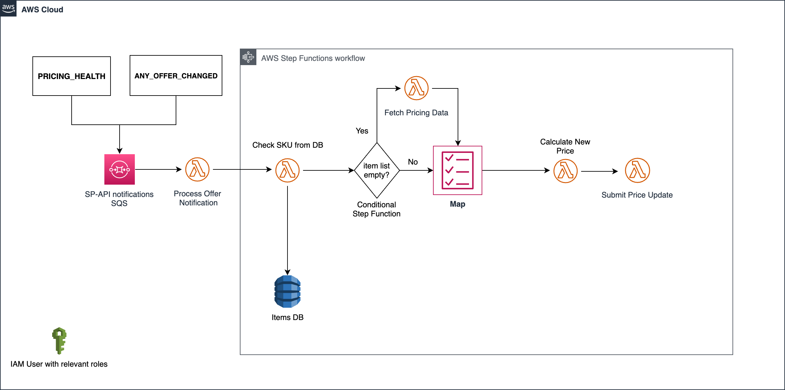

# Automating pricing decisions and become eligible for the Featured Offer (FO) using SP-API

by Katheleen G., Technical Projects Manager, Integration, Federico R., Sr. Solutions Architect, Selling Partner Developer Services, Leonardo N., Solutions Architect, Selling Partner Developer Services and Christopher K., Solutions Architect, Selling Partner Developer Services | December 10, 2023 - Updated June 21, 2024

Pricing is a key factor for Featured Offer (FO) eligibility on Amazon. Data has suggested that being selected as a FO can speed up sales by up to 50%. Automated pricing strategies ensure that sellers remain agile, allowing them to optimize sales and margins without constantly making manual price updates. This blog presents best practices and a well architected workflow on how developers can automate pricing decisions adjusting prices quickly and automatically against the competition.

### What is an Amazon product detail page and the benefits of becoming a FO?

When multiple sellers sell the same product, Amazon automatically consolidates the best product data submitted from various sellers into one details page to ensure customers get the best experience avoiding different pages and information for the same product. On this single product detail page, Amazon attaches all sellers' offers, making it easier for customers to find, compare, and buy items. Additionally, Amazon selects what it considers is the best offer for the customer browsing the marketplace, based on factors like price, condition, and shipping speed. This offer, the FO, is highlighted above the "Buy Now" button in the product details page. Qualifying offers for FO can be a strategic way to increase awareness and sales potential because it will be associated with a sale button and requires fewer clicks to complete the purchase.

### How does the FO look like and where I can check out the other offers?

The FO is represented by the "Add to Cart" button. Other available offers are located below, allowing customers to select a different one if they consider it.


## Overview of Pricing workflow

The Pricing workflow involves several key steps: 

1. **Notification Subscription**: Subscribing a SQS queue to the [PRICING_HEALTH](https://developer-docs.amazon.com/sp-api/docs/notification-type-values#pricing_health) and [ANY_OFFER_CHANGED](https://developer-docs.amazon.com/sp-api/docs/notification-type-values#any_offer_changed) notification, which are triggered when pricing or Feature Offer eligibility changes. This step is crucial as it notifies when data processing is complete, allowing for the automated retrieval and storage of document data.
2. **Check SKU reprice rule**: Checking in a database if the ASIN triggered by the notifications has pricing rules set by the seller. It is essential to make changes only in items which the seller accepted to reprice.
3. **Fetch Price**: Verifying prices for offers not present in notification. This rule calls Pricing APIs and can be set to periodically pool prices.
4. **Calculate Price**: Calculating new prices based on rules. 
5. **Submit Price**: Submitting pricing updates via Listings API.


## The PRICING_HEALTH notification

By using the  [`PRICING_HEALTH`](https://developer-docs.amazon.com/sp-api/docs/notification-type-values#pricing_health) notification, you can receive information for when a seller offer is ineligible to be the Featured Offer (Buy Box offer) because of an uncompetitive price. Sellers can take steps to restore featured offer eligibility by adjusting an offer's total price (price plus shipping minus points) so that it matches or is lower than the competitive price, or is in line with the reference prices provided.

#### The main PH elements

There are some important attributes in the notification which we are using in the flow:

* To know how to set up notifications (Amazon Simple Queue Service Workflow) [access this tutorial ](https://developer-docs.amazon.com/sp-api/docs/notifications-api-v1-use-case-guide#tutorial-set-up-notifications-span-classnotranslateamazon-simple-queue-servicespan-workflow)

The following table shows the objects and properties of the `PRICING_HEALTH` object:

| Name | Description |
| --- | --- |
| issueType | The issue type for the notification. Required. Type: string |
| sellerId | The seller identifier for the offer. Required. Type: string |
| offerChangeTrigger | The event that caused the notification to be sent. Required. Type: [`offerChangeTrigger`](https://developer-docs.amazon.com/sp-api/docs/notification-type-values#offerChangeTrigger_PricingHealth) |
| merchantOffer | Offer details of the selling partner (merchant) receiving the notification. Required. Type: [`merchantOffer`](https://developer-docs.amazon.com/sp-api/docs/notification-type-values#merchantOffer_PricingHealth) |
| summary | Information about the item that had the offer change. The information in this summary applies to all conditions of the product. Required. Type: [`summary`](https://developer-docs.amazon.com/sp-api/docs/notification-type-values#summary_PricingHealth) |

### buyBoxPrice

The following table shows the objects and properties of the buyBoxPrice object:

| Name | Description |
| --- | --- |
| condition | Indicates the condition of the item. Required. Type: string |
| landedPrice | The listingPrice plus shipping. Required. Type: [`moneyType`](https://developer-docs.amazon.com/sp-api/docs/notification-type-values#moneytype) |
| listingPrice | The price of the item. Required. Type: |
| shipping | The shipping cost. Required. Type: [`moneyType`](https://developer-docs.amazon.com/sp-api/docs/notification-type-values#moneytype) |
| points | The number of Amazon Points offered with the purchase of an item. Optional. Type: [`points`](https://developer-docs.amazon.com/sp-api/docs/notification-type-values#points_PricingHealth) |

### merchantOffer

The following table shows the objects and properties of the merchantOffer object:

| Name | Description |
| --- | --- |
| condition | Indicates the condition of the item. Required. Type: string |
| fulfillmentType | Indicates whether the item is fulfilled by Amazon or by the seller. Required. Type: string |
| landedPrice | The listingPrice plus shipping. Required. Type: [`moneyType`](https://developer-docs.amazon.com/sp-api/docs/notification-type-values#moneytype) |
| listingPrice | The price of the item. Required. Type: [`moneyType`](https://developer-docs.amazon.com/sp-api/docs/notification-type-values#moneytype) |
| shipping | The shipping cost. Required. Type: string |
| points | The number of Amazon Points offered with the purchase of an item. Optional. Note: The Points object is only returned in Japan (JP). Type: [`points`](https://developer-docs.amazon.com/sp-api/docs/notification-type-values#points_PricingHealth) |

### referencePrice

The following table shows the objects and properties of the referencePrice object:

| Name | Description |
| --- | --- |
| averageSellingPrice | The average selling price of the item. Optional. Type: [`moneyType`](https://developer-docs.amazon.com/sp-api/docs/notification-type-values#moneytype) |
| competitivePriceThreshold | The competitive price threshold from external competitors of Amazon. Optional. Type: [`moneyType`](https://developer-docs.amazon.com/sp-api/docs/notification-type-values#moneytype) |
| retailOfferPrice | The 14 day maximum of retail offer price. Optional. Type: [`moneyType`](https://developer-docs.amazon.com/sp-api/docs/notification-type-values#moneytype) |
| msrpPrice | The manufacturer suggested retail price for the ASIN. Optional. Type: [`moneyType`](https://developer-docs.amazon.com/sp-api/docs/notification-type-values#moneytype) |

To understand the other attributes in the notification, please check our [PRICING_HEALTH](https://developer-docs.amazon.com/sp-api/docs/notification-type-values#pricing_health)

## The ANY_OFFER_CHANGED notification

By using the [`ANY_OFFER_CHANGED`](https://developer-docs.amazon.com/sp-api/docs/notifications-api-v1-use-case-guide#any_offer_changed) notification, you can receive information in real time about price changes from competitors for products a seller is selling on Amazon. Whenever there is price change in any of the top 20 offers a notification will be triggered, and then you will be able to analyze the price data.


#### The main AOC elements

There are some important attributes in the notification which we are using in the flow:

The following table shows the objects and properties of the `ANY_OFFER_CHANGED` object:

| Name | Type | Description |
| --- | --- | --- |
| SellerId | String | The seller identifier for the offer. Required. |
| OfferChangeTrigger | [OfferChangeTrigger](https://developer-docs.amazon.com/sp-api/docs/notification-type-values#OfferChangeTrigger_AnyOfferChanged) | The event that caused the notification to be sent. Required. |
| Summary | [Summary](https://developer-docs.amazon.com/sp-api/docs/notification-type-values#Summary_AnyOfferChanged) | Information about the product that had the offer change. The information in this summary applies to all conditions of the product. Required. |
| Offers | Array of [Offer](https://developer-docs.amazon.com/sp-api/docs/notification-type-values#Offer_AnyOfferChanged) | The top 20 competitive offers for the item and condition that triggered the notification. Required. |

### BuyBoxPrice

The following table shows the objects and properties of the BuyBoxPrice object:  

| Name | Type | Description |
| --- | --- | --- |
| LandedPrice | MoneyType | ListingPrice + Shipping - Points. Required. |
| ListingPrice | MoneyType | The price of the item. Required. |
| Shipping | MoneyType | The shipping cost. Required. |
| Points | Points | The number of Amazon Points offered with the purchase of an item. Optional. Note: The Points object is only returned in Japan (JP). |
| Condition | String | Indicates the condition of the item. For example: New, Used, Collectible, Refurbished, or Club. Required. |

To understand the other attributes in the notification, please check our [ANY_OFFER_CHANGED](https://developer-docs.amazon.com/sp-api/docs/notification-type-values#any_offer_changed)

## The Product Pricing API

By using the [`GetPricing`](https://developer-docs.amazon.com/sp-api/docs/product-pricing-api-v0-use-case-guide#step-1-call-getpricing) operation, you can retrieve price details of SKUs and ASINs. This endpoint returns the same information than the AOC notification. We only use this API if the seller's offer is not being returned in the notification into the `Offers` node.
 

## The Listing Item API 

By using the [`patchListingsItem`](https://developer-docs.amazon.com/sp-api/docs/listings-items-api-v2020-09-01-use-case-guide#step-1-submit-listings-item-patch-request) operation, you can update product prices after your analysis using the AOC notification and getPricing endpoint (when needed).


#### The main Listing Item API elements

```
{
  "productType":"PRODUCT",
  "patches":[
    {
      "op":"replace",
      "path":"/attributes/purchasable_offer",
      "value":[
        {
          "marketplace_id": "A2Q3Y263D00KWC",
          "currency": "USD",
          "our_price": [
            {
              "schedule": [
                {
                  "value_with_tax": 15.00
                }
              ]
            }
          ]
        }
      ]
    },
  ]
}
```

`patches.value.our_price.value_with_tax` = The new price with you are updating your offer.

## Current Solution Architecture for the workflow




### Key Components and Workflow

1. **Event Sources:**
   - **PRICING_HEALTH** and **ANY_OFFER_CHANGED** are the two primary event sources from SP-API.


2. **SQS (Simple Queue Service):**
   - Both event sources send their notifications to an SQS queue. This queue acts as a buffer, receiving messages from both notifications.


3. **Lambda Function**

   1. **Process Notification:**
      - This Lambda function is triggered when messages arrive to the SQS queue.
      - This function builds the payload for the Step Functions State Machine using **ANY_OFFER_CHANGED (AOC)** and **PRICING_HEALTH (PH)** notifications and processes them accordingly.
   2. **Check SKU from DB**
      - This function checks the ASIN information from the notifications and map it with ASIN, SKU, FulfillmentType, Condition in the database (DynamoDB) appending the offer to a list.

   3. **Fetch Pricing Data**
      - This function is triggered only when the seller's offer is not in the notification calling the `getPricing` API to retrieve the necessary pricing data.

   4. **Calculate New Price**
      - The system applies price updates according to which notification is being processed.
      - For `PRICING_HEALTH` notification, it checks if the competitivePriceThreshold is included in the notification and if the seller is enrolled to this rule.
        - If **Yes**, it applies a price update using competitivePriceThreshold data to be eligible for the Feature Offer.
        - If **No**, it applies a price update using BuyBoxPrices rules decreasing a pre-defined value or percentage trying to be eligible for the Feature Offer.
      - For `ANY_OFFER_CHANGED`
        - Calculate the new list price by applying the price change rule pre-defined by the selling partner (e.g. reduce a fixed amount, or reduce a percentage). If the new list price is above the minimum threshold defined by the selling partner, continue to the next step to perform a price change; if not, finalize the execution.

   5. **Submit Price Changes:**
      - Finally, the price changes are submitted via the Listings API using the `patchListingsItem` operation.
       

4. **AWS Step Functions State Machine:**
   - The state machine orchestrates the workflow of the Lambda functions for processing SKUs and updating prices.
   - **State Machine Steps:**
     1. **Check SKU:** Initiates the process with the payload from Process Notification lambda and run Check SKU lambda.
     2. **SKU Processing:** Iterates over each SKU.
     3. **Check Notification Offer:** Verifies if the offer is present in the notification. If not present goes to Fetch Price Data lambda function, otherwise to calculate new price lambda function.
     4. **Fetch Price Data:** Retrieves the latest pricing data using the getPricing API if seller offer is not in AOCN notification.
     5. **Check Fetch Price Results:** Validates the fetched getPricing API data.
     6. **Calculate New Price:** Computes the new price based on the data using the lambda.
     7. **Check New Price Rules:** Ensures the new price adheres to predefined rules and thresholds.
     8. **Submit Price Update:** Submit the calculated price update using the patchListingsItem API.
     9. **End State:** Marks the end of the process for each SKU.


5. **IAM User with Relevant Roles:**
   - Access and permissions are managed through an IAM user with appropriate roles, ensuring secure and controlled access to resources.


## Conclusion

This guide provided you a reference solution and sample code to integrate and define a relevant pricing strategy for the seller. This helps interested sellers have a greater chance of having their offer more visible on the product details page compared to other offers.

# FAQ

### What is the difference between PRICING_HEALTH and ANY_OFFER_CHANGED?

The main difference between both notifications is regarding external competitors' price changes. E.g. the seller will not receive an `ANY_OFFER_CHANGED` notification when they become ineligible for the Feature Offer if another retailer lowers their price on an item, and it goes below the seller offer, the seller will become ineligible for the Feature Offer, but they will not receive an `ANY_OFFER_CHANGED` message. Only `PRICING_HEALTH` will be triggered.

### I received a Pricing Health notification that one of my items is not eligible to be a Featured Offer on the Product Detail page. What does this mean?

We notify you when your offer becomes ineligible to be a Featured Offer on the product detail page. This happens when your total price (price + shipping) is above the Competitive External Price, if available, or when your total price is higher than recent prices. For your offer to be eligible to be a Featured Offer on the product detail page, consider pricing your offers competitively and confirm you meet the eligibility criteria.

For more FAQs related to pricing APIs, check our [Product Pricing API and Notifications Frequently Asked Questions](https://developer-docs.amazon.com/sp-api/docs/pricing-faqs) documentation.
