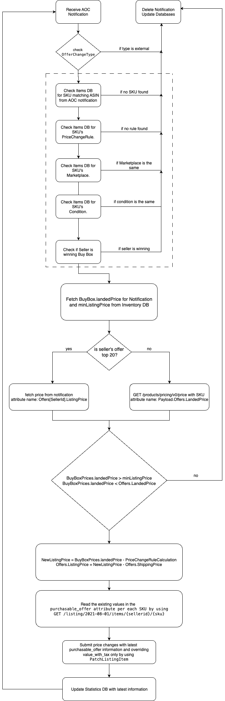

# Automating pricing decisions to become eligible to the Featured Offer (FO) using SP-API 

This blog presents best practices and a well architected workflow on how developers can automate pricing decisions adjusting prices quickly and automatically against the competition. With it you may increase seller`s chance of becoming the Featured Offer (aka Amazon Buy Box) and accelerating its sales. 

by Katheleen G., Technical Projects Manager, Integration, Federico R., Sr. Solutions Architect, Selling Partner Developer Services, Leonardo N., Solutions Architect, Selling Partner Developer Services and Christopher K., Solutions Architect, Selling Partner Developer Services | December 19, 2023

## Overview

Pricing is a key factor for Featured Offer (FO) eligibility on Amazon. Data has suggested that being selected as a FO can accelerate sales by up to 50%. Automated pricing strategies ensure that sellers remain agile, allowing them to optimize sales and margins without the need for constant manual price updates. Leveraging APIs and notifications for this task will save time, reduce human error, and enables instant responses to market changes. 
This blog post will guide you through the intricacies of using Pricing operations on SP-API to automate pricing decisions. By subscribing to the Any Offer Changed Notification (AOCN), you can be instantly notified when prices for relevant ASINs change, ensuring your offers are always in sync with the latest market dynamics. We’ll walk you through how to process the AOCN notifications, gather additional information, apply pricing rules, submit new price updates, and demonstrate these operations using sample code. The solution presented in this post is meant to provide an example of how to build on top of pricing APIs and is not meant to be a standalone, full pricing application.


## What is an Amazon product detail page and the benefits of becoming a FO?

When multiple sellers sell the same product, Amazon automatically consolidates the best product data submitted from various sellers into one details page to ensure customers get the best experience avoiding different pages and information for the same product. On this single product detail page, Amazon attaches all sellers' offers, making it easier for customers to find, compare, and buy items. Additionally, Amazon selects what it considers is the best offer for the customer browsing the marketplace, based on factors like price, condition, and shipping speed. This offer, the FO, is highlighted above the "Buy Now" button in the product details page. Qualifying offers for FO can be a strategic way to increase awareness and sales potential because it will be associated with a sale button and requires fewer clicks to complete the purchase.

### How does the FO look like and where I can check out the other offers?

The FO is represented by the "Add to Cart" button. Other available offers are located below, giving customers the ability to select a different one if they consider it.


### How an offer becomes eligible for the FO?

There are a number of factors that affect FO eligibility. For example, seller should have a professional sales account with a good reputation and good customer service metrics.
Products must be in stock and in new or like-new goods condition. Additionally, products with short delivery times are attractive to customers and a reason to qualify as FO.
Finally, it’s also worth mentioning that competitive pricing is really important here: FO prices are typically lower than or equal to similar options, so sellers are more likely to update the price to a competitive price, in order to increase their chances of winning and have their offer as FO.

## The recommended flow to achieve the FO with the tools and API 

As we know, competitive price is an important factor in achieving FO. With this in mind, the flow presented here uses SP-API tools as part of the process. It starts by reading the AOC notification and calling the Product Pricing APIs to gather additional information if needed; it then executes logic to find the competitive prices for the product, and finally uses the Listings Item API to update the price.
Please note that FO is not guaranteed as competing offers may change and other offers may be highlighted due to other factors previously mentioned. However, maintaining competitive prices is one strategy to achieve this goal.

### The AOC notification

By using the  [`ANY_OFFER_CHANGED`](https://developer-docs.amazon.com/sp-api/docs/notifications-api-v1-use-case-guide#any_offer_changed) notification, you can receive information in real time about price changes from competitors for products a seller is selling on Amazon. Whenever there is price change in any of the top 20 offers a notification will be triggered and then you will be able to analyze the price data.

#### The main AOC components

There are some important attributes and nodes in the notification we are looking at carefully in the recommended flow:

* To know how to set up notifications (Amazon Simple Queue Service workflow) [access this tutorial ](https://developer-docs.amazon.com/sp-api/docs/notifications-api-v1-use-case-guide#tutorial-set-up-notifications-span-classnotranslateamazon-simple-queue-servicespan-workflow)


```

      "OfferChangeTrigger" : {
        "MarketplaceId" : "A2Q3Y263D00KWC",
        "ASIN" : "B092CZXSZB",
        "ItemCondition" : "new",
        "TimeOfOfferChange" : "2023-07-31T20:40:53.101Z",
        "OfferChangeType" : "Internal"
      }
```

`OfferChangeTrigger.OfferChangeType` =  Informs if the notification was triggered because of an Internal Amazon offer or External Amazon offer. In this flow we are using just Internal notification and excluding the External ones.

`OfferChangeTrigger.ASIN` =  Informs the ASIN that suffered changes and that is triggering the notification.

`OfferChangeTrigger.MarketplaceId` =  Informs the Marketplace where the ASIN that suffered the update is located.


```
BuyBoxPrices" : [ {
          "Condition" : "New",
          "LandedPrice" : {
            "Amount" : 28.97,
            "CurrencyCode" : "BRL"
          },
          "ListingPrice" : {
            "Amount" : 19.95,
            "CurrencyCode" : "BRL"
          },
          "Shipping" : {
            "Amount" : 9.02,
            "CurrencyCode" : "BRL"
          }
        } ],
```

`BuyBoxPrices` = This node informs all data related to the Buy Box offer. 

`BuyBoxPrices.Condition` =  Informs the condition of the offer that is winning the Buy Box.

`BuyBoxPrices.LandedPrice` =  Informs total price of Buy Box offer, including Shipping and Listing price. 

```
 "Offers" : [ {
        "SellerId" : "A2ZPJ4TLUOSWY8",
        "SubCondition" : "new",
        "SellerFeedbackRating" : {
          "FeedbackCount" : 35,
          "SellerPositiveFeedbackRating" : 63
        },
        "ShippingTime" : {
          "MinimumHours" : 24,
          "MaximumHours" : 48,
          "AvailabilityType" : "NOW",
          "AvailableDate" : ""
        },
        "ListingPrice" : {
          "Amount" : 50.00,
          "CurrencyCode" : "BRL"
        },
        "Shipping" : {
          "Amount" : 4.43,
          "CurrencyCode" : "BRL"
        },
        "ShipsFrom" : {
          "Country" : "BR",
          "State" : ""
        },
        "IsFulfilledByAmazon" : false,
        "IsBuyBoxWinner" : false,
        "PrimeInformation" : {
          "IsOfferPrime" : false,
          "IsOfferNationalPrime" : false
        },
        "ShipsDomestically" : true
      } ]
```

`Offers` =  Informs up to 20 active offers of sellers that are selling the same ASIN.

`Offers.SellerId` =  Informs the seller id of the offer owner. Use this property to find your seller's offer. 

`Offers.IsBuyBoxWinner` =  Informs if this offer is the Buy Box winner.

`Offers.IsFulfilledByAmazon.ListingPrice` =  Informs seller item price.

`Offers.IsFulfilledByAmazon.Shipping` =  Informs seller Shipping price.

## The Product Pricing API

By using the [`GetPricing`](https://developer-docs.amazon.com/sp-api/docs/product-pricing-api-v0-use-case-guide#step-1-call-getpricing) operation, you can retrieve price details of SKUs and ASINs. This endpoint returns the same information than the AOC notification. We only use this API if the seller's offer is not being returned in the notification into the `Offers` node.
 

## The Listing Item API 

By using the [`patchListingsItem`](https://developer-docs.amazon.com/sp-api/docs/listings-items-api-v2020-09-01-use-case-guide#step-1-submit-listings-item-patch-request) operation, you can update product prices after your analysis using the AOC notification and GetPricing endpoint (when needed).


#### The main Listing Item API components

```
{
  "productType":"PRODUCT",
  "patches":[
    {
      "op":"replace",
      "path":"/attributes/purchasable_offer",
      "value":[
        {
          "marketplace_id": "A2Q3Y263D00KWC",
          "currency": "USD",
          "our_price": [
            {
              "schedule": [
                {
                  "value_with_tax": 15.00
                }
              ]
            }
          ]
        }
      ]
    },
  ]
}
```

`patches.value.our_price.value_with_tax` = The new price with you are updating your offer.

## The recommended flow



After receiving the ANY_OFFER_CHANGE notification by Amazon SP-API SQS queue:

1. Check into Payload attribute if `OfferChangeType: Internal` or `OfferChangeType: Featured Offer` . If the attribute `OfferChangeType: External` finalize the execution.

2. After receiving the notification, retrieve from your local datastore all selling partner's SKUs associated with the ASIN that have a pricing rule defined. If there are no SKUs nor pricing rule, finalize the execution.

3. Validate if the items retrieved from the datastore are in the same marketplace as the FO by comparing against Payload/AnyOfferChangeNotification/OfferChangeTrigger/MarketplaceId from the notification. If the marketplace is not the same, finalize the execution.

4. Validate if the items retrieved from the datastore are for the same condition (New or Used) of the FO by comparing against Payload/Summary/BuyBoxPrices/0:/Condition from the notification. If the condition is not the same, finalize the execution.

5. Validate if the selling partner's offer is included in the notification by reading the following path: Payload/AnyOfferChangeNotification/Offers/<seller Id>. If it is included, continue to use the notification's data (A); if not, call the getPricing endpoint to get the SKU's data (B).: 

    A – Using only notification: 

    A.1 – Validate if the selling partner's offer is winning the Buy Box by reading the following path: Payload/AnyOfferChangeNotification/Offers/<seller Id>/IsBuyBoxWinner. If the offer is already the Buy Bux winner, finalize the execution.

    A.2 – Validate if your seller's offer list price (Payload/AnyOfferChangeNotification/Offers/<seller Id>/ListingPrice/Amount) + shipping price (Payload/AnyOfferChangeNotification/Offers/<seller Id>/Shipping/Amount) is greater than the Buy Box landed price (Payload/Summary/BuyBoxPrices/0:/LandedPrice). If not, finalize the execution.

    B. Using getPricing together with the notification:

    B.1 – Call the getPricing endpoint passing MarketplaceId, ItemCondition and SellerSKU as parameters.

    B.2 – Validate if the landed price from getPricing response (payload/Product/Offers/BuyingPrice/LandedPrice) is greater than the Buy Box landed price from the notification (Payload/Summary/BuyBoxPrices/0:/LandedPrice). If not, finalize the execution.

6. Calculate the new list price by applying the pricing change rule set by the selling partner (e.g. reduce a fixed amount, or reduce a percentage). If the new list price is above the minimum list price defined by the selling partner, continue to the next step to perform a price change; if not, finalize the execution.

7. Before submit the new price, read the existing pricing values in the `purchasable_offer` attribute per each SKU by using the GET /listings/2021-08-01/items/{sellerId}/{sku} operation.
    
8. Submit a price update with the old `purchasable_offer` information, overriding `value_with_tax` attribute only by using PatchListingItem or JSON_LISTINGS_FEED based on the number of changes being made. If you are submitting fewer than 1,500 SKUs, use patchListingsItem operation; if you are submitting between 1,500 and 10,000 SKUs, use JSON_LISTINGS_FEED.
    
9. Wait for a new AOC notification to arrive, and check if the selling partner is the new Buy Box winner. Validate all steps above again.


## Conclusion

This blog provided you a reference solution and sample code to integrate and define a relevant pricing strategy for the seller. This helps interested sellers have a greater chance of having their offer more visible on the product details page compared to other offers.
