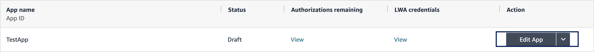
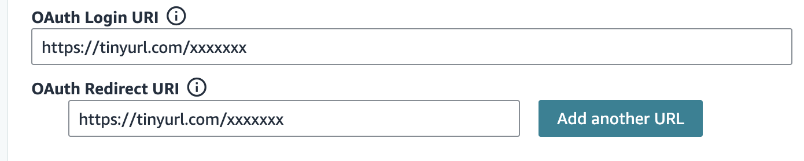

# Overview

This sample solution is a web application, currently available in Python with Flask.
In this guide, we demo how to deploy and host the solution on AWS Elastic Beanstalk platform. Alternatively, the application can be run locally and, steps and tips are provided at the end of this guide.

# Solution

This sample solution is an implementation of the Login with Amazon website authorization workflow. This web app can be deployed as a sample developer website and configured with your developer application to initiate the authorization workflow, from the selling partner clicking on an Authorize button until retrieving the Refresh Token and executing a first successful API call.

We recommend the following resources for more details on authorization with the Selling Partner API:
[Authorizing Selling Partner API Applications](https://developer-docs.amazon.com/sp-api/docs/authorizing-selling-partner-api-applications)
[Website Authorization Workflow](https://developer-docs.amazon.com/sp-api/docs/website-authorization-workflow)

# Pre-requisites

The pre-requisites for deploying the Sample Solution App to AWS are:
* [Registering as a developer for SP-API](https://developer-docs.amazon.com/sp-api/docs/registering-as-a-developer), and [registering an SP-API application](https://developer-docs.amazon.com/sp-api/docs/registering-your-application).
* An AWS account
* An [IAM user](https://docs.aws.amazon.com/IAM/latest/UserGuide/id_users.html) with a permissions policy to create, deploy and manage an Elastic Beanstalk deployment
    * An example policy is provided below
* The [AWS CLI](https://aws.amazon.com/cli/)
    * If not present, it will be installed as part of the deployment script.
* The [EB CLI](https://docs.aws.amazon.com/elasticbeanstalk/latest/dg/eb-cli3.html)
    * If not present, it will be installed as part of the deployment script.
* An https enabled URL to the deployed application configured as OAuth redirect URL in your application profile on Developer Portal
* Python 3 installed

# Usage
### 1. Update the application variables
* In [utils/constants.py](../code/python/utils/constants.py#L26), update the CLIENT_ID and CLIENT_SECRET with the values for your Developer Central application and update the APPLICATION_ID to the id of your application. Also update the SELLER_VENDOR_CENTRAL_URL for the marketplace you need or use a vendor central URL for vendor authorization. Check this seller [documentation](https://developer-docs.amazon.com/sp-api/docs/seller-central-urls) for a list of URLs per marketplace or the vendor central links [documentation](https://developer-docs.amazon.com/sp-api/docs/vendor-central-urls).

### 2. Configure the IAM user
#### I. Create IAM user
In order to execute the deployment script, an IAM user with following permissions policy is needed.
To create a new IAM user with required permissions, follow the steps below.
1. Open the [AWS console](https://console.aws.amazon.com/).
2. Navigate to [IAM Users console](https://us-east-1.console.aws.amazon.com/iamv2/home#/users).
3. Click **Add users**.
4. Select a name for your user.
5. In the **Permissions policies** section, select **Create policy**. You will be redirected to AWS IAM policies.
6. In the **Policy Editor**, select the `JSON` tab and add the following policy. Check the policy, click **Next** and finally *Create*
```json
{
  "Version": "2012-10-17",
  "Statement": [
    {
      "Effect": "Allow",
      "Action": [
        "elasticbeanstalk:*",
        "ec2:*",
        "elasticloadbalancing:*",
        "autoscaling:*",
        "cloudwatch:*",
        "cloudformation:*",
        "s3:*",
        "logs:*",
        "cloudtrail:*",
        "iam:*",
        "kms:Decrypt",
        "kms:Encrypt",
        "kms:GenerateDataKey",
        "kms:DescribeKey"
      ],
      "Resource": "*"
    }
  ]
}
```
7. Switch back to the IAM user tab, and search for the new policy in the **Permissions policies** search section, select it and click **Next**.

8. Review the changes and click **Create user**.

#### II. Retrieve IAM user credentials
Security credentials for the IAM user will be requested during the deployment script execution.
To create a new access key pair, follow the steps below. If you already have valid access key and secret access key, you can skip this section.
1. Open the [AWS console](https://console.aws.amazon.com/).
2. Navigate to [IAM Users console](https://us-east-1.console.aws.amazon.com/iamv2/home#/users).
3. Select your IAM user, which has `IAMFullAccess` permissions.
4. Go to **Security credentials** tab.
5. Under **Access keys**, click **Create access key**.
6. In **Access key best practices & alternatives** page, select **Command Line Interface (CLI)**.
7. Acknowledge the recommendations, and click **Next**.
8. Click **Create access key**.
9. Copy `Access key` and `Secret access key`. This is the only time that these keys can be viewed or downloaded, and you will need them while executing the deployment script.
10. Click **Done**.

### 3. Execute the deployment script
The deployment script will deploy the Sample Solution App on AWS Elastic Beanstalk.
To execute the deployment script, follow the steps below.
1. Locate the deployment script for the.
    1. The file is [app/deploy.sh](../app/deploy.sh).
2. Execute the script from your terminal. run `bash app/deploy.sh`.
3. Follow the prompts to initiate the Elastic Beanstalk environment:
   - You will be prompted to select the region, the application and the elastic beanstalk environment names
   - You can type Enter through to use the default options
   - When prompted for ssh keys, you might select N if you don't need to connect to the EC2 instances that will be created by Elastic Beanstalk

### 4. Configure the developer application redirect URL
After the deployment is finished:
1. Navigate to your Elastic Beanstalk applications view on AWS console and click on your application.
2. Make sure the application Health status is `Ok`. If not, check Events and Logs to troubleshoot.
3. Copy the url for the deployed web application from the Domain attribute.
4. The URL is not HTTPS enabled and thus not suitable as an OAuth Redirect URL in the application settings.
    * For this reason, we can create a tiny URL for our redirect URL. The tiny URL will support https but need to be able to pass the query parameters added by Amazon. The following tiny url service can be used for free for this purpose: https://tinyurl.com/
    * The tiny url must be created for the authorization handler endpoint, i.e. Elastic Beanstalk Domain/`success`. `success` is the default redirect URL and can be changed in [utils/constants.py](../code/python/application.py#L13) as APPLICATION_REDIRECT_URI
    * If you have a domain name registered or a certificate, you can follow this link to configure https termination: https://docs.aws.amazon.com/elasticbeanstalk/latest/dg/configuring-https.html
5. Go to your application dashboard and click on `Edit App` 
   Finally, scroll down to the OAuth section and add the tiny url created in step 4 
6. Click on `Save and exit` to save the settings

### 5. Test the solution
Everything is now ready to test the authorization sample solution.
1. Navigate to the `Domain` provided in the Elastic Beanstalk application view
2. If the application was deployed successfully, the landing page should be loaded and an `Authorize` button is visible
3. Click on `Authorize`. This redirects you to Amazon's consent page (if not logged id, you need to log in to Seller Central first)
4. Review the application and roles you are authorizing and click on `Authorize`.
5. Amazon now redirects to the configured redirect URL (tinyURL) and the handler `success` will display the `authorized.html` page with the result from the seller marketplace participations if a seller was authorized (if a vendor is authorized, the page is displayed with an authorization message only).

## Alternative Local Deployment
It is possible to use the sample solution without hosting it on AWS or other services. While it is not allowed to use localhost as an OAuth Redirect URL in you app configuration, a tunneling service can be used to share the app over https for testing purposes.
1. Navigate to the `code/python` folder.
2. Create a virtual environment and activate it
```
python3 -m venv .
source bin/activate
```
3. Install the application dependencies.
```
pip3 install -r requirements.txt
```
4. Start the application. The flask application starts on port 5000 by default
```
python3 application.py
```
5. Register to use a tunneling service such as `ngrok` and create a tunnel
```
ngrok config add-authtoken <token>
ngrok http 5000
```
This provides a forwarding https link
6. Set `https://ngrok_domain/success` from step 5 as OAuth Redirect URL in your app settings
7. Visit the application domain and test it as previously explained

### 6. Cleanup
The application comes with a cleanup script file is [app/clean-up.sh](../app/clean-up.sh).

Execute the script from your terminal by running `bash app/clean-up.sh`. 